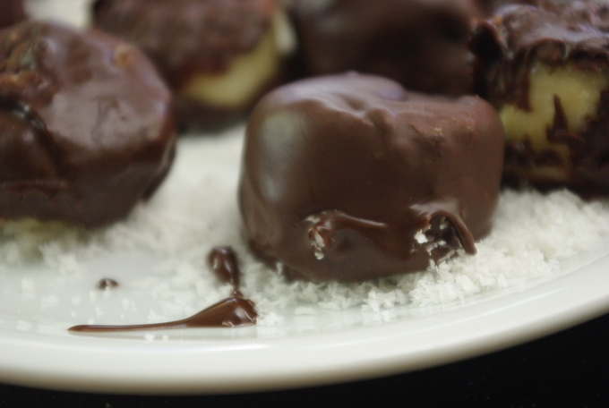
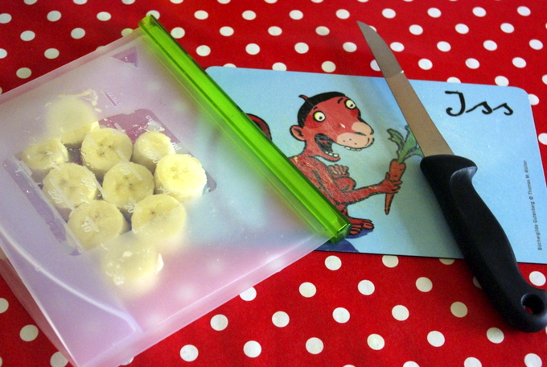
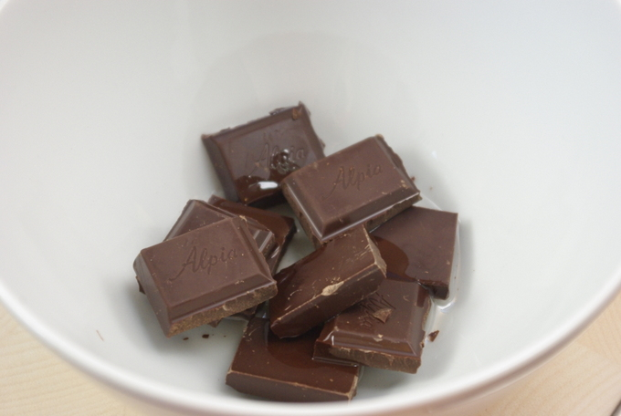
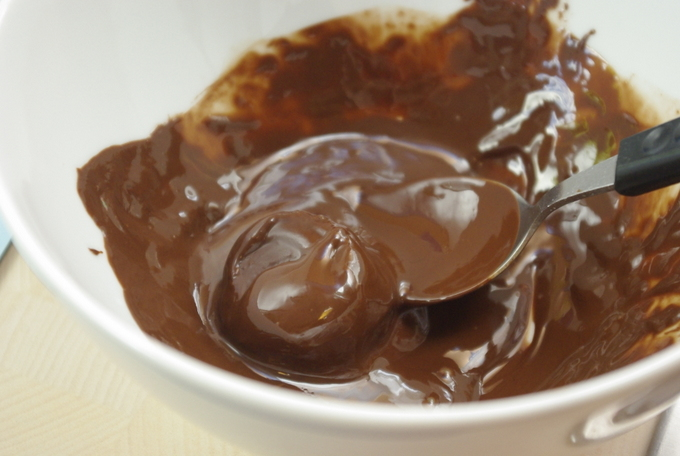
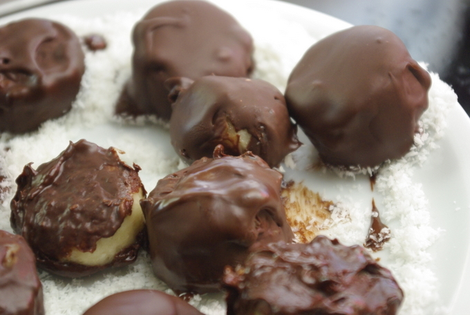
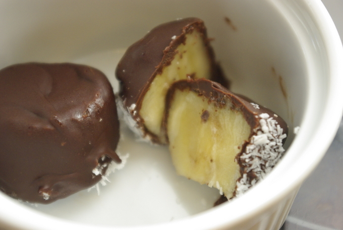

Bei einem Gewinnspiel auf einer Adventuregame-Seite werden gerade **Bananenrezepte** gesucht und als alter Adventurefan habe ich mich hinreissen lassen, mitzumachen. Das entstandene Rezept will ich natürlich nicht "verkomme lasse" und poste es gleich hier noch, damit ich es nicht verliere. Und da das Wetter ja gerade passt, will vielleicht auch der ein oder andere Leser es mal ausprobieren.

Inspiriert von vielen Rezepten, bei denen ganze Bananen am Stiel oder auch ohne Stiel in Schokolade getaucht und eingefroren werden, habe ich mir ein Rezept für kleinere Eishappen ausgedacht, denn überlegt mal: **kleine Bananenstücke** = mehr Bananenoberfläche = **mehr Schokolade** pro Banane. Und mehr Schokolade ist immer gut. Nebenbei gefrieren die kleinen Stücke schneller als eine ganze Banane. Eigentlich wollte ich auch noch ein paar bunte Zuckerstreusel auf die Glasur streuen, aber als ich im Laden vor den Streuseln stand, standen gleich daneben die **Kokosraspel**, und die klangen nicht nur viel passender zu Banane, die waren auch viel billiger. Fertig war mein Plan für das Bananen-Eiskonfekt mit Schokolade und Kokos. Das Ergebnis kann überzeugen, finden wir; es schmeckt ein bisschen wie das Affenzahn-Eis am Stiel von früher, und das **ohne Eis machen oder kaufen: die Banane selbst ist das Eis**.

 

## Zutaten

1 **Banane**

1 halbe Tafel (=50g) **Schokolade** (zartbitter oder die normale)

1 TL neutrales **Öl** (ich nehme meist Sonnenblumenöl)

2 EL **Kokosraspel**

## Zubereitung

1\. Die **Banane** in 2-3 cm große Stücke schneiden und in einen Gefrierbeutel oder -dose verpackt mindestens 15 Minuten (oder über Nacht) ins Gefrierfach stecken. (Das ist wichtig, damit nachher die Glasur schnell fest wird.)

2\. Inzwischen die halbe **Schokoladentafel** in Stücke brechen und zusammen mit dem **Öl** in der Mikrowelle vorsichtig zum Schmelzen bringen, es dauert ungefähr drei Minuten, würde ich sagen. Dazu immer höchstens eine Minute die Mikrowelle anmachen, umrühren, wiederholen, bis die Schoki flüssig, aber nicht verbrannt ist.

3\. Jetzt auf einen flachen Teller die **Kokosflocken** gut verteilen. Hierauf kommen dann die noch frisch flüssig überzogenen Bananenstücke, damit sie nicht klebenbleiben - und damit sie lecker nach Kokos schmecken natürlich!

4\. **Bananenstücke** aus dem Gefrierfach holen und einzeln mit einem Löffel in der flüssigen **Schokoladenglasur** wenden und dann auf die Kokosflocken auf dem Teller setzen.

5\. Sind alle Stücke glasiert, warten, bis sie fest geworden sind - das geht schnell, da die Banane ja gefroren war. Jetzt wieder in den Beutel packen und **nochmal mindestens 15 Minuten nachgefrieren lassen**.

6\. Einfach mit der Hand essen oder halbieren und mit Spießchen servieren.

