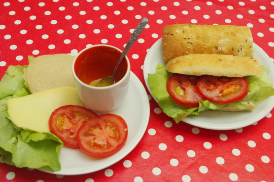

Solche Sandwiches machen wir nicht oft, wir essen ja meistens warm. Irgendwie ist es dann wie ein Fest; ein erfrischendes.

Was auf dem Briegel, oder besser auf der Seele ist, sieht man ja ganz gut nebenan liegen: je eine Scheibe Käse und vegetarischer Aufschnitt (Rotpreis!), ein Blatt Salat, zwei Scheiben Tomaten und dazu unten Butter und oben Honig-Senf-Dressing (1 Teil Senf + 1 Teil Honig).
