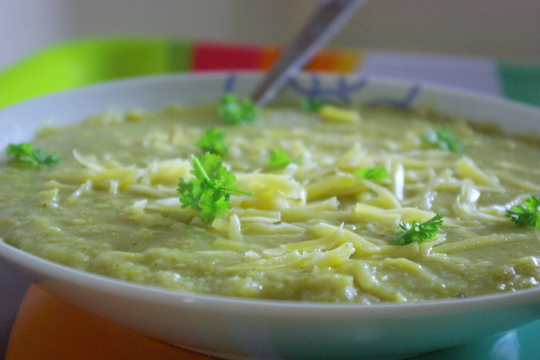

Dieses Rezept habe ich mal wieder aus einem Kochbuch (Cook's Bible Vegetarisch); zunächst war ich sehr skeptisch, ob die **Kartoffeln denn wirklich gerieben sein müssen** – das macht nämlich eine ziemliche Arbeit. Aber im Nachhinein schmeckte es wirklich etwas besser/anders als Suppen, bei denen man die Kartoffeln einfach in Würfeln hineinwirft. Vielleicht weil die Raspel angebraten sind und mehr Oberfläche für die **Röststoffe** haben als Würfel? Man weiß es nicht. Ich werde das Rezept jedenfalls demnächst **auch noch mal mit Zucchini statt Brokkoli ausprobieren**. Aber eigentlich passt es sich zu vielen anderen Gemüsen auch – **Blumenkohl** zum Beispiel.

## Zutaten

für 4 bis 6 Portionen

- 1 gewürfelte **Zwiebel**
- 1 EL **Butter** oder **Öl** (zum Braten der Zwiebel)
- 500 g **Kartoffeln**, geschält und gerieben
- 1,5 L **Gemüsebrühe** (oder ein paar EL Gemüsebrühpaste und 1,5L Wasser
- 500-700g **Brokkoli**, in kleinen Röschen
- 175g **Käse** (Gouda, Emmentaler, ...), gerieben
- **Salz, Pfeffer**, evtl etwas Petersilie zum Garnieren

## Zubereitung

1. **Zwiebelwürfel** in Öl oder Butter in einem großen Topf 5 Minuten glasig dünsten.
2. Temperatur etwas höher drehen und geriebene **Kartoffeln**, Salz und Pfeffer dazugeben; etwas anbraten.
3. Jetzt die **Brühe** draufgiessen (soviel, dass die Kartoffeln bedeckt sind – den Rest aufheben, der braucht man noch) und das ganze aufkochen und 10 Minuten köcheln lassen.
4. Inzwischen **Brokkoli** im Rest der Brühe garkochen (dauert etwa 8 Minuten)
5. Gekochten **Brokkoli** mit der Brühe zusammen in den ersten Topf zu den gegarten **Kartoffelraspeln** gießen und alles mit dem Pürierstab fein **pürieren**.
6. Geriebenen **Käse** in die Suppe einrühren oder aber auf dem Teller erst draufstreuen.
