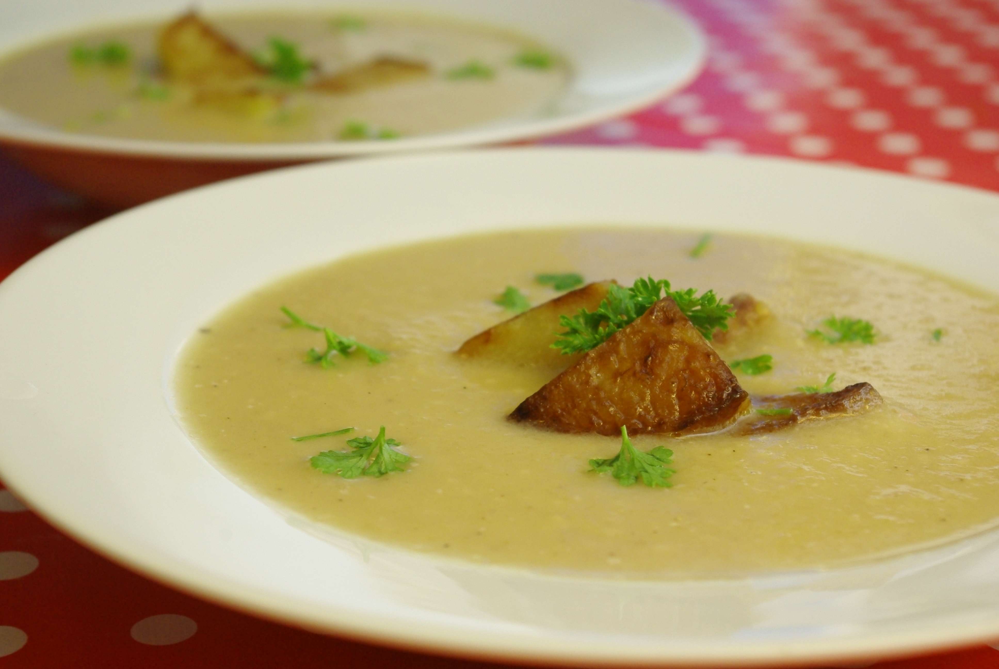

Die Kohlrabi für diese Suppe sind vorher in der Pfanne braun geröstet. Wegen der Röststoffe, ist klar.

## Zutaten

- 3 Kohlrabi in grobe Würfel/Stücke geschnitten
- 3-4 große Kartoffeln, in kleinen Würfeln (1cm)
- 1 Handvoll Sesam
- Salz, Essig, Peffer
- 1-1,5 L Wasser oder Gemüsebrühe (ich habe das Kochwasser vom Blumenkohl vom Vortag genommen, nix verkomme lasse!)
- 2 Zehen Knoblauch
- Olivenöl zum Braten des Kohlrabi
- optional: Käse (zB 75g Gouda, ich habe 2 Scheiben genommem)

## Zubereitung

1. **Kohlrabi** mit Olivenöl braun anbraten und herausnehmen. Herdplattenrestwärme nutzen und **Sesam** und **Knoblauch** in der noch heißen Pfanne etwas anzurösten.
2. **Kartoffeln** und gebratene **Kohlrabistücke** im Wasser (oder der Brühe) garen, ca. 20 Minuten wird das wohl dauern.
3. Nach 10 Minuten **Knoblauch und Sesam** dazugeben.
4. Wenn alle Gemüse gar sind, mit dem Pürierstab alles fein pürieren und mit Salz, Pfeffer, eventuell Essig (Balsamico) **nachwürzen** und wenn man mag, noch **Käse** drin schmelzen lassen. Ich habe von den gebratenen Kohlrabistücken noch ein paar aus dem Topf genommen, um sie dann später als Deko auf den Suppenteller zu drapieren.
5. Als Garnitur schmeckt **Petersilie** gut zu Kohlrabi, sagt meine "Flavor Bible" (aus der ich auch den Tipp mit Kohlrabi und Sesam habe; der hat mich überzeugt, weil ich schon wusste, wie gut Sesam in der Panade der [Kohlrabifritten](http://apfeleimer.wordpress.com/2012/04/26/kohlrabifritten/ "Neu: Jetzt mit Rezept – Kohlrabifritten") passte).
