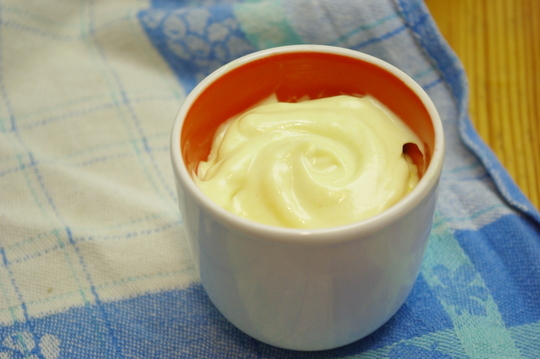

Heute habe es bei uns mal wieder [Brokkolisalat](/posts/2012/05/brokkoli-nudelsalat/ "Brokkoli-Nudelsalat"), und dazu gehört natürlich auch die Mayo. Die Gelegenheit, endlich mal das Rezept für meine eifreie Mayonnaise zu posten!

Das Rezept habe ich ursprünglich mit **Sojamilch** gemacht - so ist es sogar vegan! – und es quasi selber erfunden. Ich hatte mal auf einem Mayonnaiseglas etwas von Erbseneiweiß gelesen und dachte mir, da die Sojamilch ja auch ein Hülsenfrüchteeiweiß ist, probier ich das mal. Hat gut geklappt.

Irgendwann habe ich das quasi gleiche Rezept, aber [mit Kuhmilch auch auf Lamiacucina gefunden](http://lamiacucina.wordpress.com/2010/04/07/mayonnaise-ohne-ei-warum-es-auch-ohne-geht/) und auch wenn sich der Autor des Blogs nicht recht vorstellen kann, wieso man überhaupt Mayo ohne Ei essen möchte, fallen mir da gleich mehrere Gründe ein. Apfel zum Beispiel findet rohes Ei eklig, andere sind vegan, und einmal haben wir diese Mayo auch für meine kleine Nichte gemacht, die vorher noch nie Mayonnaise gegessen hatte, weil sie keine Eier vertrug (die Unverträglichkeit hat sich inzwischen wieder verwachsen). Na die hat sich gefreut!

Für die Zubereitung ist ein **Stabmixer/Pürierstab** am besten geeignet. Wir haben aber auch schon im Urlaub einen normalen Schneebesenmixer mit Handkurbel, einen altmodischen Sahneschläger, benutzt; das dauerte aber...

## Zutaten

2-3 EL kalte **Milch** oder **Sojamilch**

1 TL bis 1 EL **Senf** (nach Geschmack; aber ein bisschen muss schon rein, ich bin der Meinung, er dient auch unterstützend als Emulgator)

100ml **Öl** (ich nehme Sonnenblumenöl, weil es einen milden Eigengeschmack hat)

**Salz und Zucker** nach Geschmack, einrühren, wenn die Mayo fertig ist

## Zubereitung

1. **Milch** in ein sehr schmales hohes Gefäß gießen und den **Senf** dazugeben.
2. Mit dem Pürierstab beides zusammen etwas schaumig **aufschlagen**.
3. Langsam, **wirklich sehr langsam**, während des Weitermixens, **Öl** hinzugießen; erst tröpfchenweise, dann in einem dünnen Strahl. Nicht übermütig werden: wenn nach einer Weile die Mayo festzuwerden beginnt, nicht einfach einen großen Schwall Öl draufgießen, sie kann dann immernoch gerinnen!
4. **Wenn sie tatsächlich gerinnt, weil man ungeduldig war**, nimmt man ein neues Gefäß, gießt dort wieder einen Esslöffel Milch hinein und schlägt sie etwas auf. Dann wieder langsam beim Schlagen das geronnene Öl-Milchgemisch hinzugießen. Kann sein, dass man dann noch etwas mehr Öl braucht, ist ja auch mehr Milch.
5. **Wer mutig ist** und ein wirklich genau zum Pürierstab passenden Mixbecher hat, der ganz genau um den Pürieraufsatz passt (höchstens einige Milimeter weiter darf er unten sein, 1 cm rundum sind schon zuviel), probiert folgendens: Milch und Senf aufschlagen. Pürierstab im Gefäß lassen. Dann das ganze Öl auf einmal vorsichtig auf die Mischung gießen. Pürierstab unten im Gefäß lassen, anschalten und **langsam hochziehen**. Wie durch Zauberei vermischt sich so die Mayo ganz automatisch und wird fest. Geht viel schneller. Ist aber riskant. Wenn es schiefgeht, wie bei Schritt 4 die geronnene Mayo retten.
