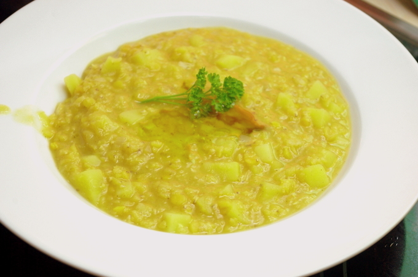

Tja, das war eine leckere und relativ schnelle Suppe aus roten Linsen mit Kartoffelwürfeln und für den marokkanischen Touch etwas Zimt; ist schon eine Weile her, aber ich glaube sogar, dass ich das Rezept selbst entwickelt habe, nachdem ich ein bisschen in meinem marokkanischen Kochbuch geblättert habe, was man da so isst und kombiniert. Ich glaube die Kartoffeln sind aber nicht original.

## Zutaten

für 4 Portionen

- 1 **Zwiebel** gewürfelt
- 250 g **rote Linsen**
- 2 große **Kartoffeln**, klein gewürfelt
- 2 große **Knoblauch**zehen
- **Wasser**
- **Salz, Zucker, Zimt, Zitronensaft, Olivenöl**

## Zubereitung

1. **Zwiebel** anbraten in **Olivenöl**, **Linsen** dazu und genug Wasser, um alles ungefähr zu bedecken. Dann Salz, **Kartoffelwürfel** und **Knoblauch** (gepresst oder gewürfelt) dazugeben.
2. Garen bis die Kartoffeln durch sind. Wenn nötig etwas Wasser nachgiessen, um die gewünschte Konsistenz zu bekommen.
3. Würzen mit Zucker, Zitronensaft, etwas **Zimt**. Ich habe auf dem Teller noch etwas **Olivenöl** draufgegossen.
