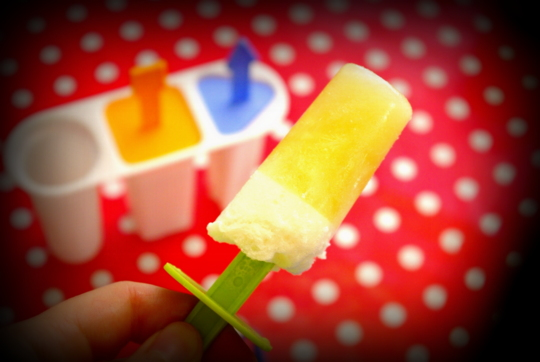

Kürzlich zur Fußball-EM hat Erich Eggimann vom Eis-Blog [www.eis-machen.de](http://www.eis-machen.de/) ein [Rezept für ein Biersorbet](http://www.eis-machen.de/2012/06/eis-rezept-bier-sorbet-mit-oder-ohne-eismaschine/) gepostet, das ich interessant fand. Ich habe mich und dann auch gleich ihn selber gefragt, ob man das auch mit alkoholfreiem Bier zubereiten kann (schmeckt uns meistens besser als das mit Alkohol), und er antwortete auch ganz prompt, dass das bestimmt ginge.

Ein wenig Zeit verging, in der wird das Biereis fast vergessen hatten; aber dann fiel es mir wieder ein, und da ich mich quasi verpflichtet fühlte, das Rezept nun auch mit dem besagten "vegetarischen" Bier, wie wir gerne sagen, mal auszuprobieren, - wo er sich die Mühe gemacht hatte-, haben wir es endlich mal gemacht. Die Gelegenheit war günstig, als wir letztes Wochenende von den Organisatoren unseres [Brettspieletreffs](http://spieletreff-neuwied.de) eingeladen waren; das Biersorbet haben wir als Gastmitbringsel dabeigehabt. Was nicht in die Eismaschine passte, haben wir in eine **Stieleisform** gegossen und später zu Hause verspeist.

Das Ergebnis sieht man unten: Bier am Stiel!

Insgesamt gefällt es uns in dieser Form fast besser als in Eiskugeln, denn hier hat man noch den "Schaum" obendrauf/untendran, so dass das Stieleis fast wie ein Glas Bier aussieht; süß.

Der Geschmack ist wie ein gefrorenes Radler und sehr erfrischend, das kommt sicher durch Limettensaft und Zucker. Mit unserem alkoholfreiem Hefeweizen war es uns schon fast etwas zu süß mit der angegebenen Zucker- und Limettensaftmenge. Das nächste Mal werde ich auf jeden Fall mal ein herberes Bier (der Autor empfiehlt Guinness), auch mit Alkohol, probieren und/oder den Zucker reduzieren bzw. mehr Limettensaft nehmen.

Trotzdem ein sehr leckeres Sorbet und Eis, danke Herr Eggimann für Rezept und Tipps!
