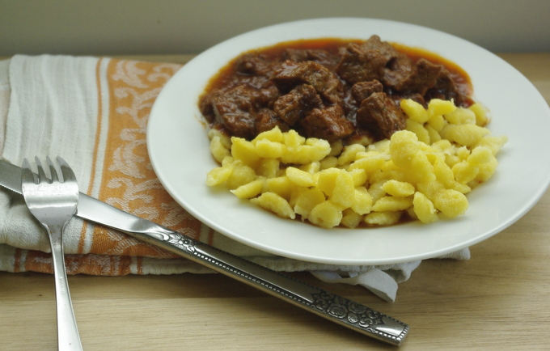

Heute habe ich endlich Gelegenheit, mein schon oft erprobtes Gulaschrezept zu verewigen. Der in Ungarn eigentlich **Pörkölt** heißt, "Gulasch" ist nämlich eigentlich eine Suppe. Die nichtvegetarische Vorlage kommt wie so oft [vom Chefkoch](http://www.chefkoch.de/rezepte/736011176204394/Ungarischer-Gulasch-Poerkoelt.html). Ich habe natürlich wie immer einige Änderungen vorgenommen; zB Zimt hinzugefügt und das Tomatenmark nochmal kräftig mit angebraten, das ist gut für die Röststoffe. Das Ergebnis ist wirklich sehr sehr köstlich, allein beim Abschmecken der Soße muss ich immer öfter als eigentlich nötig probieren, hmmmm. Wirklich eine gelungene Vegetarisierung.

Für dieses Rezept braucht man Seitan, den man am besten aus **Glutenmehl** selber macht (dann kann man nämlich trockene Gewürze gleich mit einkneten). Die Anleitung dafür poste ich demnächst auch noch mal. Bis dahin könnt ihr es ja alternativ auch mit extrudiertem **Sojaproteinwürfeln** machen, das sollte nämlich auch gehen. Dann aber vorher mit Brühe einweichen.

Ok, ich schätze, das Rezept könnte man wohl auch 1:1 mit Fleisch kochen, aber dafür übernehme ich keine Verantwortung.

## Zutaten

für etwa 6 Portionen; etwas Zeit kostet das: 2,5 Stunden etwa, dafür muss man ein paar Tage nicht mehr kochen, weil man so oft davon essen kann ;)

- 500 g **Seitan**, in Würfel geschnitten, aber noch nicht gegart (also ungedämpft, ungebacken, ungekocht, nur der rohe Teig – gewürzt mit Paprika, Knoblauchpulver, Zwiebelpulver, Sojasauce) – alternativ extrudierte **Sojafleischwürfel** oder -schnetzel, mit heißer Brühe eingeweicht
- 1 TL **Salz**
- 2 **Zwiebeln**
- 5 **Knoblauch**zehen
- 100 g **Tomatenmark** (das ist eine halbe Tube)
- 1 TL Instant-**Gemüsebrühpulver** oder 1 EL selbstgemachte **Gemüsebrühpaste**
- 1 Liter **Wasser**
- 1 TL **Paprikapulver** edelsüß
- 1 Prise Chilipulver oder Cayennepfeffer oder rosenscharfer Paprika oder [scharfe Soße](/posts/2012/06/2-miniprojekte-eistee-mit-sirup-und-scharfe-sose/)
- 1 EL **Kümmel** oder **Kreuzkümmel** (gemahlen; ich nehme eine Mischung aus beiden Kümmelarten)
- 1 Prise **Zimt**
- **Salz**
- **Zitronensaft** oder Limettensaft
- neutrales **Öl** (ich nehme Sonnenblumenöl)

　

## Zubereitung　

1. **Zwiebeln** und **Knoblauch** klein hacken.

2. 1 Stunde marinieren:

Den rohen, gewürzten **Seitanteig** in kleine Stücke von ca. 1,5 x 1,5 cm schneiden (ja, die wachsen noch). Mit **Zwiebeln, Knoblauch und 1 EL Zitronensaft** in einem großen Topf vermischen (ich habe auch schon Limettensaft genommen). Mit geschlossenem Deckel mindestens 1 Stunde marinieren lassen.

3. 25 Minuten braten mit Tomatenmark:

Nach dem Durchziehen richtig ordentlich **Sonnenblumenöl** (3 Esslöffel oder noch mehr; im Seitan ist ja im Gegensatz zum Fleisch kaum Fett!) in den Topf gießen, unterrühren und unter Rühren bei großer Hitze braun anbraten, aber nicht anbrennen lassen. Hitze etwas runterdrehen auf die Hälfte oder 2/3, die 100g **Tomatenmark** hinzufügen, und noch weitere 15 Minuten weiterbraten, dabei immer schön rühren, damit nichts anbrennt. Falls es doch droht anzubrennen, immer ein bisschen **Wasser** aufgiessen.

4. Würzen und 1 Stunde köcheln:

Jetzt etwa einen halben Liter **Wasser** in den Topf aufgießen, den **Kümmel** und 1 EL **Gemüsebrühpaste** (selbstgemacht) oder 1 TL Instant-Gemüsebrühpulver, 1 TL **Paprika edelsüß**, eine Prise Paprika rosenscharf oder entsprechende Menge [selbstgemachte scharfe Soße](/posts/2012/06/2-miniprojekte-eistee-mit-sirup-und-scharfe-sose/) und eine Prise **Zimt** zugeben, gut umrühren und bei geringer Hitze mindestens eine Stunde weiterkochen lassen. Wenn das **Wasser** verkocht, immer wieder ein bisschen **nachgießen** (insgesamt muss wohl noch ein halber Liter Wasser nach und nach dazu), damit die Soße sämig bleibt und nicht zu trocken wird. Ich habe an dieser Stelle nochmal mit **Zucker** nachgewürzt, aber das muss man selber probieren.

5. Mit Spätzle, Knöpfle oder Knödeln servieren.

6. Aufgewärmt schmeckt der Gulasch noch besser!
