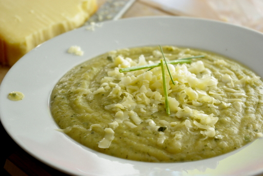

Zucchini, Zucchini, wohin nur immer damit? Ich habe mal, wie schon damals überlegt, die [Brokkolisuppe von neulich](http://apfeleimer.wordpress.com/2012/07/15/brokkolisuppe-mit-kase-und-geriebenen-kartoffeln/ "Brokkolisuppe mit Käse und geriebenen Kartoffeln") **statt mit Brokkoli mit Zucchini** gemacht. Ich habe das Gemüse aber nicht wie dort in Brühe gekocht, sondern Zucchini und Kartoffeln nacheinander abgebraten, dann die Kartoffeln mit Wasser bedeckt fast fertig gegart und dann die gebratenen Zucchini dazugegeben und zu Ende gegart. Oh, und geraspelt habe ich die Kartoffeln diesmal nicht, das ist viel zu viel Arbeit. Stattdessen habe ich sie von meinem **persönlichen Kartoffelassistenten** (Apfel) kleinwürfeln lassen, das ergibt auch viel Oberfläche, auf der sich Röststoffe bilden können.

(Ich bin nämlich **allergisch** auf rohe Kartoffeln; nein, wirklich, das ist eine Kreuzallergie, wenn man Heuschnupfen hat.)
