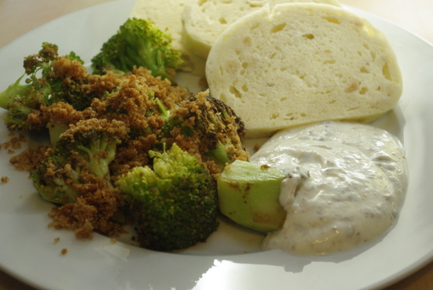

Was man hier sieht ist einfach scharf angebratener Brokkoli mit gerösteten Semmelbröseln und dazu Knödelscheiben. Der Dipp ist der eigentliche Star.

Der ist nämlich an den [römischen Moretum-Käse](http://de.wikipedia.org/wiki/Moretum) angelehnt.

Moretum habe ich das erste Mal auf einer Römerveranstaltung auf der Festung Ehrenbreitstein probiert, dort war hauptsächlich **Knoblauch, Sellerie und Essig** dran, dem Geschmack nach, daher mach ich das jetzt selbst auch so. Laut der Quelle (ein Gedicht von Vergil) gehören zusätzlich noch andere Kräuter hinein, die aber sowieso nicht so einfach zu bekommen sind – z. B. Weinraute. Koriander habe ich zwar da, aber vergessen reinzutun und es schmeckt trotzdem. Wer mag, tut also noch **Koriander** hinein (die Blätter, nehme ich an, nicht die Samen). Ich habe statt Knoblauch und Sellerie übrigens meine Gemüsebrühpaste genommen, die dieses Mal ziemlich stark nach genau diesen beiden Sachen schmeckt.

## Zutaten

für 4 Portionen Dipp

- 250g Quark
- 250g Joghurt
- ordentlich Sellerie feingehackt (ich hebe mir immer die Blätter von Knollensellerie oder auch Stangensellerie auf, man kann aber bestimmt auch was von der Wurzelknolle verwenden)
- 2 Zehen Knoblauch feingehackt oder gepresst
- 1 EL Essig
- 1 TL Zucker
- 1 EL Olivenöl
 
## Zubereitung

Alles verrühren. Fertig!
