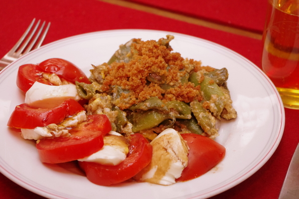

Grüne Bohnen mit Rührei, dazu Caprese-Salat (Tomatenscheiben mit Mozzarella).

Wir haben am Wochenende die grünen Bohnen in Apfels elterlichem Garten geerntet und brauchten eine Verwendung dafür. Da wir ja erst neulich den [türkischen Bohnentopf](posts/2012/08/turkischer-bohnen-tomateneintopf-yesil-fasulye/ "Türkischer Bohnen-Tomateneintopf (Yesil-Fasulye)") hatten, wollte ich diesmal was neues ausprobieren und fand bei Chefkoch dieses [Hüttenbohnen-Rezept](http://www.chefkoch.de/rezepte/1771011287077167/Gruene-Huettenbohnen-mit-Ei.html). Natürlich habe ich es etwas optimiert, denn ursprünglich gehören **Dosenbohnen** hinein und die Semmelbrösel kommen in der Pfanne in das Bohnen-Eier-Gemisch. Das stelle ich mir lätschig vor. Ich habe die Brösel getrennt gelassen und erst beim Servieren draufgestreut, so kann man es auch besser **aufwärmen** und hat trotzdem noch relativ knusprige Brösel.

## Zutaten

für 4 Portionen (als Beilage zu zB Kartoffeln oder Tomatensalat)

- 600g Bohnen (grüne Schnittbohnen)
- 6 Ei
- 6 EL Semmelbrösel
- 6 EL Butter
- Salz und Pfeffer
- etwas Bohnenkraut

## Zubereitung

1. **Bohnen** waschen und putzen (wenn nötig die Fäden entfernen) und in 2-3 cm lange Stücke schneiden.
2. Bohnen in der Hälfte der **Butter** (3EL) in einer Pfanne schön braun anbraten und dann den Deckel drauf und fertiggaren lassen, bis sie zart sind.
3. Mit **Bohnenkraut**, Salz und Pfeffer abschmecken.
4. Jetzt die **Eier** darüber geben und gut durchrühren, bis die Eier gar, aber noch nicht trocken sind.
5. Inzwischen die **Semmelbrösel** in einer Pfanne mit den restlichen 3 EL **Butter** braun braten, dann mit Salz und Pfeffer abschmecken.
6. Eier-Bohnen auf den Teller geben und mit den **Bröseln** bestreuen.
