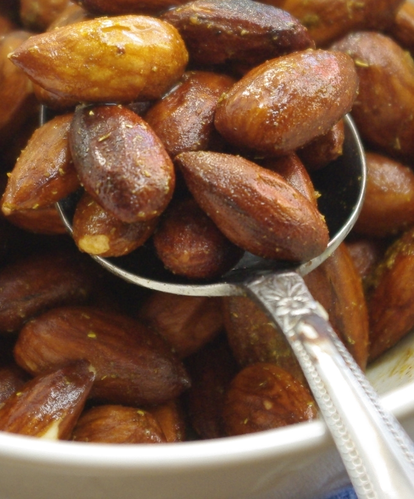
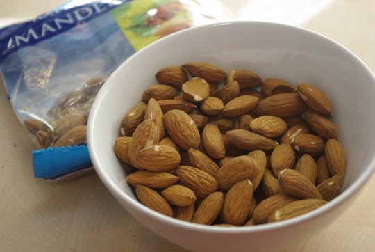

Bei den Discountern gibt es ja immer mal wieder die ethnischen Wochen, und immer wieder sehe ich dort verführerische **geröstete Snackmandeln in Dosen mit unterschiedlichen Gewürzen**. Mal sind sie griechisch, mal spanisch, mal amerikanisch. Klingt lecker, ist aber immer auch locker mal doppelt so teuer wie die normalen Mandeln im Beutel zum Backen im Nachbarregal. Als Beinahe-Schwäbin mache ich bei diesem Wucherspiel natürlich nicht mit. Selbermachen ist angesagt – aus den besagten **Mandeln aus dem Backsortiment** natürlich! Weil ich zu faul zum Spülen von Pfannen bin, mache ich das ganze **nicht auf dem Herd**, was sicherlich auch ginge, sondern schon jahrelang in einer Schüssel in der Mikrowelle. Aus der kann man die Mandeln dann gleich essen. Yeah!

Diese gerösteten Mandeln passen übrigens hervorragend auch als Zutat in anderen Gerichten, zum Beispiel zu **Brokkoli** (besonders gut im [Brokkolisalat](/posts/2012/05/brokkoli-nudelsalat/)) oder vielleicht auch Lauch. Wir haben damit letztens einen faden Lauchsalat gerade noch so gerettet.

## Zutaten

für 2 Naschende

- 100g Mandeln (das ist eine halbe Tüte Mandeln, man kann natürlich auch verdoppeln, braucht dann aber eine größere Schüssel, mehr Mitesser und sicher auch mehr Zeit in der Mikrowelle)
- 1/4 bis 1/2 TL Salz (oder, auch delikat: Rauchsalz – für Röstmandeln mit Räuchergeschmack)
- 1-2 EL Wasser
- Später: etwas Curry oder andere beliebige Gewürze, Knoblauchpulver, 1/2 TL Zucker
- evtl. 1/2 TL Öl

## Zubereitung

1. **Mandeln** mit **Wasser** und Salz gut vermischen. Das **Salz** soll sich im Wasser auflösen, damit es schön an den Mandeln haftet; wenn man es hinterher rangibt, ist es zu grob und verteilt sich nicht so gut.
2. Die so gewürzten Mandeln in einer kleinen Keramik- oder Glasschüssel **2 Minuten in der Mikrowelle** bei voller Leistung garen. **Umrühren**. **Nochmal** 2 Minuten weitergaren. Normalerweise sollten sie jetzt durch sein, aber vorsichtshalber sollte man sie probieren – Achtung, heiß! Wenn sie noch roh schmecken, nochmal in 1-Minuten-Intervallen weiterrösten. Ich schmecke, wenn sie noch roh sind am Kribbeln im Mund – ich bin allergisch auf rohe Mandeln und Nüsse (Kreuzallergie vom Heuschnupfen). Alle anderen müssen mit dem Geschmackssinn urteilen: wem es schon "geröstet" genug schmeckt, der hört auf, **sonst wieder in die Mikrowelle** damit.
3. Jetzt etwas **Öl, Gewürze und Zucker** einrühren (Gewürze und Zucker erst jetzt, weil sie sonst in der Mikrowelle verbrennen würden, das Öl, damit die Gewürze gut haften und weil es so besser schmeckt). Achtung, wenn man direkt nach dem Herausnehmen aus der Mikrowell das Öl einrührt, zischt es ordentlich.
4. Außerdem ist jetzt alles **sehr heiß**. Vor dem Essen erst mal ein paar Minuten abkühlen lassen.
