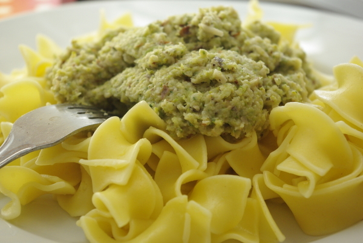

Diesmal zum gestrigen Nudeldienstag musste **Brokkoli** weg. Aber es war doch auch Nudeldienstag? Was tun? Passt ja eigentlich nicht so zusammen. Ich habe schon Brokkoli in Röschen in den Nudeln probiert, und das hat mich nicht umgehauen, ich mag lieber Soße überall, nicht grobe Brocken an einigen Stellen. Da fiel mir ein, dass ich ja vor geraumer Zeit eine Art Brokkolipesto gemacht hatte, das ganz gut war. Damals noch mit Sonnenblumenkernen.

Inzwischen habe ich die Erfahrung gemacht, dass **Mandeln** besonders gut zu Brokkoli passen. Und schon hatte ich mein Nudelrezept! Ich habe die Mandeln diesmal nicht, wie neulich gebloggt, in der Mikrowelle geröstet, sondern auf dem Herd in Öl, auch nicht schlecht. Aber währenddessen weglaufen und etwas anderes machen ist, im Gegensatz zur Mikrowellenröstung, nicht drin. Habe ich festgestellt. Ähem.

Wir haben uns übrigens entschieden, auch an den Dienstagen, an denen wir nicht für unseren Spieletreff ausgehen, einen **"Spieletreff zu Hause"** zu veranstalten, vorzugsweise **mit 2-Personen-Spielen**. Unser erstes Spiel war **"[Ballon Cup](http://www.superfred.de/balloncup.html)"**. Das Spiel ist ziemlich gut und war sogar vor Jahren auf der Empfehlungsliste zum Spiel des Jahres. Es gefiel uns so gut, dass wir gleich eine zweite Partie drangehängt haben. Leider ist es nicht mehr im Handel, so dass wir mit einer **selbstgebastelten Version** spielen. Man kann die Karten von ["Sticheln"](http://www.michas-spielmitmir.de/spieletests.php?id=sticheln) nämlich für ganz schön viele gute Kartenspiele verwenden, unter anderem das ebenfalls sehr gute und in Deutschland ausverkaufte "[Schottentotten](http://sunsite.informatik.rwth-aachen.de/cgi-bin/luding/GameData.py?f=00w^E4X&gameid=9723)". Um ehrlich zu sein haben wir Sticheln selber noch nie gespielt und es nur für diesen Raubkopier-, äh Abandonware-Zweck angeschafft.

## Zutaten

für 4-5 Portionen

- 500g Brokkoli
- 2 Zehen Knoblauch
- 100g Mandeln
- 1 Handvoll Kräuter (ich habe Petersilie und Basilikum vom Balkongarten genommen)
- Salz
- Balsamicoessig
- Zucker
- Pfeffer
- 50-100g Käse (ich habe einen Rest Gouda benutzt, aber Parmesan ist sicher auch fein)
- 1 EL Olivenöl

## Zubereitung

1. **Brokkoli** waschen, Röschen zerteilen, Strunk schälen und in Stücke zerschneiden. Alle Stücke in etwas Wasser 5 Minuten **garen** (der Brokkoli sollte nicht mehr roh, aber noch leuchtend grün sein).
2. Währenddessen die **Mandeln rösten**, entweder [in der Mikrowelle wie ich es hier schonmal beschrieben habe](http://apfeleimer.wordpress.com/2012/08/08/mikrowellengerostete-salzmandeln/ "Mikrowellengeröstete Salzmandeln") (dann aber ohne Salz und Gewürze) oder einfach mit etwas Öl in Topf oder Pfanne, das habe ich diesmal so gemacht, weil ich für die Nudeln sowieso einen Topf brauchte. Die Mandeln kann man jetzt schnell noch in den Topf mit dem Brokkoli werfen und mitgaren, dann lassen sie sich etwas leichter pürieren.
3. **Kräuter, Käse, Knoblauch, Mandeln, dann Brokkoli** und etwas vom Brokkolikochwasser (in dieser Reihenfolge) in ein hohes Gefäß (hoher kleiner Topf oder Schüssel) füllen und mit dem Pürierstab zerkleinern. Bei Bedarf noch etwas vom Brokkolikochwasser dazugeben, damit das Pürieren leichter geht.
4. **Mit Salz, Pfeffer und Balsamicoessig** würzen, wer mag kann wie ich noch etwas Zucker dazugeben. Oder noch etwas Olivenöl.
