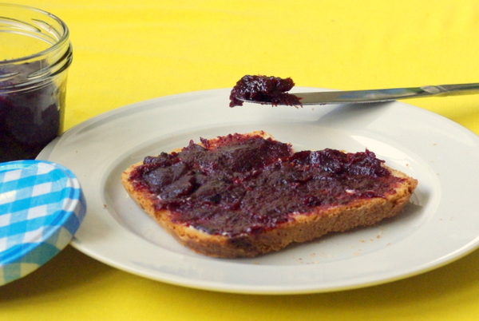

Am Wochenende habe ich erste Pflaumen geerntet und gleich Pflaumenmus daraus gekocht. Die eigentlichen länglichen Pflaumen haben für eine vernünftige Menge Mus nicht genug hergegeben, daher habe ich noch "Saupflaumen" dazugenommen, eine kleine runde Sorte, die gerade richtig reif und süß ist. Leider löst sich bei denen das Fruchtfleisch sehr schwer vom Kern, vielleicht wurden sie deswegen früher lieber den Schweinen gegeben; das Entkernen von Hand war ziemlich mühsam.

Das [Rezept fürs Pflaumenmus (von Chefkoch.de abgewandelt)](http://www.chefkoch.de/rezepte/324361114537236/Pflaumenmus.html) ist für den Backofen und ohne Gelierzucker, das Mus wird einfach lange genug eingekocht. Langes Garen soll auch bei Pflaumen gut sein, wohl für die "stimmungsbeeinflussenden Inhaltsstoffe", [wie Udo Pollmer vermutet](http://www.dradio.de/dkultur/sendungen/mahlzeit/1032362/ "dradio-Mahlzeit Abschrift über Pflaumen"). Egal warum, das Mus schmeckt, ich mache das schon seit einigen Jahren nach diesem Rezept.

## Zutaten

für ca. 6 Gläser Pflaumenmus

- 3 kg reife Pflaumen
- 2-4 Pflaumenkerne
- 500 g Zucker (optional: teilweise braunen Zucker nehmen)
- 1 TL Zimt
- 5 gemörserte Nelken
- wer einen Walnussbaum hat: eine grüne Walnuss

## Zubereitung

1. **Pflaumen** waschen und entsteinen. 2-4 **Kerne** aufheben.
2. Entsteinte **Pflaumen**, den **Zucker, Nelken und Zimt** vermischen und alles zusammen in ein tiefes Backblech oder einen Bräter oder Lasagneform oder ähnliches geben.
3. Dort jetzt und **2-3 Stunden Saft ziehen lassen** oder aber in einem Topf auf dem Herd aufkochen, um das gleiche Ergebnis zu erzielen. Geht schneller.
4. Dann bei 180 Grad im **Backofen** (bei Umluft 160 Grad) etwa **2 Stunden** einkochen lassen, zusammen mit den aufgehobenen **Kernen** und der grünen **Walnuss** (die ist aber optional und soll Geschmack und Farbe verbessern, aber ich mache es fast immer ohne, schmeckt trotzdem). Immer mal wieder, vielleicht alle halbe Stunde, Ofentür öffnen um die angesammelte **Feuchtigkeit abdampfen** zu lassen.
5. Aus dem Backofen nehmen, Kerne raussammeln, die Walnuss, wenn verwendet, herausnehmen (die grüne Schale sollte sich im Ofen aufgelöst haben und nur noch die eigentliche Nuss in der Nussschale soll übrigbleiben – was bei mir aber nicht der Fall war!), in einen großen, hohen Topf füllen und mit dem Stabmixer **pürieren**, dann nochmal **aufkochen**.
6. Sofort in mit kochendem Wasser ausgespülte Gläser mit Twist-Off-Deckel **füllen**. Deckel drauf und Gläser auf dem Kopf stehend abkühlen lassen.
