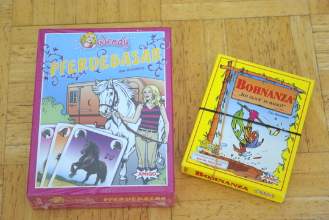
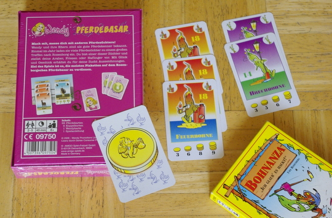

Zu allererst: Schnell schnell, solange es das noch gibt - bei Müller gibt es das Kartenspiel Wendy Pferdebasar im **Abverkauf für 2 Euro**. Es lohnt sich!

Denn Wendy Pferdebasar **ist Bohnanza** mit anderem Thema. Man sammelt Pferde zum Ausstellen, statt gewöhnungsbedürftig aussehende nur halbwitzige Bohnen bei Bohnanza. Besonders, wenn man **kleine Nichten** hat, die auf Pferde stehen, eine gute Investition.

Jetzt fragen sich wahrscheinlich viele, was überhaupt Bohnanza ist. Das haben [andere schon besser erklärt](http://de.wikipedia.org/wiki/Bohnanza), deshalb nur **kurz zusammengefasst**: das ist ... super! Man sammelt und handelt mit Bohnen, die man dann anbaut und später erntet, um Punkte, bzw. Bohnentaler zu erhalten. Besonders das **Handeln und Tauschen** macht den Reiz des Spiels aus, es ist ähnlich wie das Handeln mit den Rohstoffen bei den Siedlern von Catan und sehr kommunikativ. Schenken kann man übrigens auch, wenn man Karten nicht gebrauchen kann und ein anderer sie nehmen würde, aber nicht so sehr will, dass er was dafür bezahlt; oder aber er nichts zum Tauschen hat.

Das Standard-Bohnanza ohne Erweiterung geht für 3-5 Spieler, mit Erweiterung können 7 mitspielen. Das gute an **Wendy** mit ihren Pferden ist: es ist auch eine **Variante für 2 Spieler** enthalten. Außerdem kann man es schon mit 8 Jahren spielen; Bohnanza komischerweise erst ab 12.

Hier unten sieht man mal **die beiden im Vergleich**: rechts angebaute Bohnen auf zwei Bohnenfeldern, links die entsprechenden Pferde auf den beiden Koppeln (Bild auf dem Karton). Ich habe meinen Pferdebasar noch nicht ausgepackt, denn ich will ihn an ein pferdebegeistertes Kind aus der Familie verschenken, pssst. Da meine N..., äh, das Kind natürlich schlauer ist als alle anderen Kinder (genau wie jedes Kind), kriegt es das Spiel schon mit 7 Jahren, obwohl es erst ab 8 erlaubt ist. Ätsch!

Unten in der Mitte sieht man noch einen **Bohnentaler** und das Gegenstück auf der Schachtel, den Huftaler in gleich dreifacher Ausfertigung (da hat jemand mächtig abgeräumt, hoho).

Wie man sieht, sind die **Bohnenbilder Geschmackssache**. Mir gefallen sie nicht, und besonders witzig finde ich sie auch nicht. Pferde sind zwar auch nicht jedermanns Sache, aber ich finde sie viel besser als pseudowitzige Bohnen.

Ein Super-Deal bei Müller also. Jedoch würde ich den Pferdebasar nicht zum vollen Preis kaufen (wie bei einigen Onlinehändlern zu finden), denn da ist er teurer als das normale Bohnanza - fast doppelt so teuer. So schlimm sind die Bohnen dann auch wieder nicht. **Bohnanza kostet normalerweise zwischen 6 und 8 Euro**. (Falls jemand lieber Bohnen mag als Pferde, auch wenn ich mir das überhaupt nicht vorstellen kann.)
