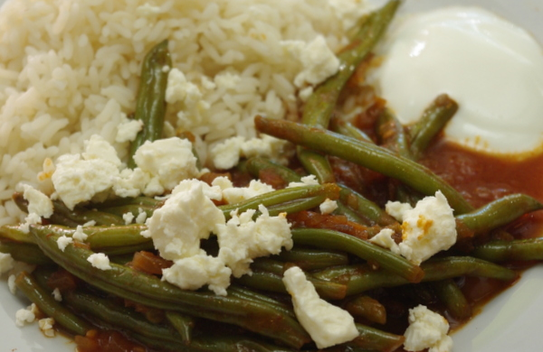

Heute mal ein türkisches Gericht, das ich auf [Chefkoch.de gefunden](http://www.chefkoch.de/rezepte/873721192711301/Yesil-Fasulye.html) habe. Wie immer habe ich es etwas abgeändert, diesmal, indem ich hauptsächlich die ganzen guten Vorschläge der Kommentatoren eingearbeitet habe.

Viele lassen das Fleisch ganz weg, das passt mir natürlich gut, so ist es **von alleine ein vegetarisches Gericht** geworden. Man kann aber auch Seitan oder Sojafleisch verwenden, wenn man nicht auf die Fleischtextur verzichten möchte. Auch fügen viele noch **Tomatenmark** hinzu, damit es sämiger und schön rot wird. Ich kann mir vorstellen, dass es besser schmeckt und auch gesünder ist, denn habe schon oft gehört, dass Tomaten am besten lange geköchtelt werden sollen und dadurch die Nährstoffe viel besser aufgenommen werden können (bzw die Pflanzenabwehrstoffe durch langes Garen neutralisiert werden). Je länger Tomaten gekocht werden, desto besser, sagt man. Jedenfalls ist Tomatenmark ja auch gegart, denke ich, allein schon, um es so zu konzentrieren, wie es auf der Tube steht. Also: Tomatenmark dazu: schmeckt und tut besser.

Zumal ich gerne meine **eigenen Tomaten vom Balkon** verwenden wollte, und die waren etwas klein. Hier sieht man sie, zum Größenverständnis, auf einer Untertasse:

Zusätzlich habe ich auch noch ein paar **Gewürze** hinzugefügt, die die anderen auch verwenden und die ich passend finde: Paprikapulver und scharfe Soße. Gebraten habe ich in **Olivenöl**, das kommt mir passender vor als die ursprünglich angegebenen Butter. Als Beilage haben wir **Reis** gegegessen, aber Fladenbrot passt bestimmt auch gut. Dazu gab es **Joghurt**. Zu guter Letzt habe ich auf Empfehlung eines Kommentators noch **Fetakäse** drauf gestreut, auch wenn das wohl nicht echt türkisch ist.

## Zutaten

für 4 Portionen

- 500 g grüne Bohnen
- 1 Zwiebel
- 2 Tomaten
- 1 Tasse Wasser
- Salz
- Olivenöl
- 2-3 EL Tomatenmark
- Paprika edelsüß
- Paprika rosenscharf (oder scharfe Soße)
- optional: etwas Knoblauch
- optional: 1 EL Sojahack, Seitanhack, oder Seitan, klein gewürfelt

Zubereitung

1. **Zwiebel** feinhacken und in **Olivenöl** bräunen. Wer Hack oder Seitanwürfel verwendet, gibt sie jetzt dazu und brät sie mit. Weiterbraten, bis alle Flüssigkeit verschunden ist.
2. **Tomaten** in kleine Würfel schneiden und **Bohnen** putzen.
3. **Bohnen** und Salz dazugeben und leicht abbraten.
4. **Tomatenmark** dazugeben und ebenfalls anrösten.
5. **Tomatenwürfel** und Paprikapulver dazugeben
6. Auf niedriger Stufe langsam dünsten bis die Bohnen gar sind; das dauerte bei mir etwa 10 Minuten. Wenn zwischendurch die Flüssigkeit verdunstet ist, immer mal wieder etwas **Wasser** dazugießen.
7. Mit Salz, Paprika und scharfer Soße **abschmecken**. Ich habe noch etwas **Knoblauch**granulat eingerührt.
