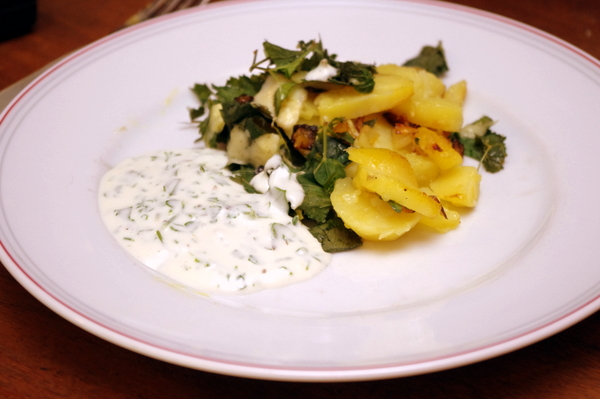
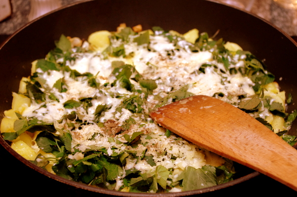

 

Heute gab es mal wieder das [Giersch-Rösti von Ostern](http://apfeleimer.wordpress.com/2012/04/11/giersch-kartoffel-rosti-ohne-bild/ "Giersch-Kartoffel-Rösti") (Rezept siehe dort), und diesmal habe ich sogar Bilder gemacht. Oben auf dem Teller, unten in der Pfanne beim Käseschmelzen. Dazu gab es eine Knoblauch-Mayonnaisesoße mit frischer Volgelmiere. Übrigens sollte man Vogelmiere immer ganz frisch verwenden und nicht in der Soße stehenlassen.

 

 

