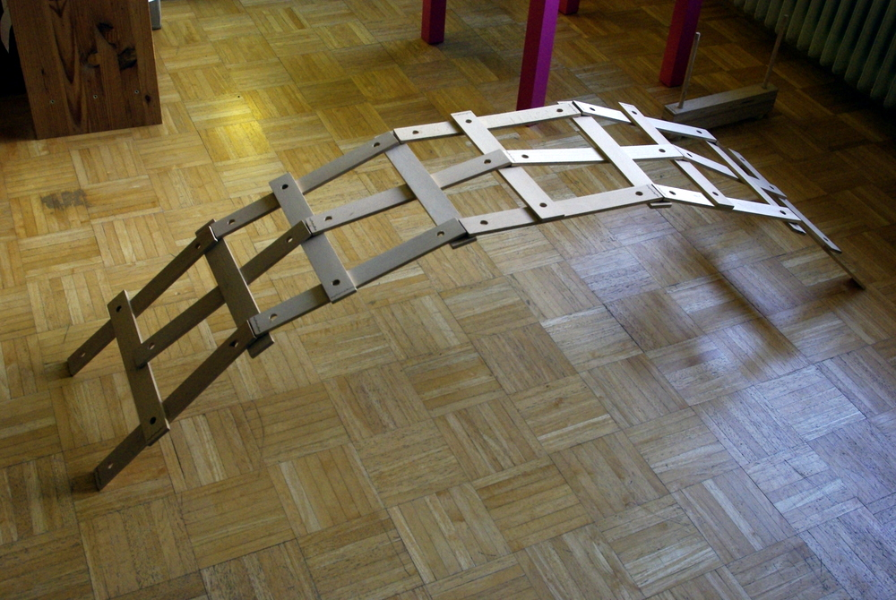

Ok, ich löse [das Rätsel](http://apfeleimer.wordpress.com/2012/09/07/ratsel-der-woche-was-ist-das-mitmachen-kommentieren-los/ "Rätsel der Woche: Was ist das? Mitmachen! Kommentieren! Los!") auf, damit ich auch endlich mal wieder über Essen schreiben kann ;). Ich merke schon, es ist nicht jeder so ein eifriger Googler wie ich.

Es ist eine [Leonardo-Brücke](http://de.wikipedia.org/wiki/Leonardo-Br%C3%BCcke "Die LEonardobrücke bei Wikipedia"). **Leonardo da Vinci** hat sie erfunden; eine Brücke, die ganz ohne Schrauben und Nägel oder Gurte hält, einfach durch Zusammenstecken der Latten. Wie man sieht, habe ich es auch allein fast komplett aufgebaut. Nach der nächsten Latte brach die Brücke zusammen, weil man beim Aufbauen von der Seite drankommt und alles verrutscht. Zu zweit ist es sicher einfacher.

\[caption id="attachment\_826" align="alignnone" width="540"\] Leonardobrücke\[/caption\]
