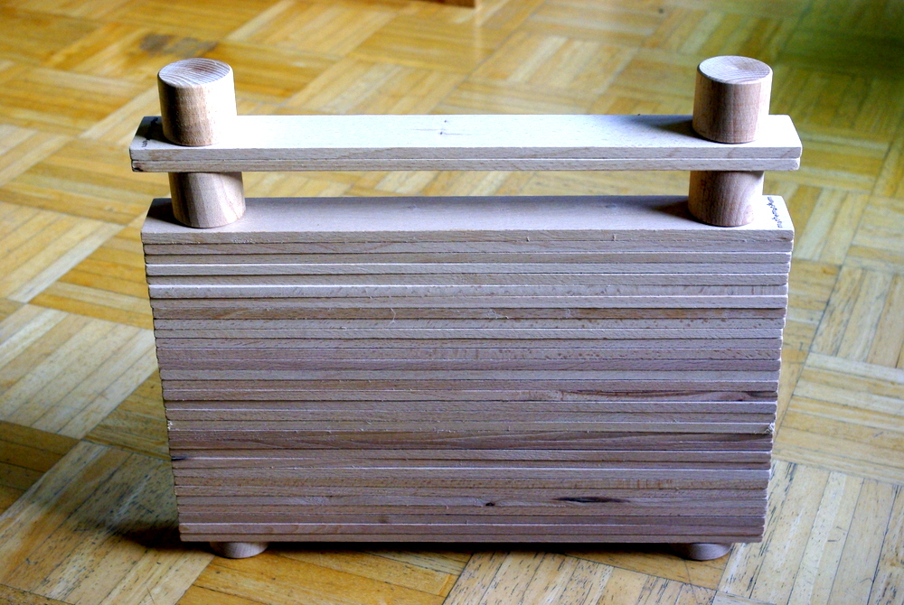
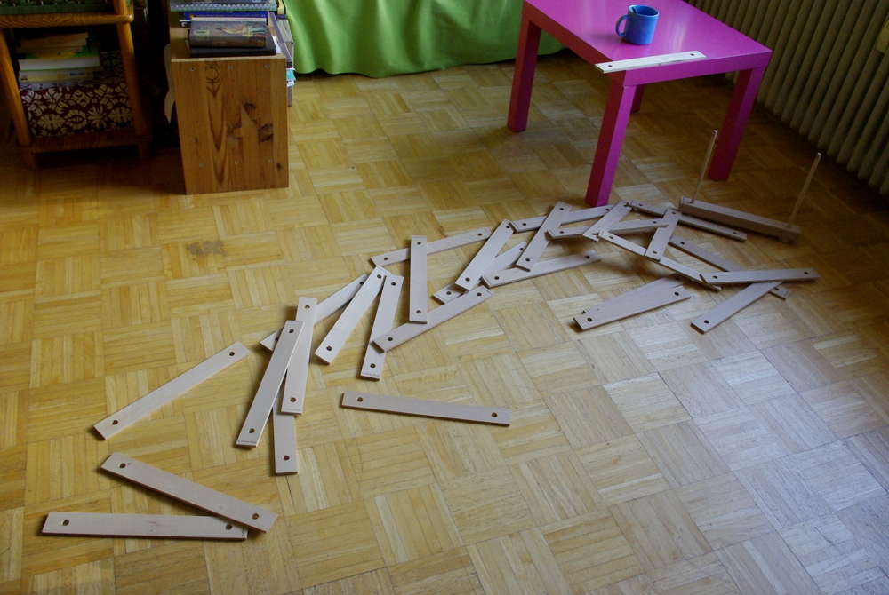

Ich habe gewonnen!

Kürzlich gab es in unserem innerstädtischen Einkaufszentrum eine interaktive Ausstellung zum Thema [Tüfteln und Knobeln](http://www.tueftelnundknobeln.de/). Sehr schön gemacht übrigens, wir haben auch wunderbar mit einem Fremden bei einer [gespiegelten Finde-den-Fehler-Aufgabe](http://www.euroscience.de/tuefteln-und-knobeln/exponate/grossexponate-smart-boards/spiele "Original und Fälschung mit Spiegelung") an einer Art modernen Beamer-Tafel (Lehrer kennen sie wohl als "Whiteboard") kooperiert. Brachte also auch die Menschen vorbildlich zusammen. (Herr Spitzer hat also nicht recht, wenn er diese Whiteboards für Verdummer hält, im Gegenteil, sie fördern **Teamwork**. Und das ist ja auch schlau heutzutage.)

Und am Ende gab es sogar noch eine **Verlosung**, bei der man etwas unbekanntes gewinnen konnte. Wer mich kennt, weiß: da muss ich mitmachen - und alle meine Verwandten auch. Leider habe ich keine Haustiere. (Ich scherze, diesmal habe ich wirklich nur für mich ... und Apfel und **EIN** weiteres Familienmitglied mitgemacht). Zum Glück hat derjenige nicht gewonnen, den Gewinn musste man nämlich persönlich abholen und derjenige wohnt gar nicht in der Nähe. Ich selbst, die auch tatsächlich die Aufgaben gelöst hat, habe **gewonnen**, unter meinem eigenen Namen. Puh, nochmal Glück gehabt.

Jedenfalls gab es drei Aufgaben: ein Code war zu lösen ("Viel Erfolg!" war die Lösung), ein Sudoku mit Zeichen statt Zahlen und eine Schätzaufgabe (es waren wohl wirklich um die **5.000 Smarties**). Ich habe alle richtig beantwortet und hatte letzte Woche einen höchstoffiziellen Brief im Kasten, komplett mit Füllfederhalter-Unterschrift des Center-Managers. Echte Tinte, nicht ausgedruckt! (Nicht so wie ihre täuschend echt aufgedruckte Füllerunterschrift im Dankesbrief zur Dreck-Weg-Aktion letztens, Frau Bürgermeisterin!). Mann war das spannend. Auch hier **wieder keine Nennung des gewonnenen Gegenstands**. Wohl kein Gutschein für das Einkaufszentrum? Ich liebe Gutscheine... Nun ja, warten auf den nächsten Nachmittag war angesagt.

Treffpunkt war dann beim Center-Management, super versteckt ganz oben auf dem Parkdeck. Leider war der Center-Manager nicht selbst da; stattdessen übergab eine junge Dame mit einem verschmitzten Lächeln und einem (ironischen?) "Viel Spaß!" mir einen kleinen, aber sehr schweren Karton; unbeschriftet. Geheimnisvoll. Auf dem Weg nach Hause habe ich schon mal reingeschaut und konnte mir keinen Reim drauf machen, **auch kein Beipackzettel** dabei. Zu Hause auch erstmal keine Idee. Ist es ein Holzkoffer aus Latten? Ein tragbarer Riesenfächer? Nun, immerhin, man konnte den Griff abmontieren und erhielt diesen Haufen von einzelnen Latten:

Nach intensivem Nachdenken über den **Ausrichter** des Gewinnspiels und der Knobel-Ausstellung (das Mathematikum in Gießen) habe ich dann - mit meinen **Google-Skills** (Hallo [Herr Spitzer](http://www.spiegel.de/kultur/tv/talkshow-von-guenther-jauch-debatte-ueber-das-internet-a-853505.html "Manfred Spitzer bei Günther Jauch, er findet Google doof und Whiteboards auch. ")!) - die Lösung gefunden.  Aber die gibt es erst demnächst, inzwischen können die Leser ja mal **einen Tipp abgeben**. Lehrer der Naturwissenschaften haben vielleicht schon eine Idee? Leider gibt es nichts zu gewinnen außer einer spannenden und anregenden Lösungssuche wie ich sie mir auch gegönnt habe. Und vielleicht Ruhm und Ehre. Den Holzkoffer behalte ich selber.
