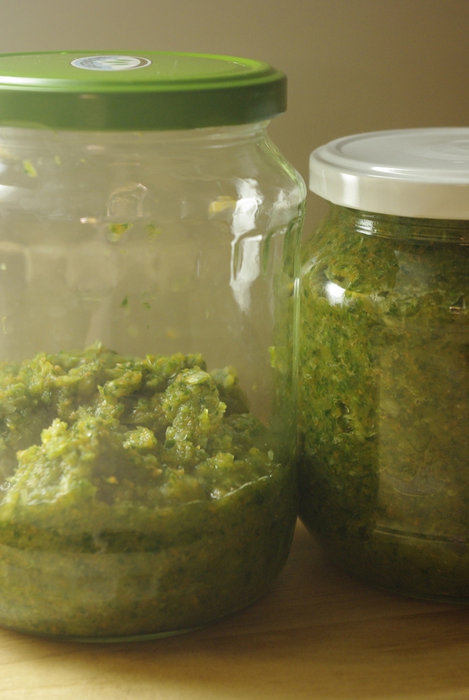
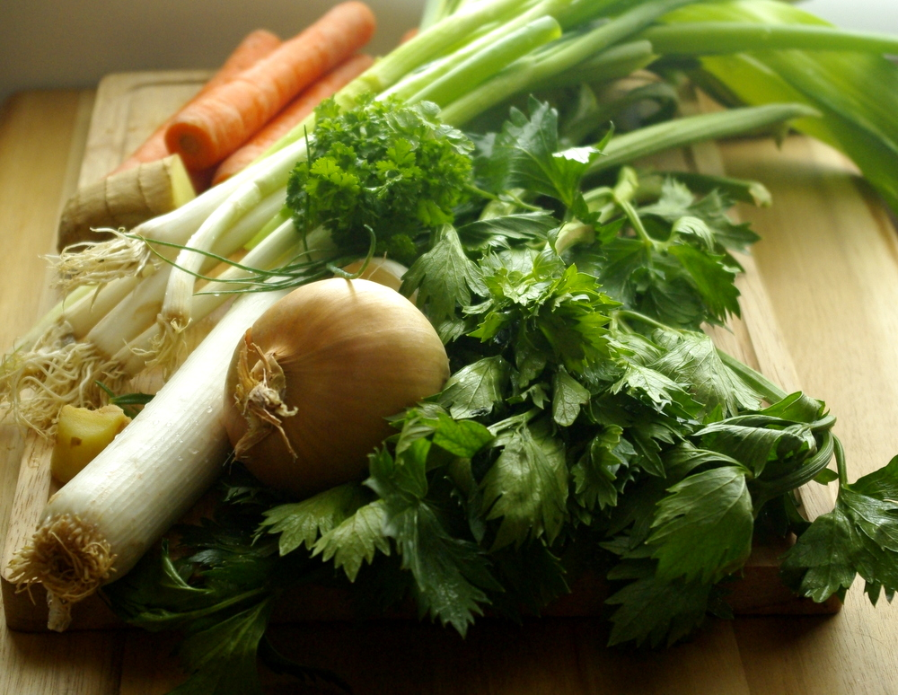
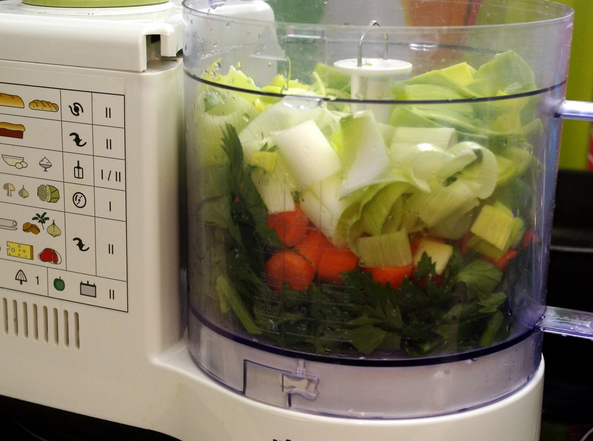
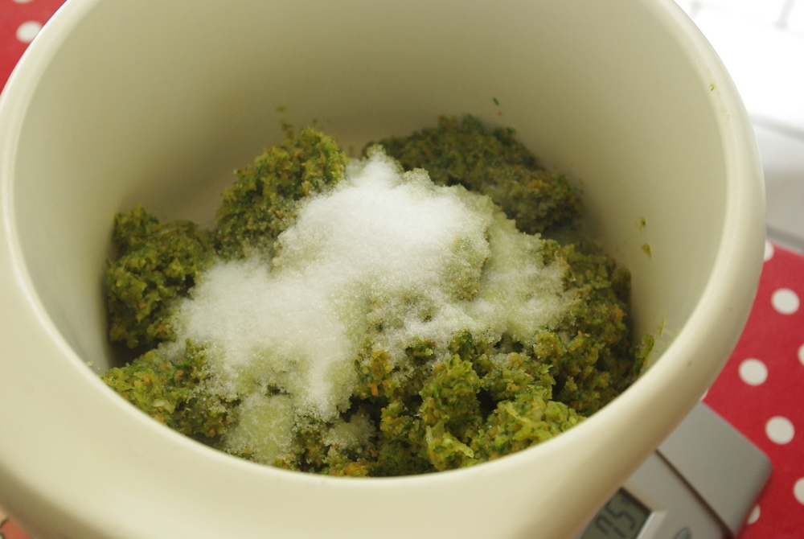
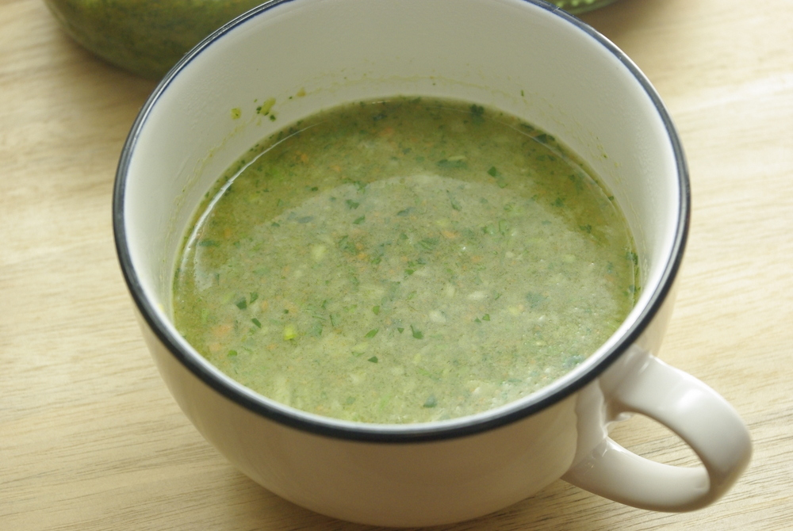

Ich war heute mal wieder Müll aufsammeln am Moselufer, wie schon [im März zum Dreck-Weg-Tag](http://apfeleimer.wordpress.com/2012/03/17/dreck-weg-2/ "Dreck weg 2"), diesmal aber ohne städtischer Aktion. Dabei habe ich mal eine komplett unwissenschaftliche Statistik aufgestellt, was die Leute so an verschiedenen idyllischen Uferbereichen am häufigsten wegwerfen:

**Überall**: leere **Zigarettenschachteln** und die metallenen und durchsichtigen Papierchen, die dazugehören (am beliebtesten: West) und fast noch öfter: **Papp- und Plastikbecher von Kaffee** zum Mitnehmen - vom Bäcker, vom McDonald's, vom Aldi... Das Zeug scheint echt der Hit zu sein bei Müll-Fallenlassern.

**Bei den Schwänen, Gänsen und Enten:** Plastikverpackungen von Toastbrot, Sandwichbrotscheiben oder Bäckertüten aus Papier - offensichtlich kaufen die Leute extra zum Füttern ganze Billig-Brote und werfen dann die Beutel direkt neben den begafften Tieren in die Natur. (Ich glaube insgeheim wollen sie den Schwänen sowieso nur beim Kämpfen um die besten Brocken zugucken, ein wenig wie bei den Gladiatorenkämpfen ;)).

**An Stellen, wo man gut Grillen kann:** Bierflaschen, Wegwerfgrills, Alufolie und Fleischverpackungen

Am Ende hatte ich nach nur einer knappen Stunde einen vollen schweren blauen Müllsack, den ich bis nach Hause zur Mülltonne geschleppt habe. Ich geb das dann als 10 Minuten Gewichttraining bei meinem Sportstracker ein... und das Aufsammeln vielleicht als Nordic Walking?

**Aber jetzt mal zum eigentlichen Thema: zur Gemüsebrühe.** Ich habe diese Paste ja jetzt schon [ein](http://apfeleimer.wordpress.com/2012/08/09/gebratener-brokkoli-mit-altromischem-moretum-dipp/ "Gebratener Brokkoli mit altrömischem Moretum-Dipp") [paarmal](http://apfeleimer.wordpress.com/2012/04/18/fenchelbolognese/ "Nudeln mit Fenchelbolognese") [erwähnt](http://apfeleimer.wordpress.com/2012/04/24/grune-buchstabensuppe/ "Grüne Buchstabensuppe") [in](http://apfeleimer.wordpress.com/2012/07/07/brokkoli-honig-tofu-mit-reis/ "Brokkoli-Honig-Tofu mit Reis") [meinen](http://apfeleimer.wordpress.com/2012/07/12/vegetarischer-gulasch-mit-seitan-oder-extrudierten-sojaproteinwurfeln/ "Vegetarischer Gulasch mit Seitan (oder extrudierten Sojaproteinwürfeln)") [Rezepten](http://apfeleimer.wordpress.com/2012/07/15/brokkolisuppe-mit-kase-und-geriebenen-kartoffeln/ "Brokkolisuppe mit Käse und geriebenen Kartoffeln"). Das praktische ist, dass kein Glutamat dran ist (viele wollen das ja nicht übermäßig zu sich nehmen), man die Gemüse beliebig variieren kann (praktisch für Selleriealergiker, denn Sellerie ist in fast allen gekauften Brühen), und außerdem kann man Gemüse aufbrauchen, das weg muss. Die einsame Stange Lauch, die paar Karotten, denen im Kühlschrank schon neue blassgelbe Blätter gewachsen sind, alles kann rein. Oder die Blätter von der Sellerieknolle, die sonst eh keiner essen will, die sind nämlich sehr würzig.

Das ganze basiert auf einer gehäckselten Mischung aus (festem) Gemüse und Kräutern, die man **fast beliebig variieren** kann und **Salz im Verhältnis 1:10**, also 10g Gemüsemasse auf 1g Salz. Das Rezept habe ich mal wieder [vom Chefkoch](http://www.chefkoch.de/rezepte/1234331228376365/1-A-Suppengewuerz.html "1-A-Suppengewürz bei Chefkoch"), diesmal so gut wie gar nicht abgewandelt, bis auf die Gemüse- und Kräutersorten und die relativen Mengen, da nehme ich jedesmal einfach was ich so da habe - nur Möhren, Lauch und Sellerie kommen bei mir immer rein.

Verwenden kann man die Paste genau wie Instant-Brühpulver oder Brühwürfel oder frische Gemüsebrühe: als Gewürz für Soßen und andere Gerichte oder einfach als schmackhafte Brühe für Fläde oder Maultaschen - dann mit kochendem Wasser aufgegossen.

## Zutaten

Verschiedene Suppengemüse und -kräuter zB:

- Möhren
- Porree/Lauch
- Sellerieknolle
- Zwiebeln / Frühlingszwiebeln
- Knoblauch
- Ingwer
- Schnittlauch
- Petersilie
- Sellerieblätter
- viel Salz zur Haltbarmachung, ca 1/10 des Gewichts vom Gemüse
- einige Schraubgläser, gut gespült und mit kochendem Wasser ausgespült

## Zubereitung

1. Gemüse und Kräuter **grob hacken** und in der Küchenmaschine **fein pürieren**. Jetzt **pro 100g Gemüsepaste 10g Salz** hineinmischen. 
    
    \[caption id="attachment\_839" align="alignnone" width="540"\] Es kommt ordentlich viel Salz dazu, wie man sieht...\[/caption\]
2. Wer keine Küchenmaschine hat, hackt entweder von Hand alles sehr fein (ist sicher entspannend und erspart die tägliche Meditationssitzung) oder macht es mit dem Pürierstab: das ist normalerweise zu trocken und es fliegen einem die Brocken um die Ohren. Aber gibt man das Salz schon nach dem Schneiden zum Gemüse und lässt etwas Saft ziehen, geht das Pürieren besser, sagt eine Kommentatorin bei Chefkoch.
3. Jetzt alles bis zum Rand **in die Gläser füllen**. Geschlossene Gläser kann man ganz gut einfach so ungekühlt im Regal aufbewahren, angebrochene im Kühlschrank. Wenn man immer nur mit einem sauberen Löffel Paste herausnimmt, hält sie sich so Wochen oder Monate, die geschlossenen sogar bis zu einem Jahr.

\[caption id="attachment\_840" align="alignnone" width="540"\] Das Wasser vom Ausspülen der Schüsseln trinke ich traditionell am Ende als leckere Suppe - in der Mikrowelle heißgemacht.\[/caption\]
