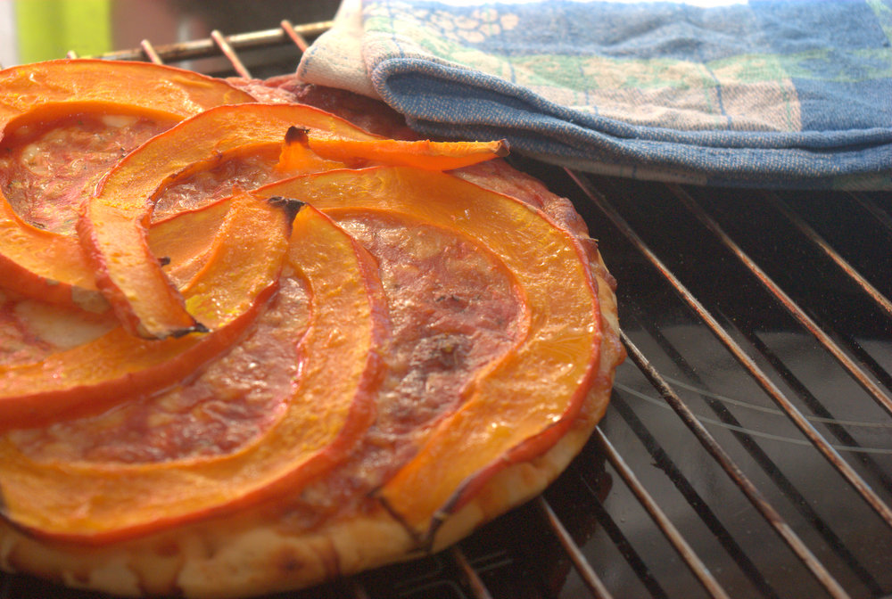
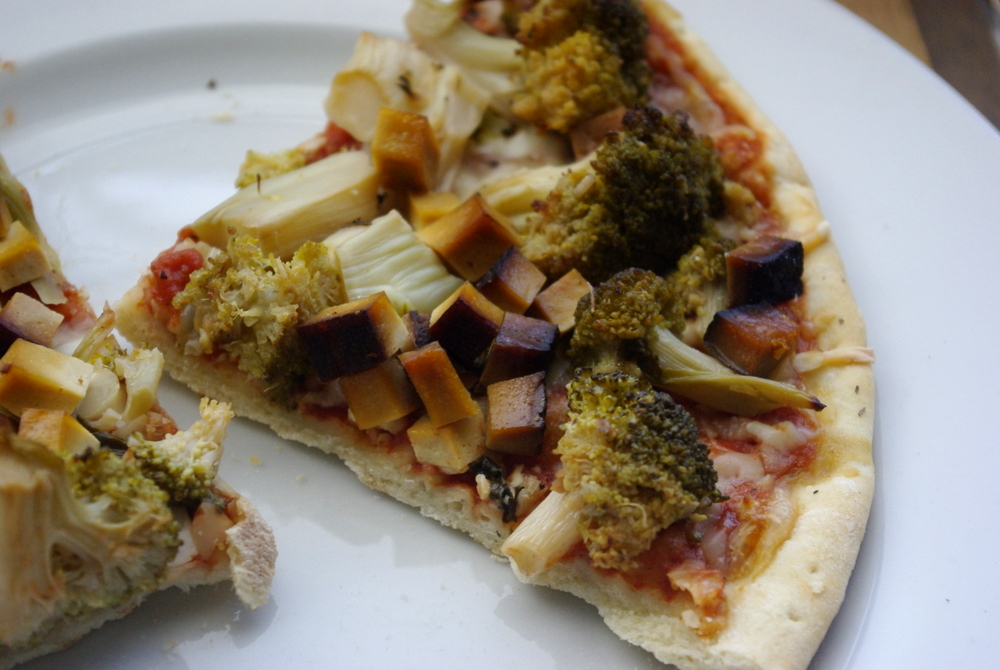

Hach, hab ich lang nichts übers Essen gepostet - ich taste mich mal mit etwas Einfachem wieder heran: ein paar neue Variationen **aufgemotzter Tiefkühlpizza**. Manchmal braucht man auch mal was schnelles. Beide Versionen basieren auf gekaufter Pizza Margherita, die kurz vor Ende der Backzeit mit einem Spezialbelag veredelt wird.

Im Moment gibt es ja gerade wieder massenweise **Hokkaido**\-Kürbisse günstig. Einfach in dünne Spalten schneiden, auf eine fast fertiggebackene Pizza legen und mit etwas **Knoblauch** bestreuen - ich habe pulverisierten genommen. Zuletzt noch etwas **Öl** aufträufeln oder aufpinseln und fertigbacken für etwa 5 bis 10 Minuten.

Und kürzlich war bei uns **Brokkoli** reduziert, da hab ich gleich zwei genommen und wusste dann nicht so recht wohin damit. Meine Flavor Bible schreibt, dass Zitrone und Knoblauch dazu passt. Aber auch Bacon. Hm, sowas haben wir nicht da, aber Räuchertofu!

Also fix den **Brokkoli** in ganz kleine Röschen geteilt und mit feingewürfeltem **Knoblauch** und Salz kurz angedünstet und mit **Zitronensaft** abgelöscht. Etwas Zucker würzt gut. **Räuchertofu** in kleine Würfel schneiden. Dann den angegarten Brokkoli und die Räuchertofuwürfel auf der fast fertiggebackenen Pizza verteilen und fertigbacken bis der Brokkoli knusprige braune Stellen hat. 10 Minuten vielleicht?

