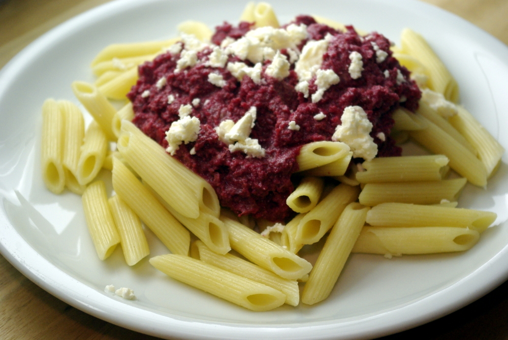

Letzten Dienstag vorm [Spieletreff](http://www.spieletreff-neuwied.de "Die Homepage unseres Spieletreffs") gab es endlich mal wieder ein bisschen etwas ausgefallenes zu den obligatorischen Nudeln. Die Wochen davor hatten wir leider oft Tomatensoße aus dem Glas. Die war zwar sehr gut - eine spanische "Tomate Frito", die ich auch mal selber rekreeieren will, aber irgendwann reicht es mit dem Fertigzeug. (**Edit**: Die [Tomate Frito gibt es jetzt auch hier als Rezept](http://apfeleimer.wordpress.com/2013/03/07/nudeldienstag-tomate-frito/ "Nudeldienstag: Tomate Frito"), ich hab sie endlich richtig nachbauen können.)

Also gab es **Nudelsoße aus Roter Bete und Walnüssen**. Die Rote Bete gibt es im Folienpack alle paar Monate im Aldi im Sonderangebot für ein paar Pfennige (40 Cent glaub ich das Pfund), dann decke ich mich damit ein. Frisch bereite ich das Zeug eher selten zu, weil das Schälen so aufwendig ist. Und Walnüsse haben wir gerade säckeweise von den familieneigenen Bäumen, die dieses Jahr anscheinend sehr fruchtbar waren.

Das Rezept habe ich schon länger im Repertoire, es ist aus einem sehr schönem, überraschend kreativen Kochbuch namens "Noch mehr Rezepte unter 1,50 €" von Bettina Matthaei. Ich habe aber noch ein paar Sachen weggelassen (saure Sahne, Petersilie) und hinzugefügt (Fetakäse, der passt gut).

## Zutaten

für 4-5 Portionen

- 1 Zwiebel
- 100g Walnüsse (ohne Schale)
-  500g Rote Bete (vorgegart und geschält aus dem Folienpack)
- Öl zum Braten
- [Gemüsebrühpaste](http://apfeleimer.wordpress.com/2012/10/14/gemusebruhe-paste-eingemachtes-suppengewurz-und-inoffizieller-dreckwegtag/ "Gemüsebrühe-Paste / eingemachtes Suppengewürz und inoffizieller Dreckwegtag") oder -pulver und ca. 200ml Wasser
- 5 EL Balsamicoessig
- 2 TL Kreuzkümmel (gemahlen oder am Stück, egal, wird noch püriert)
- Pfeffer, Salz, Zucker
- 100g Fetakäse

## Zubereitung

1. Die **Zwiebel** würfeln und auch die **Rote Bete** in ca. 1cm große Würfel schneiden. Nüsse, wenn nötig, knacken und etwas zerbröseln. Ein paar Nüsse kann man als Deko noch zurückhalten und später darüberstreuen.
2. In einem hohen Topf (damit es beim Pürieren nicht so spritzt) **Zwiebelwürfel** im Öl glasig anbraten, die **Nüsse dazugeben** und gemeinsam anrösten.
3. Jetzt **Rote Bete-Würfel dazugeben** und auch noch ein wenig anrösten, dann mit Gemüsebrühpaste, Wasser und Balsamico **ablöschen**.
4. Mit Zucker und **Kreuzkümmel** würzen und 10 Minuten köcheln lassen.
5. Alles mit dem Stabmixer **pürieren** und nochmal mit Salz und Pfeffer abschmecken. Auf Nudeln servieren und mit zerbröseltem **Fetakäse** bestreuen.
