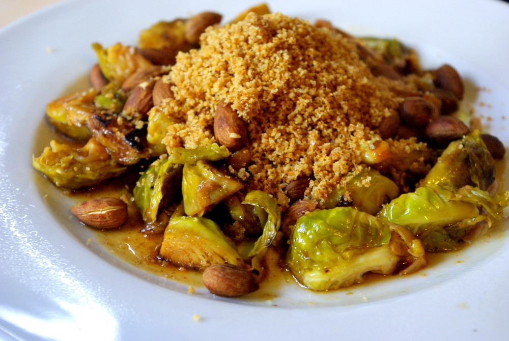

Neulich, als ich dieses Blog mal wieder als meinen persönlichen Rezeptezettelkasten benutzt habe und eine Idee für Rosenkohl suchte, fiel mir auf, dass ich zu diesem Thema noch nie etwas geschrieben habe. Kein Rezept, keinen Link, kein Foto. **Dabei ist Rosenkohl ja wohl im Winter total wichtig, oder?!** Es gibt ja nicht so viel anderes. Apfel ist auch ein Riesenfan (kleiner Scherz, haha; dabei passen Äpfel und Rosenkohl eigentlich geschmacklich gut zueinander).

Also habe ich folgende Eigenkreation herausgekramt, die sogar letztens beim Eimer-Apfel ganz gut ankam, trotz seiner Antipathie gegen dieses Gemüse. Basis war die Erkenntnis, dass **Äpfel, Mandeln und Semmelbrösel** laut meiner Flavor Bible super zu Rosenkohl passen.

## Zutaten

für 4 Portionen

- 1kg Rosenkohl
- 2 EL Apfeldicksaft oder alternativ eine Mischung aus Apfelsaft, Essig und Zucker
- Gemüsebrühe (ca. 200ml) bzw entsprechende Menge [Gemüsebrühpaste](http://apfeleimer.wordpress.com/2012/10/14/gemusebruhe-paste-eingemachtes-suppengewurz-und-inoffizieller-dreckwegtag/ "Gemüsebrühe-Paste / eingemachtes Suppengewürz und inoffizieller Dreckwegtag") (oder Pulver) und Wasser
- etwas Speisestärke (ca. 2 TL) zum Andicken der Soße

Zum Drüberstreuen:

- Semmelbrösel, Gewürze (wie beim [Blumenkohl mit Bröseln](http://apfeleimer.wordpress.com/2012/05/04/blumenkohl-mit-bechamelsose-und-semmelbrosel/ "Blumenkohl mit Bechamelsoße und Semmelbrösel"): Zucker, Salz, Knoblauchpulver, Essig, Pfeffer)
- Mandeln (ganze oder in Blättchen)

## Zubereitung

1. **Rosenkohl** putzen und vierteln.
2. Rosenkohlviertel in Öl portionsweise gut **anbräunen**, dann wieder alle Portionen in einen gemeinsamen Topf zusammenschütten.
3. Mit **Apfeldicksaft** (oder Apfelsaft, Essig und etwas Zucker) ablöschen, mit ca. 200 ml **Gemüsebrühe** (zB [Gemüsebrühpaste](http://apfeleimer.wordpress.com/2012/10/14/gemusebruhe-paste-eingemachtes-suppengewurz-und-inoffizieller-dreckwegtag/ "Gemüsebrühe-Paste / eingemachtes Suppengewürz und inoffizieller Dreckwegtag") oder Instantpulver und Wasser) aufgießen; Deckel drauf und **Rosenkohl** in der Brühe etwa **5-10 Minten garen** – bis er weich, aber noch etwas grün ist (er wird gelb, wenn er zu gar ist).
4. Um die Brühe zu einer **Soße** zu machen, muss sie jetzt noch **angedickt** werden. Dazu etwas Flüssigkeit abnehmen und in einer kleinen Schüssel mit 2 TL **Speisestärke** verrühren. Diese Mischung in den Rosenkohl einrühren und aufkochen lassen.
5. Dazu passen ohne Fett in der Pfanne geröstete **Mandeln** und würzige (_mit_ Fett!) gebratene **Semmelbrösel** wie diese hier beim [Blumenkohl](http://apfeleimer.wordpress.com/2012/05/04/blumenkohl-mit-bechamelsose-und-semmelbrosel/ "Blumenkohl mit Bechamelsoße und Semmelbrösel") (aber Sesam und Leinsamen würde ich weglassen).
