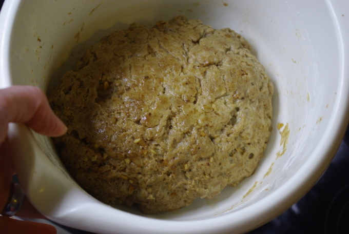
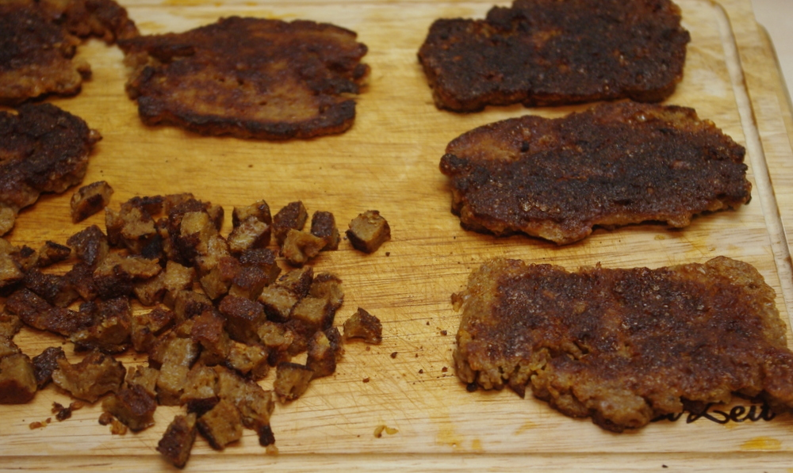

Das heutige Rezept passt ganz gut in die winterlichen Feiertage, viele Familien essen ja Chili zu Weihnachten oder an Silvester.

Vor Jahren habe ich mal über irgendeinen Chiliwettbewerb in Amerika gelesen, bei dem die Zutaten des Gewinnerchilis genannt wurden. Die habe ich mir damals notiert und direkt in ein Standardrezept integriert. Heraus kam dieses Rezept, dass ich dann noch mit Seitan vegetarisiert habe. Dazu passt Reis, Brot oder Tortillachips. Oder Tacoschalen mit geriebenem Käse. **Oder man macht einen Wrap mit Salat und Käse in einem herzhaften Pfannkuchen** (gut mit übriggebliebenden Eiweissen zB vom Eismachen herzustellen):

**Den Seitan bereite ich so zu:** 300g Seitanmehl (auch als Glutenmehl oder Weizengluten verkauft) mit entweder mit ordentlich Chili- oder Tacogewürzmischung oder mit Knoblauchpulver, Paprikapulver, Zwiebelpulver und Salz trocken vermischen, dann die nasse Komponente (ca. 200-300ml) zusammenmischen (aus hauptsächlich Wasser, etwas Öl, Zitronensaft oder Essig und etwas Sojasoße) und in die trockenen Zutaten einkneten. Wenn zu trocken, etwas Wasser hinzufügen und verkneten.

Dann schneide ich nach einer Ruhezeit diesen Teig roh in dünne Scheiben und brate ihn schön braun an. Diese Scheiben schneide ich dann in kleine Würfel und verwende sie im Rezept unten, indem ich sie nach dem Braten von Zwiebeln und Paprika hinzufüge.

 

Übrigens: statt der Gewürze kann man auch eine Gewürzmischung für Tacos oder Chili nehmen, ich habe vor ein paar Jahren ein Riesenglas davon günstig erstanden und nehme das immer für mein Chili. Aus dessen Zutatenliste habe ich auch die Komponenten der hier aufgelisteten Mischung der Gewürze her.

## Zutaten

- 1 gehackte **Zwiebel**
- 500g einer Proteinquelle: gekochte Linsen, Sojahack, **Seitan**
- Gemüse: **Paprikaschoten** gewürfelt und/oder **Mais** (ich nehme eine Dose)
- gehackte **Tomaten** (frisch oder 2 Dosen a 400g)
- 1 Dose **Kidneybohnen** a 420g (oder trockene einweichen und vorgaren)

wichtig als Gewürze:

- etwas **Bier und/oder Rotwein** (für Kinder und andere Nicht-Trinker kann man den Alkohol aber auch weglassen)
- etwas **(flüssigen) Kaffee** (ca. 1/2 Tasse)
- **Kakaopulver**
- **Kreuzkümmel**
- **Paprikapulver (edelsüß)**
- **Knoblauch**
- etwas scharfes: **scharfe Soße**, Chilipaste, Chilipulver oder Chilischoten

## Zubereitung

1. **Zwiebeln, Protein und Gemüse** (wenn Paprika; Mais aber nicht) zuerst anbraten. Wenn man den Seitan wie ich oben beschrieb verwendet, wird er nicht nochmal mit angebraten, sondern danach dazugegeben, vor dem nächsten Schritt.
2. Dann gegarte **Bohnen, Tomaten, und Knoblauch** dazu, weiterbraten, **Gewürze** dazu.
3. Hitze runterdrehen und möglichst lange alles **köcheln**, etwa 1-2 Stunden mindestens.
4. **Am nächsten Tag noch besser**, also gerne einen Tag vorher zubereiten. Oder zwei!
