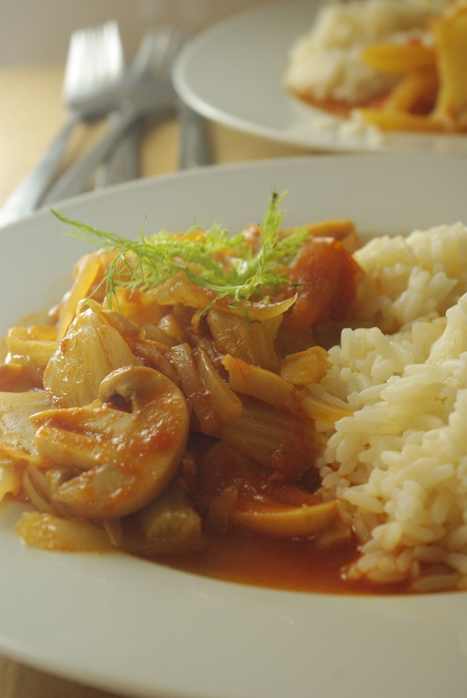

Unter dem Namen "**Fenchel nepalesisch**" findet man die Originalversion dieses Rezepts häufig im Netz. Ursprünglich scheint es aber mal wieder von einer [Chefkoch-Userin zu kommen, der es eine Aupair aus Nepal gezeigt hat](http://www.chefkoch.de/rezepte/1161651222264003/Fenchel-nepalesisch.html "Rezept bei der Quelle chefkoch.de"). Das Gute ist, dass es nicht so nach Fenchel schmeckt wie die traditionellen europäischen Gerichte damit (mmmmh, Tasse Fencheltee gefällig ;)?); meine Eltern zum Beispiel aßen ihn eine Zeitlang gern zu Lachs, aber da ist er mir zu dominant; mal ganz abgesehen vom Fisch, der geht gar nicht.

Aber hier geht der Fenchel, mit dem ich früher wenig anzufangen wusste, eine schöne Verbindung mit den anderen Zutaten ein; und das sind auch noch so wenige, und die Zubereitung so schnell und einfach – zumindest in meiner Variante  - das muss man einfach mal probiert haben. Ich kann das Gericht jedenfalls wärmstens empfehlen. **Reis** passt sehr gut dazu.

Ich habe das Rezept noch ein bisschen verändert – hauptsächlich mehr Fenchel bei ungefähr gleichbleibender Menge der anderen Zutaten – und natürlich stark vereinfacht: die frischen Tomaten und Pilze nehme ich lieber aus der Dose, besonders bei den Tomaten dürfte das außer im Hochsommer sogar besser schmecken als mit frischen. Außerdem erspare ich mir das Chilischotenschneiden und verwende meine [scharfe Soße](http://apfeleimer.wordpress.com/2012/06/27/2-miniprojekte-eistee-mit-sirup-und-scharfe-sose/ "2 Miniprojekte: Eistee mit Sirup und scharfe Soße") – Tabasco oder deren billigere Kopie vom Pennymarkt oder eine ähnliche Soße aus dem asiatischen Laden gehen sicher auch.

## Zutaten

für 4 Portionen

- 2 **Fenchelknollen** (ca. 500g)
- 1 Dose **Pilze in Scheiben** geschnitten (Champignons, meine hatte 290g Nettogewicht und 170g Abtropfgewicht, 314ml, von Aldi – 3. Wahl)
- 1 **Dose ganze Tomaten** (wer faul ist kann auch gehackte nehmen) – 400g (Abtropfgewicht 240g, 425ml), auch von Aldi
- 1 große oder 2 kleinere **Zwiebeln**, in Streifen geschnitten
- 1 Stück **Ingwer**, etwa walnusgroß oder etwas kleiner
- 1 TL **Zucker**
- Etwas **Salz**
- **Öl** zum Braten
- 1 großer Spritzer [scharfe Soße](http://apfeleimer.wordpress.com/2012/06/27/2-miniprojekte-eistee-mit-sirup-und-scharfe-sose/ "Rezept für selbstgemachte scharfe Soße") (oder 1/2 Chilischote, ein paar Chiliflocken ...)

 

 

## Zubereitung

1. **Zwiebeln** grob in Streifen schneiden, **Ingwer** feinhacken oder reiben und den **Fenchel** (ohne die strohigen Teile der "Finger") in Scheiben und dann grobe Streifen schneiden.
2. **Öl** in einem Topf erhitzen und **Zwiebeln** und **Ingwer** kurz anbraten, dann **Fenchel** dazugeben und ebenfalls mit anbraten – etwa 5 Minuten.
3. Die beiden Dosen öffnen, **Pilze** direkt mit Wasser in den Topf kippen, **Tomaten** erst noch herausfischen, grob etwas in Stücke schneiden und ebenfalls mit dem Tomatensaft aus der Dose in den Topf geben.
4. Mit **Salz, Zucker und scharfer Soße** (oder Chili) würzen und noch eine Weile köcheln lassen, vielleicht nochmal 15 Minuten. Bis dahin sollte auch die Flüssigkeit etwas verkocht sein und eine relativ sämige Soße herauskommen.
