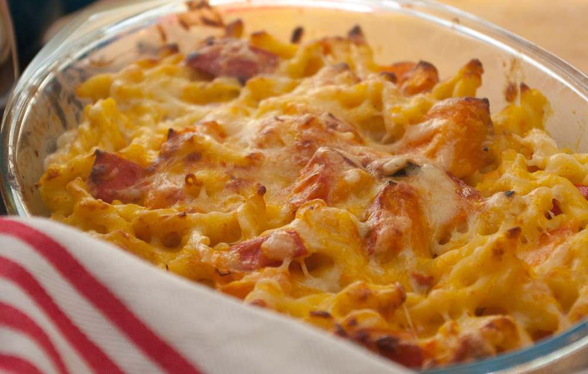
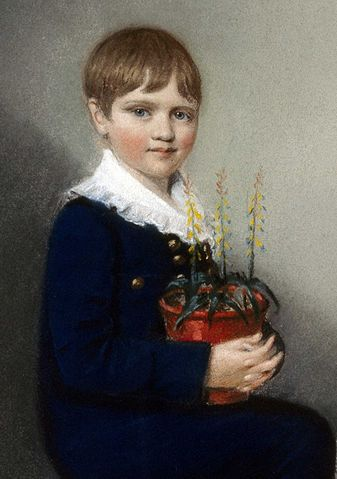
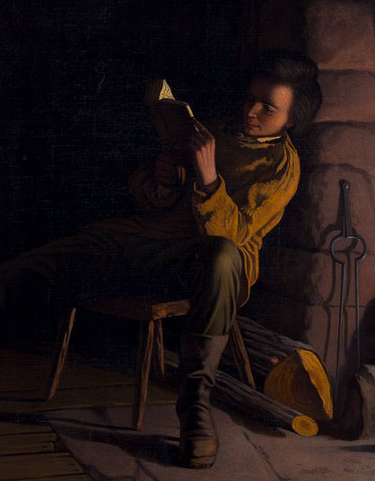

Kennt ihr das? Im Herbst gibt es immer die Hokkaido-Kürbisse super rotpreisig, äh, günstig, und man deckt sich erstmal mit einem ganzen Haufen ein, weil die sich ja so gut halten. Aber dann Mitte bis Ende des Winters weiß man nicht mehr so recht, was man damit machen soll. 

**Kürbissuppe** gab es bestimmt schon ein paarmal, und auch die gebratene Kürbisstücke mit Rapunzelsalat wollen nicht mehr so recht imponieren. (Unter uns: sie machen auch nicht so richtig satt.) Kürzlich habe ich aber auf einem der Kochblogs, die ich verfolge, [Paprika meets Kardamom](http://paprikameetskardamom.wordpress.com/2012/12/18/im-kase-und-kurbishimmel-auf-erden-butternut-macncheese/), diese interessante Idee gesehen: Maccaroni & Käse, das uramamerikanische Rezept, das wohl die meisten Amerikaner nur noch aus dem Pappschächtelchen von Kraft kennen, aber diesmal selbstgemacht UND mit Kürbis! 

Das könnte passen, dachte ich mir. Ich zögerte noch, weil ich weiß, dass Nudelaufläufe meist **nicht sehr fotogen sind**. Aber es geht ja um den Geschmack. Trotzdem poste ich diesmal das erste Mal ein mit Lightroom bearbeitetes Foto (sonst war ich immer zu faul und nahm Picasa), um die Appetitlichkeit des Auflaufs etwas zu unterstützen. Und irgendwann lerne ich ja vielleicht doch, Aufläufe appetitanregend zu stylen und beleuchten. Demnächst werde ich vielleicht doch mal die Aufsteckblitze und Reflektoren herausholen, statt mit meinem [Superfix-Schokokussschachtel-Lightscoop-Nachbau](https://lifehacker.com/5884059/make-a-mirrored-popup-flash-bouncer-for-your-camera-out-of-an-upcycled-snack-box "Ich bin bei Lifehacker!") zu hantieren (Ja, das ist mein Projekt auf Lifehacker! Ich bin berühmt!). Hoffentlich wird dabei das Essen nicht kalt!

**Vor dem Rezept aber nochmal etwas anderes:**  [Heute ist Darwin-Tag](http://de.wikipedia.org/wiki/Darwin-Tag "Alles über den Darwintag bei Wikipedia")! Wie jeden 12.2. – denn heute hat Charles Darwin Geburtstag. Übrigens am selben Tag und im selben Jahr (12.02.1809) wie Abraham Lincoln. Hier sieht man die beiden als Knaben. Ach, wenn sie sich doch nur gekannt hätten! Wahrscheinlich hätten sie sich gar nicht gemocht. Vielleicht kannten sie sich ja sogar und hassten sich!

 Charles Darwin mit 7 Jahren. Gemälde von Ellen Sharples, Public Domain durch abgelaufenes Copyright. Quelle: http://en.wikipedia.org/wiki/File:Charles_Darwin_1816.jpg

 Abraham Lincoln als Knabe; Gemälde von Eastman Johnson; Public Domain durch abgelaufenes Copyright. Quelle: http://en.wikipedia.org/wiki/File:Lincoln-as-a-boy-reading-at-night.jpeg

**Zurück zu Charles und seinem Tag**: Dieser soll nämlich Darwin, **seinen Beitrag zur Naturwissenschaft und auch die Wissenschaft selber feiern**. Vor einiger Zeit habe ich Darwins Briefe nach Hause von seiner Forschungsreise der Beagle als Hörbuch beim Putzen angehört. Ich wußte zwar, was man so über ihn weiß, aber ich war trotzdem überrascht, wie fortschrittlich er für seine Zeit gedacht hat. Trotz allem war er natürlich ein Kind seiner Zeit, und auch einige Vorurteile über andere Kulturen konnte man in seinen Briefen herauslesen. Aber seine Ansichten müssen trotzdem revolutionär gewesen sein in einer religiös geprägten Gesellschaft wie dem damaligen England. Seine wissenschaftliche Vorgehensweise fand ich auch vorbildlich (außer wenn er seltsamen Tieren von Hinten eins auf die Nuss gegeben hat, um ein Exemplar für die Wissenschaft zu opfern). Ich dachte immer, damals ging alles nur um Blutegel und andere dunkle Dinge, wenn von Wissenschaft geredet wurde.

Wer etwas besonderes zu diesem Gedenktag unternehmen möchte, um die Entdeckung der Evolution zu feiern – **wie wäre es mit einem Spaziergang in die Natur?** Ich schaue mir gerne die verschiedenen Enten- und Gänsearten bei uns am Moselufer an, die dort gemeinsam herumwatscheln, alle – etwas bis ganz schön – unterschiedlich aussehen aber doch sehr eng verwandt sind – Schwäne sind Gänsevögel, Nilgänse, Rostgänse, Blässgänse und Kanadagänse sowieso, und zusammen mit den Stockenten, Mandarinenten, Brautenten und Tafelenten gehören sie auch alle zusammen zu den Entenvögeln. Das sind alles Arten, die wir schon an einer Stelle getroffen haben.

Und jetzt zum Rezept!

## Zutaten

für 5-6 Portionen

- ca. 1 kg **Hokkaido**\-Kürbis
- 2 El **Öl** (ich nehme Sonnenblumenöl, aber andere empfehlen auch Olivenöl)
- 500 g **Nudeln**: Makkaroni, Gabelspaghetti, oder "Gemelli" (die nehme ich gerne, weil es sie bei Rewe und Hit auch von ja! in rotpreisig gibt – es sind kurze, sehr dünne Spiralen) **Soße: (eigentlich eine Käse-Bechamel)**
- 2 EL **Öl** + 1 TL **Butter**
- 2 EL **Mehl**, gehäuft
- 2 EL mittelscharfer **Senf**
- 500 ml **Milch**, eventuell gestreckt mit etwas Wasser, wenn einem das zu gehaltvoll ist oder sie dann nicht mehr für den Kaffee am nächsten Morgen reicht ;)
- 100-200 g geriebenen **Käse**: Emmentaler (oder Gouda, ich habe gemischt, weil ich noch einen Rest Gouda hatte) – etwas vom Käse aufheben, um am Ende zum Überbacken über den Auflauf zu streuen

## Zubereitung

1. Hokkaido-**Kürbis** in Würfel schneiden (2-3 cm Kantenlänge) und mit 2 EL **Öl** und ordentlich **Salz** gemischt in eine flache Auflaufform (oder von mir aus auch ein Backblech, wer Bock auf viel Spülen hat ;) – das erspare ich mir lieber).
2. Bei 180°C Umluft insgesamt ca. **45 Minuten backen**, bis die **Kürbiswürfel** weich sind und schön braune Stellen bekommen – etwa nach 20-25 Minuten mal durchrühren.
3. **Butter und Öl** in einem kleinen Topf erhitzen und 2 gehäuft EL **Mehl** darin unter Rühren anrösten. Jetzt die Flüssigkeit (1/2L **Milch**) langsam unterrühren und aufpassen, das es nicht klumpt. Am Anfang kann das sehr schnell gehen – ich rühre deshalb direkt mit einem Schneebesen, damit ich eventuelle Klumpen direkt wieder zerschlagen kann.
4. Jetzt den **Senf** (2 EL) und etwas **Knoblauchpulver** und **Zucker** einrühren und noch ein Stückchen weiterköcheln lassen, damit das Mehl seinen mehligen Geschmack verliert. Immer schön weiterrühren!
5. Inzwischen die **Nudeln** kochen und abgießen und dann den Großteil des **Käses** reiben und in die Soße schmelzen.
6. Derweil sollte der Kürbis weich sein, also los: ein Drittel der **Kürbiswürfel** mit Kartoffelstampfer oder Gabel in der Soße **zerstampfen**. Soße nun noch mit **Salz und Pfeffer** nachwürzen.
7. Nudeln, übrige 2/3 der Kürbiswürfel (unzerstampft) und die Käsesoße in einer großen Auflaufform verrühren. Restlichen Käse drüberstreuen und bei 180°C Umluft 15 Minuten überbacken, bis der Käse etwas angebräunt ist.
