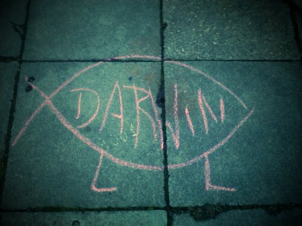

Gestern beim Spaziergang suchten wir hier noch schnell - bisher erfolglos - einen Geocache. Doch nanu, was ist denn das hier auf dem Boden? Mal genauer hinsehen...

Ja genau, ausgerechnet heute: der Darwinfisch als Streetart ;)!
