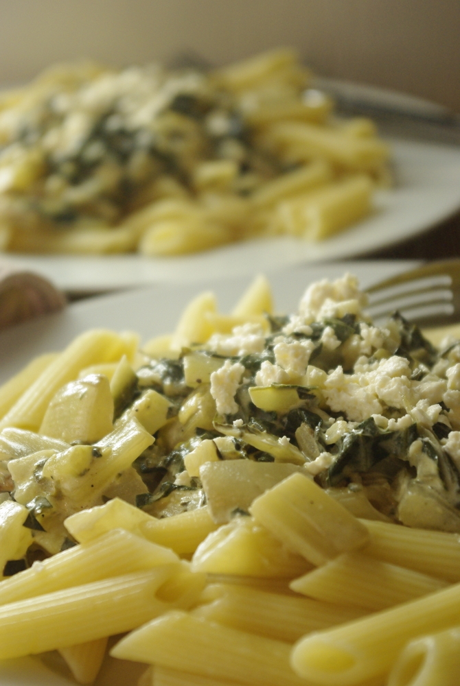

Die Urform dieses Rezepts habe ich mal wieder [bei Chefkoch gefunden](http://www.chefkoch.de/rezepte/1279611233327827/Spaghetti-mit-Mangold-Fetacreme.html "Nudeln mit Mangold-Feta-Creme bei Chefkoch.de"). Natürlich habe ich noch etwas daran herumgedoktert. 

Am Ende wurden Zubereitung und auch die Zutaten sehr ähnlich wie bei den [Mangoldkartoffeln aus Kroatien (Blitva)](/posts/2012/03/kroatisch/ "Blitva, Kroatische Mangoldkartoffeln"). Praktisch, dann muss ich mir nur 1,5 Rezepte merken statt zwei. Hier gibt es aber mal Nudeln dazu, außerdem Feta, und – um das ganze soßiger zu machen – Sahne.

## Zutaten

für 4 Portionen

- 500 g Nudeln
- 1 Staude **Mangold** (das waren bei mir etwa 500-600 Gramm)
- 1 große **Zwiebel** (fein hacken)
- 2 **Knoblauchzehen** (fein hacken)
- etwas **scharfes** Gewürz, z. B. [meine scharfe Soße](http://apfeleimer.wordpress.com/2012/06/27/2-miniprojekte-eistee-mit-sirup-und-scharfe-sose/ "2 Miniprojekte: Eistee mit Sirup und scharfe Soße"), oder Sriracha, oder Tabasco, Cayennepfeffer, Chilipulver
- etwas **Öl** zum Anbraten (Olivenöl passt gut, da ein bisschen mediterran angehaucht)
- 100 ml süße **Sahne** – das ist ein halber Becher, soviel hatte ich noch – man kann aber nach Geschmack auch bis zu 200ml nehmen, oder stattdessen 100ml Milch
- 200 g **Feta**\-Käse (entspricht einer Packung)
- etwas Salz, Zucker, Zitronensaft, Pfeffer (zum Würzen)

## Zubereitung

1. Stiele vom **Mangold** abschneiden und in Stücke von 1-2 cm schneiden. Die Blätter des Mangold in Streifen schneiden und erstmal von den Stielen getrennt halten.
2. **Nudeln** in Salzwasser kochen.
3. Währenddessen die **Zwiebel** und **Knoblauch** hacken und in etwas Öl anbraten, dann die **Mangoldstiele** dazugeben und etwa 5 Minuten weiterdünsten. Dann die **Mangoldblätter** dazugeben und fertiggaren (nochmal 5 Minuten etwa).
4. Dann **Sahne** und **Feta** (zerbröselt) einrühren und mit den **Gewürzen** abschmecken (das scharfe Gewürz, Salz, Pfeffer, Zucker, Zitronensaft). Ein wenig Feta übriglassen.
5. Mangoldsoße auf den **Nudeln** anrichten und die zurückbehaltenen **Fetabrösel** darüberstreuen.
6. Wer das Gericht noch etwas veredeln möchte, kann noch ein paar **Pinienkerne** drüberstreuen.
