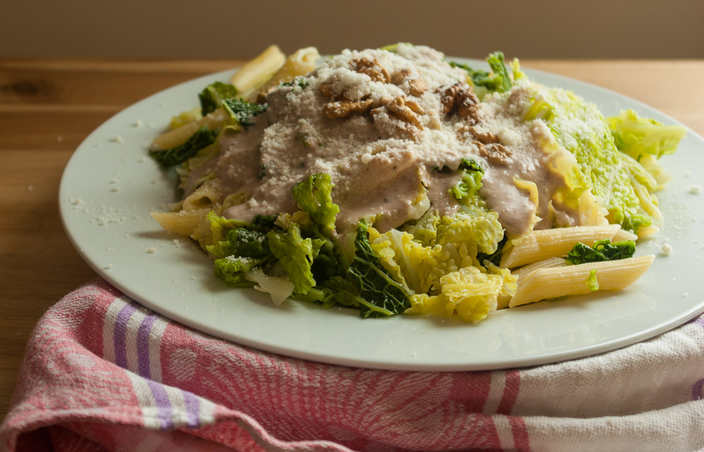

Wieder ein Rezept [vom Chefkoch](http://www.chefkoch.de/rezept-anzeige.php?ID=1709071279782746 "Rezept bei Chefkoch.de"), das ich beim googeln nach Wirsing + Walnuss gefunden habe, die Kombination hatte meine Flavor Bible empfohlen. Wir haben es inzwischen schon drei mal gekocht – einerseits ist halt Wirsingzeit, aber zusätzlich ist es aber auch sehr lecker. Demnach hat es sich einen Platz hier verdient.

Ich hab noch nicht mal viel daran geändert, nur die Mengen etwas angepasst und die Spezialöle durch unser Standard-Sonnenblumenöl ersetzt. Und mit dem Käse experimentiert: statt Parmesan habe ich **Pecorino** probiert, was ja auch ein parmesanartiger Käse ist, aber vom Schaf, und auch **Kuhmilchfeta**. Beides passt gut.

Also eigentlich heißt es ja Pesto, aber ich finde, bei Pesto gehört eigentlich immer etwas Grünes hinein. Hier handelt es sich eher um eine Walnuss-Zitronen-**Mayonnaise**, denn so etwas in der Art entsteht beim Pürieren, wohl durch das Eiweiß in den Nüssen und natürlich recht viel Öl.

Noch was zu den **Flüssigkeitsmengen**: die benutze ich eigentlich eher als **Richtwerte**. Öl, Zitronensaft und ein wenig vom Nudelkochwasser gebe ich meistens ohne Abmessen dazu sondern frei Schnautze. Hauptsache es ist insgesamt genug Flüssigkeit im Pürierbecher, damit die Nüsse bedeckt sind und mir beim Zerkleinern nicht um die Ohren fliegen.

Das oben ist übrigens mein erstes Essensfoto mit meinem Aufsteckblitz, gebounct an der seitlichen Wand.

## Zutaten

für 4 Portionen

- 500 g **Nudeln**
- ca. 1 kg **Wirsing** (etwa ein kleiner Kopf)
- 200 g **Walnüsse** ohne Schale
- 3 **Knoblauchzehen**
- 100 g **Pecorino**, Parmesan oder Fetakäse
- 10 EL **Öl** (vorzugsweise Olivenöl, aber das mag ich nicht so und habe es daher nicht oft da – ich nehme immer Sonnenblumenöl)
- 10 TL **Walnussöl** – auch das hatte ich bis jetzt nie da und habe einfach noch mehr Sonnenblumenöl verwendet
- 8 TL **Zitronensaft** (ich habe auch schon als ich keinen Zitronensaft hatte, eine Mischung aus Essig und Apfelsaft genommen – Apfel passt sowieso gut zu Wirsing)
- Salz und Pfeffer und etwas Zucker

## Zubereitung

1. **Wirsing** ohne Strunk in Streifen von vielleicht 5 cm Länge schneiden.
2. **Nudeln** kochen und 4-5 Minuten vor Ende der Garzeit die **Wirsingstreifen** mit ins Nudelwasser geben, zusammen fertiggaren.
3. 120 g der **Walnüsse** (also 80g zurückhalten zum Dekorieren) zusammen mit den **Knoblauchzehen**, dem **Öl**, dem **Zitronensaft** sowie ca. 10 EL des **Nudelkochwassers** mit dem Pürierstab cremig pürieren. Den Großteil des **Käses** hinzugeben und mitpürieren (etwas zum Dekorieren zurückhalten). Erst danach mit Salz und Pfeffer abschmecken – der Käse ist recht salzig.
4. Die Nudeln und den Wirsing abgießen und auf Tellern anrichten, die Walnuss-Käse-Soße daraufgeben und mit den restlichen Walnüssen und etwas Käse bestreut servieren.
