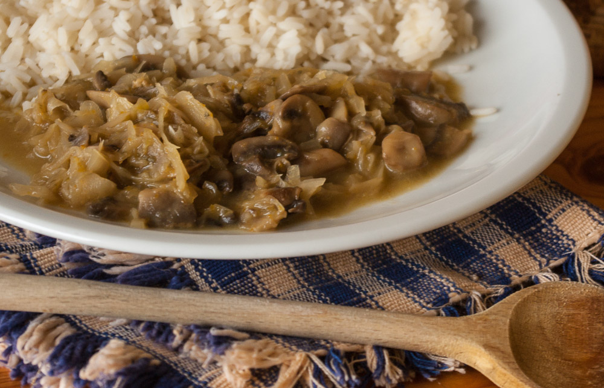

Das [Pilzragout von neulich](http://apfeleimer.wordpress.com/2013/02/17/pilzragout/ "Pilzragout") kann man übrigens wunderbar variieren - hier zum Beispiel mit etwas Sauerkraut, das ganz am Ende noch dazugegeben und kurz mitgekocht wurde. So bekommt das Gericht eine polnische Note; man könnte vielleicht sogar Pieroggen damit füllen, oder das ganze mit Blini servieren, obendrauf vielleicht noch einen Kleks Schmand oder saure Sahne.
