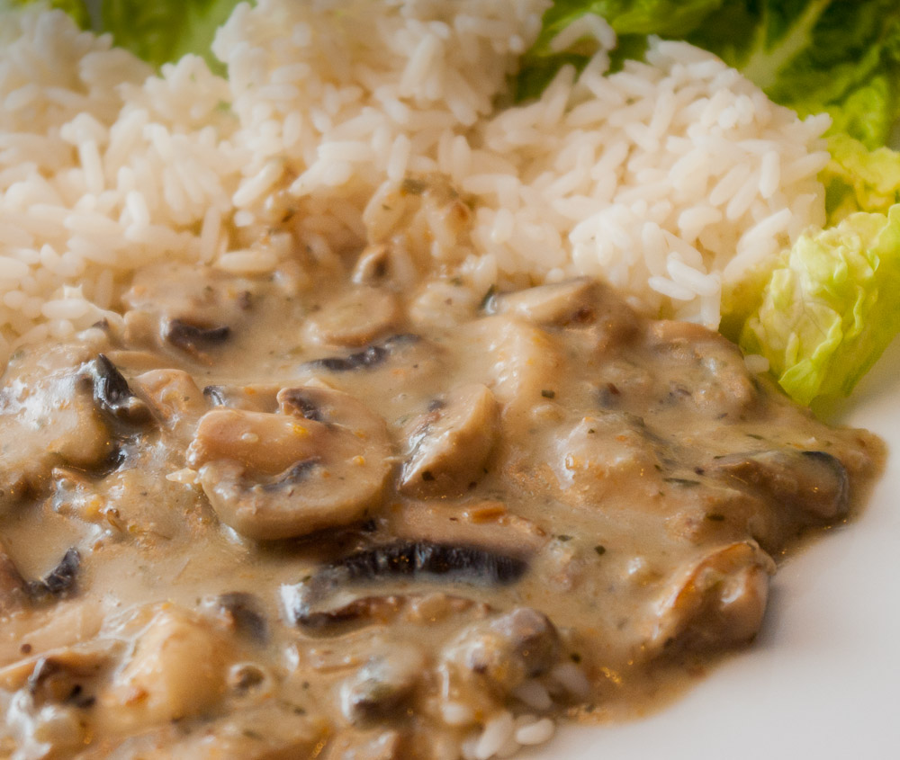

Dieses Rezept gibt es bei uns gerade besonders oft - kein Wunder, schließlich sind Champignons gerade häufig im Sonderangebot. Und nach den Sonderangeboten baue ich ja immer meinen wöchentlichen Kochplan auf. Nachdem mir das Rezept für Pilzragout aus einem meiner Kochbücher zu kompliziert erschien, habe ich dieses auf die "Basics" reduzierte Rezept entwickelt.

Eine wichtige Rolle spielt meine [selbstgemachte **Gemüsebrühepaste**](http://apfeleimer.wordpress.com/2012/10/14/gemusebruhe-paste-eingemachtes-suppengewurz-und-inoffizieller-dreckwegtag/ "Gemüsebrühe-Paste / eingemachtes Suppengewürz und inoffizieller Dreckwegtag"), die hier mitgebraten wird - ein bisschen so wie das [Französische Mirepoix](http://de.wikipedia.org/wiki/Mirepoix "Mirepoix bei Wikipedia") (das genau wie meine Paste aus feingehacktem Sellerie, Möhre und Zwiebel besteht). Da meine Paste auch noch Kräuter, vor allem Petersilie, enthält, kann man sich dann auch die Zugabe derselben sparen. Wer stattdessen aber Gemüsebrühe in Pulver- oder anderer Form verwenden will, gibt diese erst später dazu und muss am Ende auch noch etwas feingehackte Petersilie ins Ragout rühren. Ich finde auch den **Wein** oder ein ähnliches herb-säuerliches Getränk wie abgestandenen Sekt oder Prosecco vom der letzten Feier (nix verkomme lasse!) wichtig. Aber ich weiß auch, dass einige keinen Alkohol im Essen (oder anderswo) haben wollen; da würde ich den Wein vielleicht durch eine Mischung aus Apfel- oder Traubensaft, Essig und Gemüsebrühe **ersetzen**. Übrigens auch sehr herb und wurde wohl früher auch in den Apfelwein gemischt, um Traubenwein näher zu kommen: Schlehen oder **Schlehensaft**. Hier aber nicht so passend, es sei denn man möchte dunkelrotes Pilzragout essen. Auch nichts dagegen einzuwenden, wenn ich so drüber nachdenke.

Man kann statt der Champignons bestimmt auch andere Pilze verwenden, zum Beispiel selbst gesammelte (natürlich nur, wenn man sich auskennt!). Habe ich allerdings noch nicht ausprobiert. Aber helle und dunkle Champignons hatte ich schon, das geht auf jeden Fall beides. Dunkle sollen ja ein bisschen aromatischer sein.

\[gallery columns="2" ids="976,987"\]

Eine schöne polnische Variante erhält man, wenn man [wie hier beschrieben und bebildert](http://apfeleimer.wordpress.com/2013/02/25/pilzragout-variation/ "Pilzragout-Variation mit Sauerkraut"), am Ende noch Sauerkraut mitkocht. Oder man verwendet das Ragout so wie es ist [als Soße zum Schnitzel](http://apfeleimer.wordpress.com/2013/03/02/pilzragout-variation-schnitzelsose/ "Pilzragout-Variation: Schnitzelsoße"), auch schön.

## Zutaten

für 4 Portionen

- 500g **Champignons**
- 1-2 **Zwiebeln** (grob gehackt)
- _2_\-3 EL **Gemüsebrühpaste** (oder Gemüsebrühpulver + Petersilie)
- 1-2 EL **Speisestärke** zum Andicken
- 150 ml **Wein** (oder Prosecco, oder abgestandener Sekt von Silvester, nix verkomme lasse!) - etwa ein Glas
- 200 ml **Milch** oder mehr (falls Soße nach dem Aufkochen noch zu dickflüssig)

## Zubereitung

1. **Zwiebeln** hacken und in ordentlich **Öl**, zusammen mit etwas **Butter** (nicht nur Butter allein, da die sonst anbrennt) oder einfach in Butterschmalz (kann man höher erhitzen) andünsten.
2. Pilze putzen und in Scheiben schneiden, Herdplatte auf höchste Stufe drehen und **Pilzscheiben** zu den Zwiebeln geben. Gut scharf anbraten.
3. Die **Gemüsebrühpaste** dazugeben und auch nochmal ein wenig mit anrösten. Wer keine solche Paste besitzt sondern nur Gemüsebrühe in Pulverform, wartet mit der Zugabe und gibt sie, und etwas Petersilie, später dazu. Mehr weiter unten.
4. Währenddessen schonmal in einer Tasse oder Schüssel die **Speisestärke** mit etwas **Milch** verrühren. (Wer möchte, macht sich daraus bei richtiger Dosierung der Zutaten [eine coole Nicht-Newtonsche Flüssigkeit](https://www.youtube.com/watch?v=S5SGiwS5L6I "Video vom über Stärkewasser laufen") und experimentiert noch etwas damit rum, bevor er die Soße damit andickt. Nicht-Newtonsche Flüssigkeiten werden durch Krafteinwirkung wird sie zum Feststoff und danach wieder flüssig - man kann also quasi auf "Wasser" laufen, ohne unterzugehen.)
5. Jetzt Topfinhalt mit **Wein** ablöschen, noch kurz aufkochen und dann die **Stärke-Milchmischung und den Rest der Milch** (ca. 1/4L) hineinrühren und nochmal etwas köcheln, bis die Soße die richtige Konsistenz hat. Es kann sein, dass sie jetzt zu dickflüssig ist - dann noch etwas Milch nachgießen und verrühren.
6. Jetzt noch etwas **nachwürzen** mit Pfeffer und wenn nötig, Salz. Wer keine Gemüsebrühpaste mitgebraten hat, gibt jetzt sein Gemüsebrühpulver dazu. Und natürlich dann auch etwas gehackte **Petersilie**.
7. Passt zu Bratkartoffeln, Knödeln oder auch Reis.
8. Wichtig: wer Pilzgerichte wie dieses **aufwärmen** möchte, sollte sie [nach dem Kochen schnell abkühlen](http://www.sueddeutsche.de/leben/spinat-und-pilze-aufwaermen-oder-nicht-1.472431 "Hinweise zum Aufwärmen von Pilzen und Spinat bei der Süddeutschen") (auf dem Balkon geht das momentan ja ganz gut) und danach immer gut kühlen - damit keine Keime gedeihen können und dann beim nächsten Mal gut durcherhitzen auf mindestens 70 Grad.
