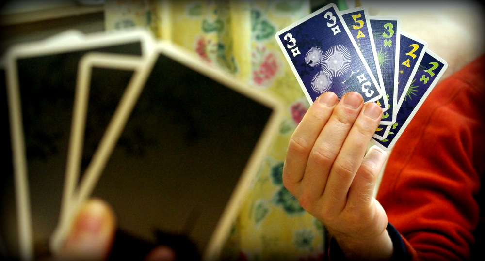
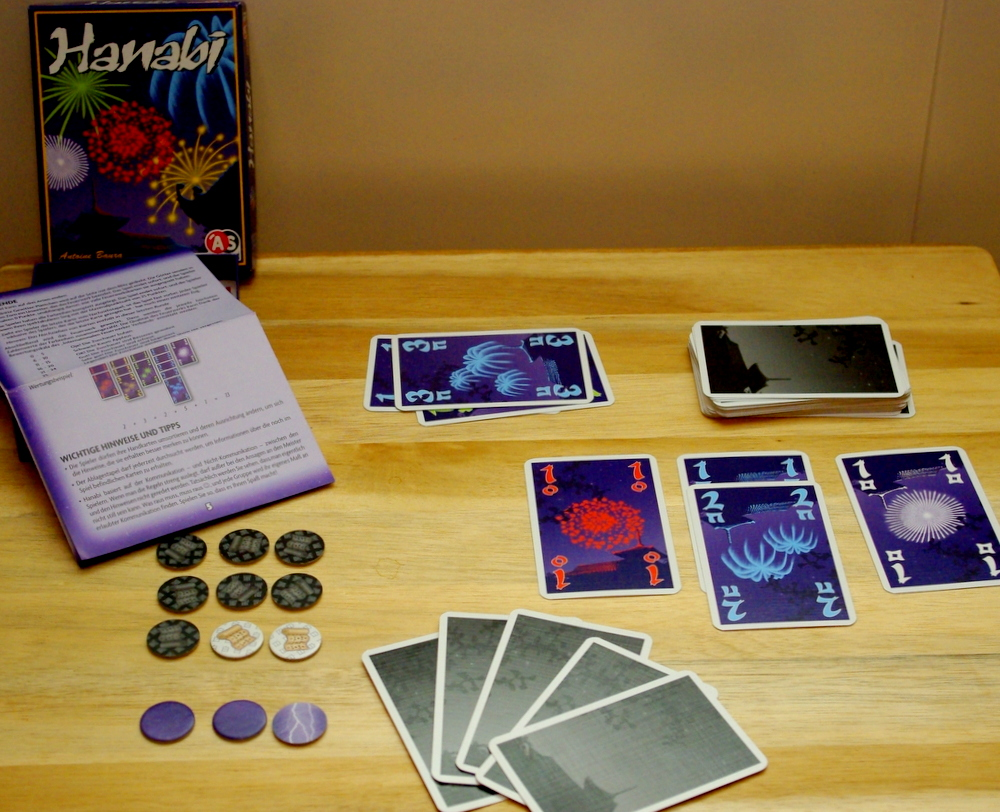

Mensch, ich hab ja lange keinen Spieletipp mehr gegeben - und das, obwohl es doch jetzt Hanabi gibt!

[Hanabi](http://www.spiele-check.de/page.php?page=game_view&gameid=11641 "Hanabi bei spielecheck.de (Infos, Bilder und Rezensionen)") ist genau das richtige Spiel für den Apfeleimer: der Autor Antoine Bauza hat mit wenig Material (nur ein kleiner Stapel Karten) ein schnelles elegantes Spiel ohne Schnörkel erfunden, und außerdem ist es **rotpreisverdächtig** billig! Nur etwa 7-8 Euro muss man hinlegen (z.B. bei Onlinebuchhändlern oder bei Müller) für eine Menge Spielspaß für 2-5 Spieler. Den hat man nämlich auch, das ist ja am Ende - trotz Rotpreis - doch das Wichtigste.

Was zuerst auffällt: he, die halten die **Karten ja verkehrtherum**! Das gehört so. Denn bei Hanabi soll man nicht die eigenen Karten sehen, sondern die der anderen. Trotzdem spielen alle gemeinsam miteinander gegen das Spiel, nicht gegeneinander. Man kooperiert, deduziert **und kommuniziert auch ganz ordentlich**. Das kommunikative Element finde ich ja beim Spielen total wichtig. Ich mag deswegen auch die Spielehits 7 Wonders (auch von Bauza!) und Dominion nicht so, weil man da eher stumm spielt. (Das ist nichts für mich, sogar Singleplayer-Computerspiele spiele ich lieber zu mehreren, da kann man sich viel besser beraten.)

Wir wollen nämlich **zusammen ein tolles Feuerwerk hochgehen lassen, und zwar alles schön in der richtigen Reihenfolge**: Zuerst ein roter Knall, dann zwei, dann drei, bis zum fünften. Das gleiche auch für die anderen Farben. Der Name ist schließlich japanisch und bedeutet dort Feuerwerk - und in Japan muss schließlich alles seine Ordnung haben.

### Wie es geht

Übersetzt in ein Kartenspiel bedeutet das: wir legen Karten in der richtigen Reihenfolge von 1 bis 5 aufgefächert aus, jede Farbe auf ihren eigenen Stapel. Blöd nur, dass wir **unsere eigenen Karten gar nicht sehen können** - na wenigstens können die anderen einem aber dafür **Hinweise** geben.

Sie können einem sagen, **wo man rote (oder gelbe, blaue, etc) Karten auf der Hand hat. Oder aber sie sagen einem, wo man Einsen (oder 2en, etc) stecken hat.** Beides gleichzeitig sagen - "du hast da ne rote 1!" - wäre witzlos, deshalb ist das gar nicht erst erlaubt.

Man darf nur auf **alle** Karten einer bestimmten Farbe oder bestimmter Zahl deuten. Als Kartenbesitzer merkt man sich das am besten gut und kombiniert sein Wissen mit den Tipps, die man von den anderen bekommen hat. Auch was die anderen für Karten auf der Hand haben, sieht man ja, und kann hilfreich sein.

Wenn man dann denkt, sicher zu sein was man hat, legt man eine Karte aus - **hoffentlich in der richtigen Reihenfolge, ohne doppelte Karten und ohne Lücken**. Wenn nicht (z.B. rote 1 oder 3 soll auf rote 1), gibt es einen **Blitz** (siehe links unten, ein Blitzplättchen wird umgedreht) - es droht ein Gewitter aufzukommen und das ganze schöne Feuerwerk ins Wasser fallen zu lassen. Denn das passiert nach drei solchen Blitzen.

Klingt ja alles ganz einfach? Ist es aber nicht ganz, denn **man darf nicht endlos viele Hinweise geben** - irgendwann sind die Hinweisplättchen (die hellen mit der Schriftrolle) aufgebraucht. Man bekommt nur neue, wenn man eine Karte einfach auf den Ablagestapel wegwirft. Oh-oh, hoffentlich war das eine, die man nicht mehr braucht. Viele Karten sind nämlich mehrmals im Spiel, und wer braucht schone eine rote 1, wenn man schon bei der roten 3 angelangt ist mit dem Auslegen. Aber aufgepasst: die 5 gibt es in jeder Farbe nur einmal! Die sollte man also lieber nicht abwerfen.

Wenn der Zugstapel aufgebraucht ist, geht es langsam ans Punktezählen. 25 Punkte kann man erreichen, aber auch 21 sind schon gut: "das Publikum ist begeistert". Ab 20 ist es dann nur noch "zufrieden", und ab 15 sind sie auch noch "besseres gewohnt".

### **Fazit:**

Hanabi ist seit Weihnachten wohl unser meistgespieltes Spiel. Bei fast jedem Spieletreff kommt es auf den Tisch, und es sind immer auch mehrere Exemplare da, weil das wohl einfach jeder haben muss, so gut ist es. Auch in der Familie kommt es super an. Besonders interessant ist, wie unterschiedlich es sich spielt, wenn man seine Mitspieler gut oder noch nicht so gut kennt. Dann versteht man die Hinweise oft recht schnell und intuitiv, weil man wohl im engeren Freundes- und Familienkreis ähnlich denkt. Bei fremderen Mitspielern muss man sich manchmal erst explizit drauf einigen, was man aus den Hinweisen schließen kann.
