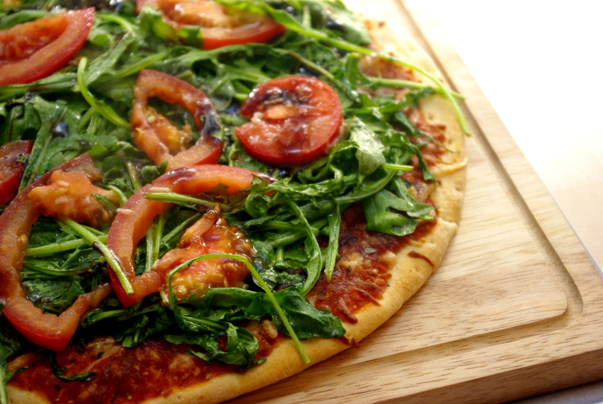

Wer schon länger mitliest, weiß: Wenn es mal wieder schnell gehen muss sind wir hier beim Apfeleimer nicht so; es muss nicht immer alles from Scratch (oder die allerbeste Qualität vom Bio-Wochenmarkt) sein, da gibt es auch mal Fertigpizza - dann aber immer ein bisschen verfeinert, vorzugsweise mit etwas, was es gerade als Rotpreisangebot im Supermarkt gab. Neulich war das Rucola. Bei diesem Rezept wird der Rucola mit Tomaten erst zu einer Art Salat verarbeitet, ganz ähnlich, wie wenn man ihn roh essen wollte - mit Knoblauch, Essig und Öl. Die Idee habe ich [hier vom Chefkoch](http://www.chefkoch.de/rezepte/186701079954570/Rucola-Pizza-mit-Parmaschinken.html "Chefkoch.de: Rucolapizza mit Parmaschinken") - den dort verwendeten Schinken lasse ich aber natürlich weg, wir sind hier schließlich nicht in der Schnitzelwirtschaft sondern im vegetarischen Apfeleimer.

 

## Zutaten

für 3 gefrorene Pizzen - etwa 3-4 Portionen

- 3x **Fertigpizza** Margherita (tiefgefroren)
- soviel **Rucola** wie man mag (ich nahm 150 Gramm für drei runde Pizzen)
- 2-3 **Tomaten** (in Stücke/Scheiben schneiden)
- Balsamico-**Essig** oder -Creme
- **Öl** (wer's mag, nimmt am besten Olivenöl)
- 2 **Knoblauchzehen**

## Zubereitung

1. **Rucola** und **Tomaten** waschen.
2. **Tomaten** in halbe Scheiben oder wie man mag schneiden, **Knoblauchzehen** hacken oder auspressen und zu den Tomaten geben.
3. **Rucola** dazugeben und verrühren.
4. Pizza nach Anleitung backen, **3 Minuten vorher** rausnehmen, **Öl in den Rucola-Tomaten-"Salat" rühren** und alles auf der Pizza **verteilen**.
5. Pizza noch **drei Minuten** in den Ofen schieben, bis der Rucola leicht **anwelkt**.
6. Nach dem Rausnehmen noch ein wenig **Balsamico** darüber träufeln.
