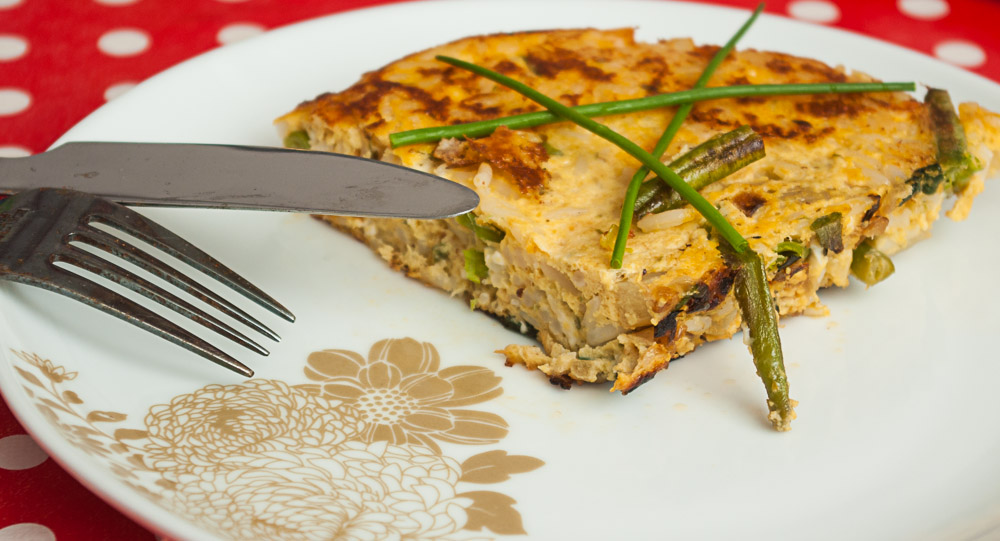

 

Von den wunderbaren Resteverwertungsmöglichkeiten der Fritata habe ich [das erste mal bei Katy vom Non-consumer Advocate gelesen](http://thenonconsumeradvocate.com/2009/10/cheap-eats-hakuna-frittata/).  

Was auch immer noch im Kühlschrank ist, sei es gekochter Reis, Nudeln, oder gekochte Kartoffeln vom Vortag, zusammen mit ein paar Eiern und etwas Gemüse (zB aus dem Gefrierfach), und wenn man hat, noch etwas Käse, hat man schnell eine vollständige Mahlzeit. Die abgebildete Fritata ist aus Reis, grünen Bohnen, einem Blatt Mangold und zerbröseltem Feta, der noch offen im Kühlschrank war. Als Flüssigkeit zum Verdünnen der Eier (ohne wird die Fritata sehr fest) habe ich einen Rest Steaksoße genommen. Die stand noch von Silvester im Kühlschrank und war nie besonders gut angekommen. Ich habe sogar die Flasche mit Wasser ausgespült, um den letzten Rest rauszubekommen und das Ei noch etwas zu verdünnen.

## Zutaten

für 2 Portionen

- 3-4 **Eier** (können auch übriggebliebene Eiweiße von Eierlikör, Eis, etc. sein, dann etwas mehr)
- 1 **Zwiebel**, gewürfelt
- schon **gekochten Stärkerest**: Reis, Nudeln, gewürfelte Kartoffeln
- 1-2 Handvoll **Gemüse**, was da ist: hier gefrorene grüne Bohnen und ein Blatt Mangold
- etwas **Käse**: ich habe hier eine Handvoll übriggebliebenen Feta (zerbröselt) verwendet
- etwas **Flüssigkeit**: Milch, Rest Grillsoße aus fast leerer Flasche, Ketchup...
- Salz, Pfeffer

## Zubereitung

1. **Zwiebeln** mit dem gewürfelten **Gemüse** anbraten.
2. Inzwischen die Stärke (**Kartoffelwürfel, Reis oder Nudeln**) mit den **Eiern, dem Käse** und etwas **Flüssigkeit** verrühren und mit **Salz und Pfeffer** kräftig würzen.
3. **Ei-Gemisch** über **Gemüse und Zwiebeln** in die Pfanne gießen.
4. Einige Minuten braten, dann **wenden**. Das ist nicht ganz einfach; ich habe es mit einem großen Teller gemacht, den ich auf die Pfanne gelegt habe, dann die Fritata durch Umdrehen der Pfanne auf den Teller befördert und von dort wieder, jetzt gewendet, in die Pfanne gleiten lassen. Nochmal ein paar Minuten fertigbraten lassen.
