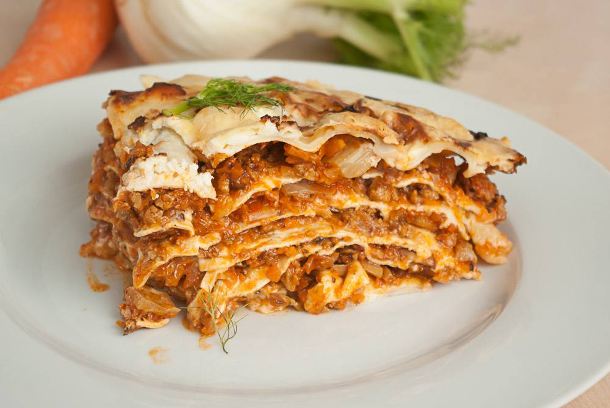

Bevor schon wieder der nächste Nudeldienstag ist, poste ich jetzt endlich mal das Rezept vom letzten Dienstag. Eigentlich sind es aber eher Verweise auf andere Rezepte, denn diese Lasagne basiert auf ein paar, die es schon mal gab – und zwar auf der [Fenchelbolognese](http://apfeleimer.wordpress.com/2012/04/18/fenchelbolognese/ "Nudeln mit Fenchelbolognese") als rote Soße und [Bechamelsoße](http://apfeleimer.wordpress.com/2012/05/04/blumenkohl-mit-bechamelsose-und-semmelbrosel/ "Blumenkohl mit Bechamelsoße und Semmelbrösel") als weiße Soße.

## Zutaten

für 4-6 Portionen

- Lasagne-**Nudelplatten**
- **Käse** zum Überbacken (ich habe diesmal Feta genommen)

**Fenchelbolognese:**

- 1 große **Fenchelknolle** (ca. 300-400 Gramm)
- 3 **Möhren**
- 2 **Knoblauch**zehen
- 2 EL **Öl** zum Braten
- 180g **Sojahack** (eine ganze Packung bei der Sorte, die wir hatten) oder 400g **Seitanhack** (ich habe Seitan selbst mit Gewürzen und Wasser angemischt, dampfgegart und dann in der Küchenmaschine feingehackt)
- 1 große oder 2 kleine **Dosen Tomaten** (800g) oder eine Tube (200g) **Tomatenmark**.
- etwas **Gemüsebrühpaste** (oder Pulver)
- kleines Glas **Rotwein** (zur Not geht auch Weißwein oder vielleicht auch Balsamico)
- **Pfeffer & Salz**

**Bechamelsoße:**

- 2 EL **Öl** + 1 TL **Butter**
- 2 EL **Mehl**, gehäuft
- 500 ml **Milch**

## Zubereitung

1. Zuerst die **Bolognese** [nach diesem Rezept kochen](http://apfeleimer.wordpress.com/2012/04/18/fenchelbolognese/ "Nudeln mit Fenchelbolognese"), gerne auch am Vortag, nach einer Nacht durchziehen schmeckt sie noch besser.
2. **Für die Bechamel: Butter und Öl** in einem kleinen Topf erhitzen und 2 gehäuft EL **Mehl** darin unter Rühren anrösten. Jetzt die Flüssigkeit (1/2L **Milch**) langsam unterrühren und aufpassen, das es nicht klumpt. Am Anfang kann das sehr schnell gehen – ich rühre deshalb direkt mit einem Schneebesen, damit ich eventuelle Klumpen direkt wieder zerschlagen kann.
3. Jetzt etwas **Knoblauchpulver** und **Zucker** einrühren und noch ein Stückchen weiterköcheln lassen, damit das Mehl seinen mehligen Geschmack verliert. Immer schön weiterrühren!
4. Bechamel, Lasagneplatten und Bolognese (in dieser Reihenfolge) **abwechselnd** in einer Auflaufform aufschichten, ganz zuunterst in die Form gehört immer eine Schicht weiß, also Bechamel, und zu oberst nach der letzten Nudelschicht ebenfalls nochmal großzügig weiße Soße drauf. Dann mit Käse bedecken und wie auf der Lasagneplattenpackung angegeben backen. Bei mir waren das 180°C bei Umluft für mindestens 30 Minuten. Eventuell den Käse eine Weile bedecken, damit er nicht verbrennt.
