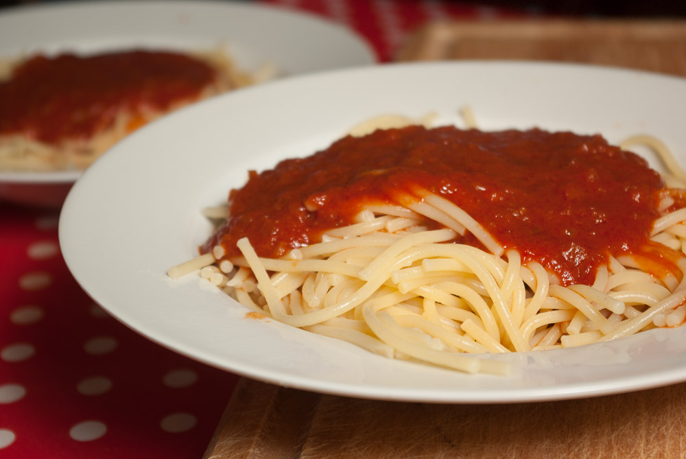

[Tomate Frito](http://en.wikipedia.org/wiki/Tomate_Frito) haben wir vor einiger Zeit in einer Spanien-Sonderaktion im Supermarkt als Soße im Glas gekauft. War lecker, natürlich ganz schnell gemacht (Glas auf, Herd an), süßer als "italienische" Standard-Tomatensoße und erinnerte mich an die Nudelsoße, die es früher bei uns zu Hause gab, wenn mein Vater mal ausnahmsweise gekocht hat. Muss wohl ein Rezept von seiner Mutter sein. Jetzt gibt es die Sonderaktion und so auch die Soße nicht mehr, und nachdem ich mich auf der Zutatenliste und bei Wikipedia schlau gemacht habe, was so hineingehört, habe ich mich an die Arbeit gemacht, das ganze nachzubasteln. Die ersten 1-2 Male stimmte es noch nicht so ganz, aber beim dritten Mal habe ich es hinbekommen. Wichtig: bei Tomate Frito ist **Zwiebel** dran, und im Original, wie es der Name schon sagt, werden die Tomaten **gebraten**. Ich habe stattdessen Tomatenmark gebraten, das spritzt nicht so wie die wässrigen Tomaten und geht auch schneller. Und Öl ist ebenfalls wichtiger Bestandteil, laut Wikipedia. Ich sage, damit es so schön süßlich wird wie die im Glas, ist es auch **Zucker**. Und dazu ist das Rezept noch **so einfach, dass es fast so schnell geht, wie ein Glas aufzumachen**. Und so muss es sein am Nudeldienstag, da müssen wir schließlich gleich zum Spieletreff und sind sowieso immer spät dran.

## Zutaten

für 4 Portionen und 500g Nudeln

- 2-3 EL **Öl**
- 1 Tube **Tomatenmark**
- 1 **Zwiebel**, sehr fein gehackt
- 1 EL [Gemüsebrühpaste](http://apfeleimer.wordpress.com/2012/10/14/gemusebruhe-paste-eingemachtes-suppengewurz-und-inoffizieller-dreckwegtag/ "Gemüsebrühe-Paste / eingemachtes Suppengewürz und inoffizieller Dreckwegtag")
- 500 ml **Wasser** 
- (oder statt Paste und Wasser 500 ml Gemüsebrühe)
- 1 EL **Zucker**

## Zubereitung

1. In ordentlich **Öl** die **Zwiebeln** kurz anschwitzen, dann, wenn man sie verwendet, **Gemüsepaste** dazu und auch  **Tomatenmark**. Alles zusammen noch 2-3 Minuten weiterbraten.
2. Mit **Wasser** (oder Gemüsebrühe) aufgiessen, den EL **Zucker** einrühren und 3-5 Minuten weiterköcheln lassen. Fertig!
