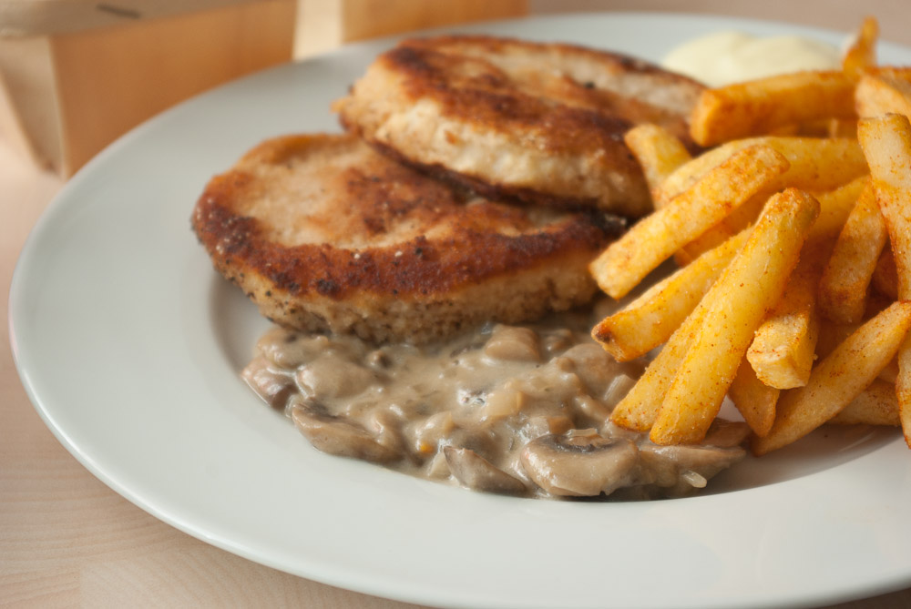

Noch eine Möglichkeit für [das Pilzragout](/posts/2013/02/pilzragout/ "Pilzragout") von letzter Woche: als **Pilzsoße** zu einem schönen Schnitzel, hier aus Sellerie, ähnlich wie [die Kohlrabitaler](/posts/2012/07/kohlrabitaler-mit-sesampanade-kartoffelbrei-und-joghurtdipp/ "Kohlrabitaler mit Sesampanade, Kartoffelbrei und Joghurtdipp") von vor ein paar Monaten.
