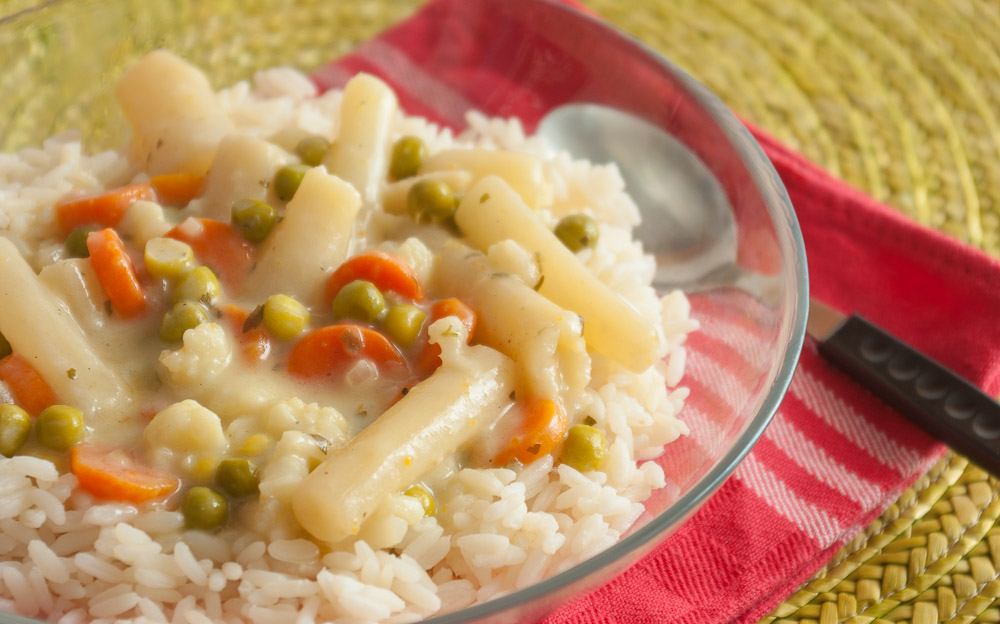
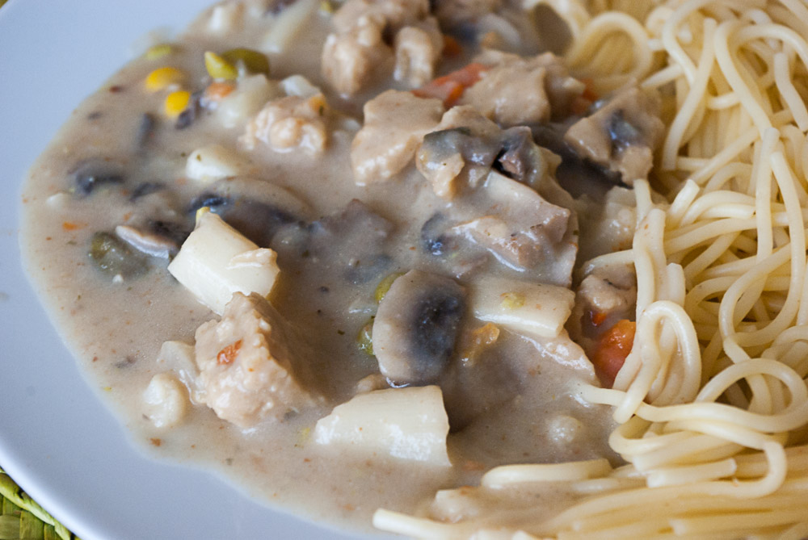

Hier mit Schwarzwurzel aus dem Glas.

Wenn man nach Rezepten für Hühnerfrikassee sucht, findet man immer nur solche komplizierten, bei denen man Schlagsahne im Haus haben muss und womöglich auch noch die Soße mit einem Eigelb legieren soll. Kommt gar nicht in Frage, vor allem weil die Rezeptautoren nie schlüssig erklären, wieso diese beiden Dinge so wichtig sind. Wenn es nur ums Andicken der Soße geht – haben die noch nie von Mehlschwitze gehört?

 Also Sahne haben wir nur zu besonderen Anlässen da, sonst würde der Apfel sowieso nur wieder Eiscreme draus machen. Ich finde auch nicht, dass Sahne in diesem Rezept so viel beitragen könnte – reicht ja schon, der armen Kuh die ganze Milch für dieses Rezept abzuzapfen, aber jetzt noch ganze 2 Liter davon verbraten, um nur 200ml Sahne zu erzeugen (wie die Verpackung stolz verkündet)? Und Eigelb zum Legieren finde ich einfach unnötig. Oder unterschätze ich hier die Eigelblegierung? Weiß das jemand?

 Daher habe ich mal alles Unnötige aus dem Hühnerfrikassee entfernt – die Hühner sowieso – und nur das Essenzielle dringelassen: **Gemüse** (auf jeden Fall Erbsen und Spargel oder Schwarzwurzel), eine **weiße Soße und Kapern**. 

 Na gut, man kann als Huhnersatz gegarte **Seitanstücke** hineingeben, aber auch mit Gemüse pur ist das Frikassee vorzüglich. Sogar die Gemüseschnippelei erspare ich mir durch Verwendung von gefrorenem Buttergemüse. Das überraschenderweise nämlich besser als sein Ruf ist – wer hätte gedacht dass dort eigentlich nur Gemüse, Butter, Stärke und Gewürze dran sind? Statt Spargel verwende ich hier Schwarzwurzeln, einfach weil ich die gerade da hatte und mal etwas variieren wollte. 

 Ein **Lorbeerblatt** gehört aber schon dran, deshalb bleibt es; auch wenn ich Lorbeer überhaupt nicht mag, und bei zuviel davon sehr empfindlich bin, besonders in Tomatensoßen. Auch hinein gehören Kapern. Leider hatte ich dieses Mal keine, daher sind auch keine auf dem Foto. Apfel war bestimmt froh, der mag nämlich wiedrum keine Kapern, dafür aber Lorbeer um so mehr. Ich finde auch den **Wein** wichtig; aber wenn jemand **keinen Alkohol verwendenden möchte** (und nein, [der Alkohol verdunstet nicht komplett beim Kochen oder Backen!](http://www.n-tv.de/wissen/frageantwort/Kann-Alkohol-verkochen-article7334566.html)) könnte den **Wein auch ersetzen**. Traditionellerweise mit einer Mischung aus Apfel- oder Traubensaft und Brühe – zumindest wird das überall im Internet so empfohlen. Ehrlich gesagt, finde ich aber, dass das überhaupt nicht schmeckt wie das, was ich am Wein im Essen so gut finde: das Herbe. Wer also etwas experimentierfreudiger ist, versucht es mal mit meiner neusten Idee: **schwarzem oder grünen Tee.** Bei hellen Gerichten wie diesem passt am besten grüner Tee, bei dunklen, zum Beispiel mit Tomatensoßen oder braunen Soßen, stelle ich mir schwarzen Tee passend vor. Eventuell kann man noch mit etwas Essig nachwürzen, aber mir reicht auch schon der tee allein, denn Wein, der sauer ist, ist für mich kein guter Wein. Vielleicht habe ich aber auch eine unkonventionelle Vorstellung von schmackhaftem Wein. Ich gebe zu: für mich muss Wein wenigstens ein bisschen süß, äh, "lieblich" sein. 

Luxus-Frikassee mit allem: frischem Spargel, frischen Pilzen, Seitan. Übrigens eingefroren und im Topf unter Rühren wieder aufgetaut, das geht also auch sehr gut.

Wer etwas ganz besonderes aus einem Alltags-Frikassee machen möchte, kann gerne Spargel oder Schwarzwurzel und Erbsen und Karotten frisch zubereiten, Seitan (oder Huhn, grummel) dazugeben und vielleicht sogar einen Teil der Milch mit Sahne ersetzen. Ein paar Champignons passen auch sehr gut dazu, zur Not auch aus Glas oder Dose. Aber auch in der einfachen Variante ist das Frikassee sehr gut. Genug geredet, ein Rezept gibt es doch auch!

## **Zutaten**

- Öl und 1-2 EL Butter (für die Mehlschwitze)
- 2 gehäufte EL Mehl (ebenso)
- 250-300 ml Milch
- 1 Glas Schwarzwurzel (meins hatte 530g, Abtropfgewicht 320g) oder 1 Glas Spargel (alternativ für Gourmetfrikassee: 1 Pfund frischen Spargel in ca. 3-5 cm lange Stücke schneiden und im Frikassee mitgaren)
- 1 Karton (300-400g) tiefgefrorenes Buttergemüse (mindestens Erbsen und Möhren sollten drin sein, bei mir waren noch Blumenkohl und Mais dabei)
- optional: 150g Seitan aus Glutenmehl mit Gemüsebrühpulver, Knoblauch und Zwiebelpulver gewürzt, mit Wasser und Öl verknetet und im Dampfeinsatz gedämpft, dann in mundgerechte Stück schneiden)
- ca. 100ml Weißwein (oder kräftig aufgebrühter grüner Tee)
- 1 Lorbeerblatt
- Zitronensaft
- Kapern
- Salz, Pfeffer

## **Zubereitung**

1. Eine **Zwiebel-Mehlschwitze** machen: 1/2 bis 1 kleingewürfelten **Zwiebel** in **Öl und etwas Butter** glasig garen und dann 2 gehäufte EL **Mehl** darin hell anrösten.
2. Aufgießen mit 250-300ml **Milch** (langsam und am besten mit Schneebesen).
3. Das Glas **Schwarzwurzeln** (oder **Spargel**) komplett mit Flüssigkeit hineingießen (längere Stangen vorher in mundgerechte Stücke schneiden) und die Packung gefrorenes **Buttergemüse** ebenfalls heineingeben. (An dieser Stelle würde ich **Seitan** dazugeben, wenn verwendet; und auch die optionalen **Pilze** kann man jetzt hinzugeben.)
4. 1 EL **Gemüsebrühpaste** (oder Pulver), kleines Glas **Weißwein** (oder übriggebliebenen abgestandenen Sekt, oder eben den **grünen Tee**) und 1 **Lorbeerblatt** dazurühren.
5. 8-10 Minuten köcheln, dann Lorbeerblatt wieder herausfischen.
6. Mit einigen Tropfen **Zitronensaft**, Pfeffer und ein paar **Kapern** abschmecken, eventuell nachsalzen.
7. Dann auf Tellern mit **Reis** zusammen servieren.
