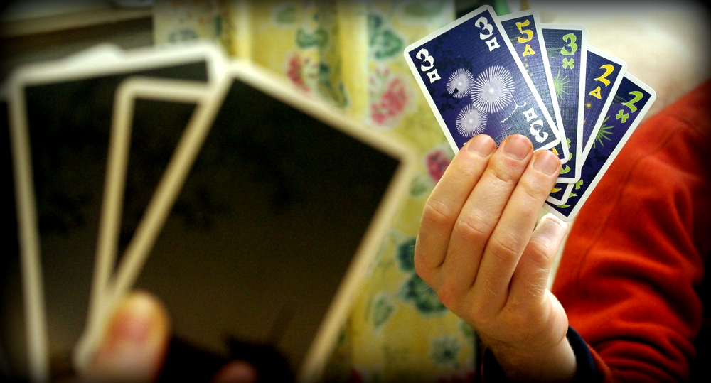

Schon vor Eeeewigkeiten habe ich ja schon das Potential des kooperativen Kartenspiels Hanabi entdeckt und [es hier vorgestellt](/posts/2013/02/spieletipp-hanabi/). Auch auf unserer Silvesterfeier habe ich es jedem aufgedrängt, weil ich es einfach superdupertoll finde. Jetzt hat das auch [die SdJ-Jury erkannt und Hanabi zum Spiel des Jahres 2013 gekürt](http://www.spiel-des-jahres.com/cms/front_content.php?idcatart=1228&id=828), yeah... äh.

Leider hab ich beim SdJ-Tippspiel unseres Spieletreffs anders getippt – für Familien mit gemischtaltrigen Spielern finde ich Hanabi nun doch nicht optimal, da hätte ich das ebenfalls nominierte Augustus vorgezogen.

Hanabi lebt halt vom richtigen Tippgeben, und ich befürchte, dass Kinder da leicht mal durcheinanderkommen und vielleicht sogar (absichtlich oder unabsichtlich?) schummeln. Das ist vielleicht in anderen Spielen nicht so schlimm, aber falsche Tipps und Unaufmerksamkeit können bei Hanabi ganz schnell zu Frustration und sogar Familienstreitigkeiten am Wohnzimmertisch führen, befürchte ich - besonders bei älteren und jüngeren Geschwistern.

Versteht mich nicht falsch, trotzdem finde ich das Spiel natürlich immer noch super, es ist eins meiner absoluten Lieblingsspiele – allerdings eher in reinen Erwachsenengruppen. **Was sagt ihr denn dazu**, falls ihr das Spiel schon kennt? (Zum Beispiel Herr Ö., der bestimmt gerade mitliest!)
