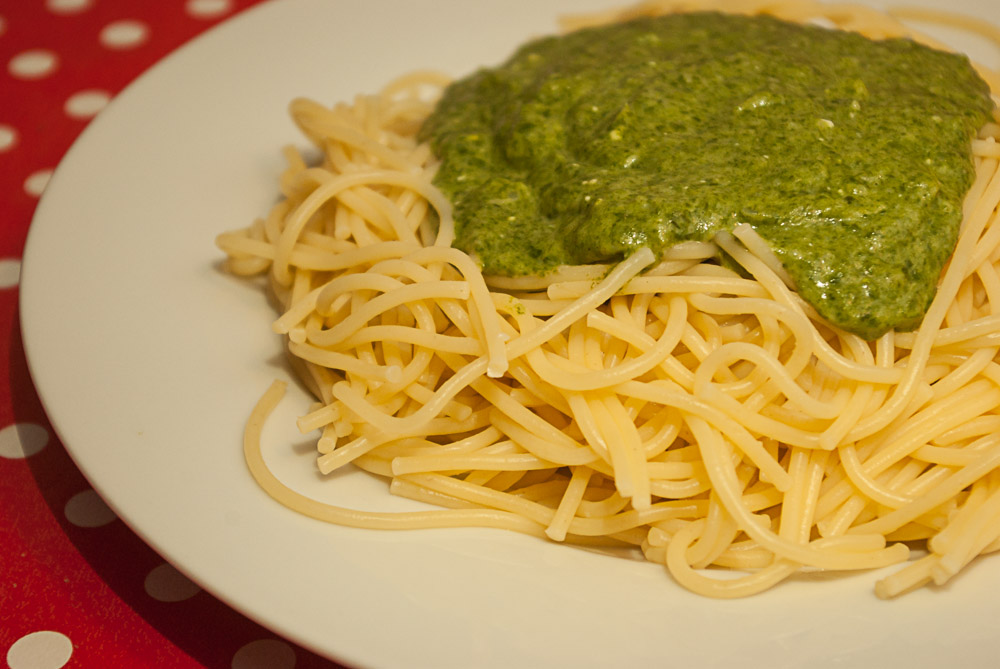

Oh Mann, wie lange ich an diesem Rezept herumgedoktert habe! 

Zuerst ist mir diese oder eine ähnliche Soße beim Spielen begegnet – unser Spieletreff findet in einem Restaurant/Kneipe statt, und jemand am Nebentisch hatte etwas bestellt, das unglaublich gut roch. Ich dachte zuerst, daß es **Nudeln mit Shrimps und viel Knoblauch** wären und habe mir die ganze Sache erstmal abgeschminkt. 

Aber die Sache hat mich nicht losgelassen, und irgendwann bin ich sogar soweit gegangen, **aus Seitan eine Art vegetarische Meeresfrüchte zu basteln**. Tintenfischringe vermisse ich ja schon lange, seit ich Vegetarier geworden bin, und ich dachte, wenn ich einmal das richtige Rezept für diesen Seitan habe, kann ich ja alles mögliche draus formen. Kurz gesagt: es hat nicht gut geklappt, obwohl ich mühsam **Meeresalgenblätter** (eigentlich für Sushirollen) im Mörser zerkleinert und in den Teig gemischt habe – es wollte einfach nicht nach Meerestieren schmecken.

Eine Zeitlang hatte ich aufgegeben, war aber zwischenzeitlich im gleichen Restaurant zum Essen eingeladen worden. Die vegetarische Auswahl ist nicht sehr groß, daher entschied ich mich für **"Spaghetti alla Verona"** – mit Spinat, Sahne, Knoblauch und Parmesan. Und was soll ich sagen, als es kam, roch es genau so wie das verloren geglaubte "Meeresfrüchte"-Gericht. Das war es also, und **der Sieg war nah**!

Natürlich habe ich direkt vergessen, nach dem Rezept zu fragen und irgendwie empfand ich es auch als Herausforderung, selber drauf zu kommen. Also probierte ich mit den Zutaten mehrmals zu Hause herum – leider schmeckte es nie so wie im Restaurant.

Irgendwann gab ich klein bei und begab ich mich zu meinem alten Bekannten, dem [Chefkoch. Dort fand ich dann](http://www.chefkoch.de/rezepte/48501016462319/Spaghetti-mit-Spinatsauce.html "Ur-Rezept bei chefkoch.de") (fast) das folgende Rezept. Verrückt, die Zutaten sind so simpel, ja fast schon ordinär. 

Natürlich habe ich deswegen das ganze auch noch etwas geändert – ich nehme viel mehr Spinat, und auch keinen Rahmspinat (da sind mir die Zutaten doch etwas fragwürdig), sondern **normalen tiefgefrorenen Blattspinat** ohne alles. Den Chefkoch-Standard, den Becher süßer Sahne, habe ich auch gekippt, oder zumindest in den dort fast ebenso beliebten Standard – **Schmand** – getauscht (schäm, ich mag ihn halt auch). Dafür aber weniger – durch die vorteilhaft feste Konsistenz haben halbvolle Schmandbecher wenigstens nicht die ärgerliche Tendenz, allenthalben im Kühlschrank oder anderswo umzufallen und ihren Inhalt überall zu verteilen, so wie süße Sahne es tut (Apfels Rucksack kann ein Lied davon ~~stinken~~ duften).

## Zutaten

für 4 Portionen

- 350-400 g Spinat, tiefgekühlt (das war bei mir etwa eine halbe Packung)
- Öl zum Braten
- 100 ml Milch
- 3 Zehen Knoblauch, fein gehackt oder aus der Knoblauchpresse
- 1 Zwiebel, gewürfelt
- 1/2 Becher Schmand oder saure Sahne (100g)
- 50 g Käse (Parmesan ist optimal, aber ich nehme einfach immer, was gerade im Haus ist; mal Gouda oder sogar Feta...)
- 1 EL Mehl, gehäuft
- Salz und Pfeffer
- etwas Essig, Zucker

## Zubereitung

1. **Zwiebel** und **zwei** der 3 **Knoblauchzehen** andünsten.
2. **Spinat** unaufgetaut hinzugeben und mit etwas Milch aufgießen. Deckel drauf und nach Packungsanweisung garen (ca 5-10 Minuten).
3. **Schmand** oder Sahne und den **Käse** (gerieben oder kleingewürfelt) hinzugeben, alles schmelzen lassen.
4. Jetzt das **Mehl** darüberstreuen und alles zusammen **pürieren** (mit dem Mixstab).
5. Dann zum Andicken **aufkochen**, bis die gewünschte Soßenkonsistenz erreicht ist.
6. Zuletzt noch die letzte zerkleinerte **Knoblauchzehe** einrühren und würzen: mit **Salz, Pfeffer, etwas Zucker** und ein bisschen **Essig oder Zitronensaft** - ich finde ein Fitzelchen Säure gehört zum Spinat, sonst schmeckt er etwas fad.
