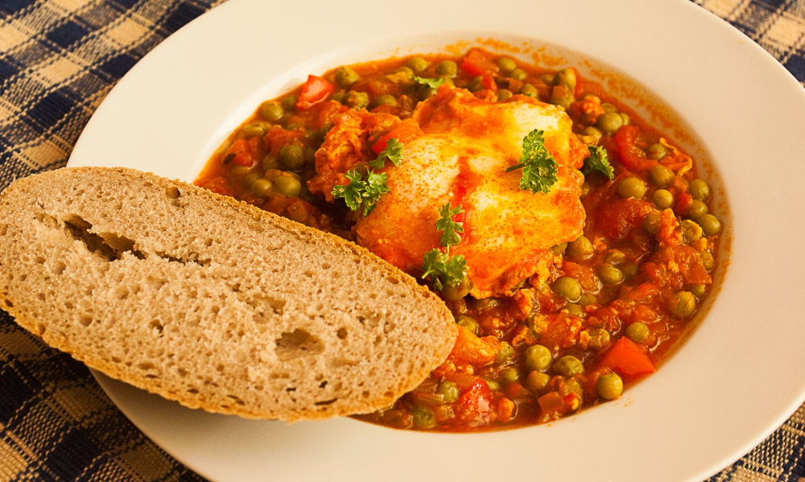

Shakshuka, [Shakshouka](http://en.wikipedia.org/wiki/Shakshouka "bei der englischen Wikipedia"), Schakschuka, Chakchouka, alles Namen für das gleiche Gericht – es stammt aus Nordafrika und besteht hauptsächlich aus einer **Tomatensoße** mit verschiedenen Gemüsen (fast immer ist Paprika dabei), in der mehrere **Eier** ganz und ohne Schale gegart werden. Gewürzt wird es scharf und fast immer mit Kreuzkümmel, manchmal auch noch mit Zimt. Man isst es, dort wo es herkommt, als Frühstück oder zum Brunch, aber wir mögen es auch als Abendessen oder Mittagessen.

Inzwischen ist es wohl in **Isreal** sehr beliebt, habe ich herausgefunden. Es finden sich in verschiedenen Kochbüchern und in Kochblogs wirklich unglaublich viele Variationen, so daß man sich manchmal fragen muss, ob das noch das gleiche Gericht ist. Das erste mal ist mir Shaskshuka in "Vegetarisch" vom GU-Verlag begegnet – daraus habe ich es dann auch mal gekocht und wir fanden es beide ziemlich gut – in dieser Version enthielt es **Erbsen**, die der Apfel noch von den Nudelsoßen seiner Kindheit kennt. Wir erinnerten uns auch später nochmal daran und hätten es gerne nachgekocht, ich fand aber nur noch ein Foto davon auf meiner Festplatte, und das auch noch ohne Namen und weder mit Angabe des Kochbuches noch mit Zutaten, wie ich es sonst meistens ablege. Nach Blättern in einigen weiteren Kochbüchern fand ich es schließlich nochmal ganz anders – vor allem **ohne Erbsen**! – in Yotam Ottolenghis "Genussvoll vegetarisch" (im Original ist der Name schöner: "Plenty"). Am Ende habe ich mich entschieden, eine Kombination der verschiedenen Rezepte zu bauen, mit allem, was mir an ihnen gut gefällt. Heraus kam das folgende Rezept, und das fertige Gericht war dann auch sehr gut – daher präsentiere ich es gern hier! Die Erbsen sind übrigens in meiner Version dringeblieben.

Noch ein [Tipp von David Lebovitz](http://www.davidlebovitz.com/2013/02/shakshuka-recipe-eggs/): man kann die Soße auch einfach in größeren Mengen einfrieren und kann sie dann jederzeit aufwärmen und ein paar Eier hineingleiten lassen. Nettes "Fertiggericht".

## Zutaten

für 4 Portionen

- Öl zum Anbraten
- 1 TL Kreuzkümmel
- 1-2 Zwiebeln, fein gehackt (ich habe 1,5 genommen)
- 4-5 Knoblauchzehen, feingehackt
- 1 Paprikaschote (rot), klein gewürfelt
- 2 kleine oder 1 große Dose Tomaten mit Saft (Tomaten würfeln)
- 1 EL Zucker
- Salz
- 1 Messerspitze Zimt
- 1/2 TL Paprikapulver edelsüß
- 1 Lorbeerblatt
- 3-4 Thymianzweige, die abgezupften Nadeln
- scharfe Soße oder Cayennepfeffer
- 250g gefrorene Erbsen
- 4 Eier
- Petersilie zum Dekorieren

## Zubereitung

1. **Kreuzkümmel** in heißem **Öl** anrösten, dann **Zwiebeln** dazu und weiterbraten bis sie goldbraun sind.
2. **Paprikawürfel** und **Knoblauch** dazugeben und 5 Minuten weiterbraten.
3. Dann die **Tomatenwürfel** dazugeben und mit **Zucker, Paprika, Zimt, Salz** würzen. **Thymiannadeln** und **Lorbeerblatt** hineingeben und 10-20 Minuten köcheln lassen.
4. **Erbsen** dazugeben und weitere 5-10 Minuten weiterköcheln. **Lorbeerblatt** herausnehmen. **Scharfe Soße** oder **Cayennepfeffer** dazugeben bis zur gewünschten Schärfe und eventuell nachwürzen (Salz).
5. Jetzt nacheinander mit einem Löffel **vier** kleine Mulden in die Oberfläche drücken und in jede ein **Ei** gleiten lassen. **Paprika und Salz** drüberstäuben und den Deckel draufsetzen. 8-12 Minuten bei niedriger Temperatur stocken lassen.
6. Jetzt für jeden Soße und ein Ei auf einen Teller geben, mit Petersilie bestreuen und **Brot** dazu servieren.
