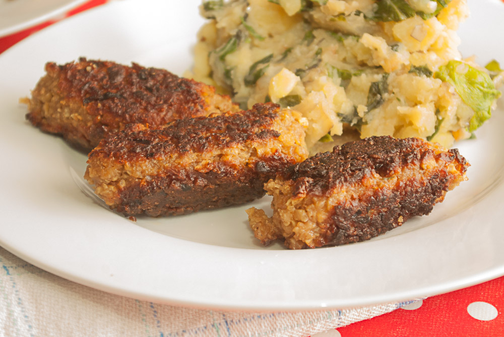

[Schon vor einer Weile](/posts/2012/07/kohlrabitaler-mit-sesampanade-kartoffelbrei-und-joghurtdipp/ "Kohlrabitaler mit Sesampanade, Kartoffelbrei und Joghurtdipp") habe ich diese vegetarischen Cevapcici, die es bei uns zu [Mangold-Kartoffeln](/posts/2012/03/kroatisch/ "Blitva, Kroatische Mangoldkartoffeln") gibt, schon mal angeteasert. Dank meines treuen Lesers Herrn A. Ö. wurde ich dann kürzlich wieder daran erinnert, dass ich das Rezept ja noch gar nicht gepostet habe (ohoh, das is nun auch schon einige Monate her). Aber nun passt es ja auch noch gerade jahreszeitlich so gut rein – denn als insgesamt rundum balkan-inspiriertes Gericht ist es ja schon fast wie Urlaub, es – am besten auf dem Balkon (haha) – zu genießen.

Cevapcici sind ja ursprünglich eine Art Würstchen aus gewürztem Hackfleisch, das ich hier durch **Seitan** und ein paar Beigaben ersetze (**Haferflocken, etwas Mehl, Ei**). Ich denke aber, man kann **auch Sojahack verwenden**, dieses extrudierte leichte Granulat (dann natürlich vorher in etwas Gemüsebrühe einweichen), oder auch das gekühlte aus Tofu. 

Ich habe auch schon das Ei durch **Kichererbsenmehl** plus mehr Flüssigkeit ersetzt, oder auch **statt 2 Eier 3 Eiweiß** genommen, die bei uns immer nach dem Eismachen übrig sind. 

Das ganze ist leider überhaupt eine sehr ungenaue Angelegenheit, da ja jede Zutat auch immer etwas schwankt in der Konsistenz und im Flüssigkeitsgehalt. Wenn das erste Cevacici in der Pfanne nicht zusammenhält, sollte man etwas mehr Mehl einkneten, aber nicht übertreiben, sonst wird es zu dicht. 

Die Cevapcici haben übrigens ein bis zwei Tage später **aufgewärmt (oder kalt zum Salat) fast noch besser** geschmeckt.

Zum **Seitanhack**: ich mache hier einen Teig aus Glutenmehl, gewürzt mit Salz oder Gemüsebrühpulver, Knoblauchpulver und Paprikapulver, die Flüssigkeit, die ich dann hineinknete – Menge nach Gefühl, bis ein elastischer Teig entseht – besteht dann aus Öl, etwas Zitronensaft, scharfer Soße, eventuell etwas Sojasoße. 

Der Teig wird dann gedämpt. Das geht am besten im Dämpfeinsatz über siedendem Wasser (halbe Stunde sollte reichen) oder, etwas schneller, in einer Schüssel in der Mikrowelle (gut abgedeckt und mit Sojasoße bedeckt). Dann 10 Minuten, einmal wenden, nochmal 10 Minuten auf höchster Stufe - das wird zwar an ein paar wenigen Stellen vielleicht etwas hart und trocken, macht aber bei Hack nichts, finde ich, denn ... nun wird alles **in der Küchenmaschine kleingehackt**. Spätestens bei der Verarbeitung zu Cevapcici werden dann die wenigen trockenen Stückchen noch weich.

## Zutaten

- 300g **Seitanhack** (es geht sicher auch Soja-Hack aus Tofu oder aus mit Brühe aufgegossenem Granulat). Das Hack sollte mit Knoblauch und Paprika in Pulverform gewürzt werden, die man entweder vor dem Zerhäckseln direkt in den Seitanteig mischt oder später ins fertige Hack mischen kann.
- 1 **Zwiebel**
- 3-4 **Knoblauchzehen**
- 1 Handvoll **Petersilie**, kleingehackt
- 1 Handvoll **Hafeflocken**
- 1 Handvoll **Mehl**
- 2 **Eier**, etwas Kicherbsenmehl oder 2-3 Eiweiß
- ein paar EL **Öl** (Hack braucht Fett, denn Seitan ist für meinen Geschmack allein zu mager und wird leicht trocken)
- 1 TL bis EL **Paprika edelsüß**
- etwas **scharfe** Soße oder Chili oder Paprika rosenscharf
- **Salz**, 1 TL **Zucker**
- genug **Wasser**, um die Masse formbar zu machen

## Zubereitung

1. Alle Zutaten zusammenkneten und sehr fest **zu Würsten formen**. Wie lang die Würste werden sollen, entscheidet man am besten danach, welche Küche man nachmachen will – in der Türkei und Bosnien-Herzegowina sind sie nur **5 cm** lang, und in Serbien eher **10 cm**, wie Wikipedia mich belehrt. (Was ist mit Kroatien? Da bekommt man sie auch, kann ich bezeugen, und ich glaube sie sind da auch eher 10 cm lang.)
2. Zuerst nur einen zum Testen scharf **anbraten**. Wenn der erste beim Braten auseinanderfällt, muss man bei den nächsten noch etwas mehr **Mehl** einkneten und beim Formen noch fester zusammendrücken!
3. Dazu passt Duvec-Reis (dazu habe ich noch kein Rezept, aber das kommt sicher auch noch, dann trage ich den Link hier nach) oder [Blitva, die kroatische Mangold-Kartoffeln](/posts/2012/03/kroatisch/).
