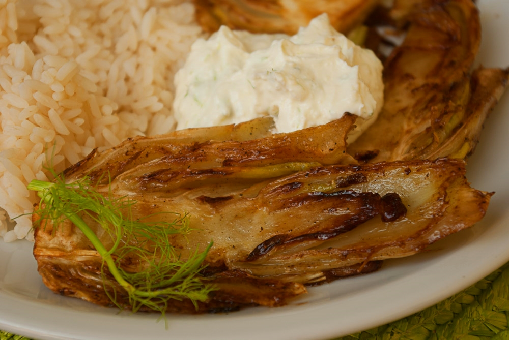

Fenchel gibt es ja öfter mal – bei dem einen in der Gemüsekiste, bei dem anderen im Super-Rotpreis-Sonderangebot – und meist weiß man nicht so recht, was man damit anfangen soll. Er ist halt doch etwas speziell. Und jedes Mal [auf nepalesisch machen](/posts/2013/01/nepalesischer-fenchel-mit-champignons-und-tomaten/ "Nepalesischer Fenchel mit Champignons und Tomaten") hängt einem auch irgendwann zum Hals raus.

Aber seitdem der Apfel zu Weihnachten _Yotam Ottolenghis_ vegetarisches Kochbuch _**"Genussvoll vegetarisch"**_ bekommen hat, ist das anders - zumindest bei uns -, und heute lasse ich endlich meine Leser daran teilhaben: das Geheimnis ist der karamellisierte Fenchel mit Feta-Quark!

Aber obwohl _Yotam_ (ich nenne ihn schon beim Vornamen, so lieb sind mir [seine Ideen](/posts/2013/07/shakshuka/) geworden) normalerweise abgefahrene Zutaten meidet, verlangt er in diesem Rezept einen _Ziegenquark_ als Beilage. Den hat noch nichtmal unser Hitmarkt, und das ist so ungefähr das exotischste Geschäft, das es hier in Drei-Kilometer-Umkreis gibt. Ok, stattdessen bietet er noch _Ziegenfrischkäse_ als Alternative an. Der wiederum enthält überraschend oft Gelatine, das kommt für uns nicht in die Tüte.  

Also musste ich mir mal wieder meine eigenen Gedanken machen, aber das mache ich ja eigentlich auch ganz gern. Heraus kam meine einzigartige **Feta-Quark-Creme**, aus – genau – einem Teil Fetakäse und ein bis zwei Teilen normalem Quark. Schmeckt super, wenn auch sicher ganz anders als Ziegenquark.

## Zutaten

- 2-3 große Knollen **Fenchel**
- 40 g **Butter**
- 3-4 EL **Öl**
- 2 EL **Zucker**
- **Salz** und **Pfeffer**

### Für die Feta-Quark-Creme:

- 100g **Fetakäse** (das ist in etwa eine halbe Packung)
- 250g **Quark** (Magerquark oder mit Sahne, wie man mag, wir haben beides schon gemacht)
- optional: 1 gepresste oder gehackte **Knoblauchzehe**
- feingehacktes **Grün** des Fenchels

## Zubereitung

1. **Fenchel** waschen, trockentupfen und das ungenießbare Zeug wegschneiden: die "Finger" und eine dünne Scheibe vom Wurzelansatz (die trockene braune Stelle ganz unten). Aufheben sollte man, nebem dem Fenchel selbst, das Grün. Es dient als Kraut für die Würzung der Käsecreme.
2. Fenchel längs in Scheiben von ca. 1 cm Dicke schneiden.
3. Die **Butter** zusammen mit dem **Öl** in einer großen Pfanne erhitzen, bis beides schäumt, dann einige Scheiben Fenchel hineinlegen – nicht zu viele auf einmal, sonst kühlt es zu schnell ab und wird nicht richtig braun. 3 Minuten braten, wenden und nochmal 2 Minuten bräunen.
4. Danach die Fenchelscheiben wieder aus der Pfanne nehmen und stattdessen den **Zucker** zusammen mit **Salz und Pfeffer** hineingeben.
5. Zuckermischung für eine halbe bis ganze Minute erhitzen, den Fenchel wieder hineinlegen und  ca. 2 Minuten pro Seite karamellisieren.
6. Für die Creme den **Fetakäse** mit dem **Quark** pürieren (oder, wenn es etwas gröber sein darf, den Käse zerbröseln und mit Quark verrühren). Nach Geschmack den **Knoblauch** und fein gehacktes **Fenchelgrün** einrühren. Bei Bedarf noch mit etwas Säure, nachwürzen z. B. Zitronensaft.
7. Dazu passt Reis oder Weißbrot.
