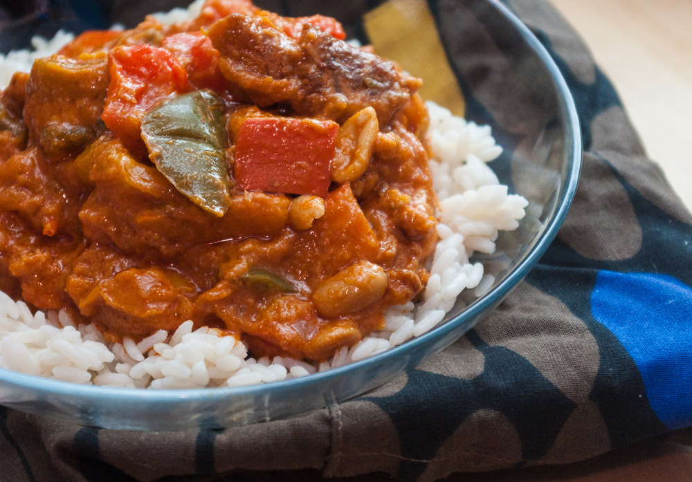

Je mehr dieser ethnischen Gerichte ich probiere, desto mehr wird mir klar, wie ähnlich sie sich überall auf der Welt sind: dieser Erdnusseintopf hat z. B. einiges gemeinsam mit einem Pörkölt aus Ungarn (bei uns als [Gulasch bekannt, es gibt sogar ein schönes Rezept hier in unserem Blog](http://apfeleimer.wordpress.com/2012/07/12/vegetarischer-gulasch-mit-seitan-oder-extrudierten-sojaproteinwurfeln/ "Vegetarischer Gulasch mit Seitan (oder extrudierten Sojaproteinwürfeln)")) oder Chili con Carne (auch hier haben wir eine leckere [vegetarische Rezeptvariante](http://apfeleimer.wordpress.com/2012/12/29/vegetarisches-chili-ohne-carne-mit-seitan-soja-oder-linsen/ "Vegetarisches Chili ohne Carne mit Seitan, Soja oder Linsen")).

Meine Inspiration kam hauptsächlich von [hier](http://www.food.com/recipe/african-chicken-peanut-butter-soup-191639), wo ein sehr ähnliches Rezept mit Huhn vorgestellt wird. Ich habe dafür Seitan verwendet, aber eigentlich ist auch der optional, ich habe ihn auch schon sehr erfolgreich einfach weggelassen. Der Eintopf lebt eher von Kürbis, Paprika und Erdnüssen.

## Zutaten

für 4 Portionen mit Beilage, zum Beispiel Reis

- 2-3 EL **Öl** zum Braten
- 500g **Seitan**\-Teig, roh, in Streifen von ca. 2-3 cm geschnitten
- 3 **Paprikaschoten**, in ca. 3x3cm großen Würfeln/Stücken – Farbe egal, aber bei Trikolor-Schoten, also jeweils einer in rot, gelb und grün,  wird der Eintopf natürlich etwas bunter
- 1 **Zwiebel**, gewürfelt
- 1 kleiner oder 1/2 großer Hokkaido-**Kürbis**, in ca. 3x3cm großen Würfeln
- 3 **Knoblauchzehen**, feingehackt oder aus der Knoblauchpresse
- 100g **Tomatenmark** (halbe Tube)
- ca. 1 L **Wasser**
- 1 Dose (150g) geröstete gesalzene **Erdnüsse**, die Hälfte davon in Küchenmaschine oder Blitzhacker zu Erdnusmus oder -butter püriert (Geduld haben und der Maschine immer wieder nach einer Minute Arbeit eine längere Pause erlauben, damit sie nicht überhitzt)
- 1/2 TL **Zimt**
- 1 TL bis EL **Currypulver**
- 1/2 TL **Kreuzkümmel**
- etwas **scharfe Soße** oder Chiliflocken/Cayennepfeffer
- ordentlich **Salz**
- **Pfeffer**

### Zubehör: 

- **Nichthaftende Pfanne** – jaja, ich weiß, beschichtete Pfannen sind zweifelhaft – wer nicht damit leben kann: eine gut präparierte Gusseisenpfanne soll auch nichthaftend agieren, welbst wenn ich das selber noch nie himbekomme habe.
- **großer Topf**, in dem dann alles zusammen gegart wird, nachdem es einzeln in der Pfanne angebraten wurde – so ähnlich mache ich auch meine Ratatouille; damit erhalten alle Zutaten ihre Röststoffe, die immer das beste am Essen für mich sind.

## Zubereitung

1. Zutaten nacheinander scharf **anbraten**, danach jeweils in dem gleichen großen Topf sammeln.
2. Bratreihenfolge: **Seitanwürfel,** dann **Paprika** und **Zwiebelwürfel,** dann **Kürbis** und **Knoblauch**.
3. Wenn nun alles im **großen Topf** ist, diesen auf die heiße Platte stellen, auf der vorher die Pfanne war, und das **Tomatenmark** dazugeben und anrösten.
4. Mit **Wasser** aufgießen und **Gewürze (Zimt, Curry, Kreuzkümmel, scharfe Soße, etwas Salz)**, **Erdnussbutter** und **ganze** **Erdnüsse** hineinrühren.
5. Alles etwa 30 Minuten köcheln lassen und mit **Salz und Pfeffer** abschmecken. Bei mir muss immer überrasschend viel Salz dran. Wenn es erst nicht so richtig schmecken will, nochmal ordentlich mit Salz nachwürzen, das wirkt wunder.
6. Einfach so als Eintopf servieren oder zu **Reis**.
