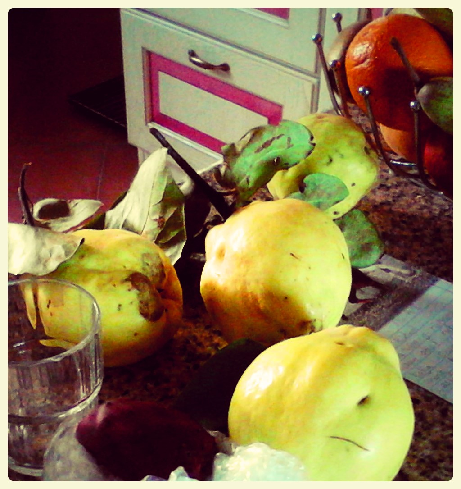

So, wie versprochen kommt hier schon endlich das nächste Rezept. Jahreszeitlich gerade noch so passend, denn bei uns liegen überall noch die **kleinen japanische Zierquitten** in den Büschen auf Höfen (bei uns an der Uni und am Supermarktparkplatz). Die kann man wunderbar für Gelee verwenden, auch wenn sie Zierquitten heißen, sind sie mehr als genießbar, sie schmecken sogar sehr gut. Ich selber habe auch noch ein paar größere **italienische Quitten** aus dem Sardinien-Herbsturlaub mitgebracht, die nochmal ein bisschen anders schmecken.

So sehen die hiesigen Zierquitten vom bodennahen Strauch aus (links, nur etwa so groß wie ein kleiner Pfirsich), und so wie rechts die sardinischen Quitten vom mannshohen Bäumchen (so groß wie eine richtig große Birne oder ein großer Apfel). Die sardinischen ähneln eher denen, die man auch gelegentlich bei uns im Laden kaufen kann.

**Früher** habe ich **Quittenmarmelade** mit geschälten und **pürierten Quitten mit Gelierzucker** gemacht, die auch ganz gut ankam. Mir selber aber war die Konsistenz etwas zu fest, und die Marmelade erinnerte auch durch das pürierte Fruchtfleisch irgendwie zu sehr an Apfelmus. Inzwischen fand ich dieses Rezept [hier bei der Badischen Zeitung](http://www.badische-zeitung.de/gastronomie-1/quittenmarmelade--20573709.html) von einer schwäbischen alten Dame, einer pensionierten Apothekerin, und es gefällt mir viel besser!

Das Ergebnis ist nämlich ein **köstliches, fast karamelliges, aber trotzdem fruchtiges Gelee mit ganz kleinen Stücken**, und kommt meist ohne zusätzliches Geliermittel aus. Es genügt das in den Schalen und Kerngehäusen enthaltene fruchteigene Pektin, das man getrennt ausgekocht. Als Rückfallplan, falls die Gelierprobe nicht gelingt, würde ich aber trotzdem noch ein wenig Pektin oder handelsüblichen Gelierzucken bereithalten.

## Zutaten

- **Quitten**, soviel wie man mag oder findet
- etwa genauso viel (gewichtsmäßig) **Zucker**, und vielleicht noch etwas mehr als Backup
- für den Notfall: etwas **Gelierzucker** (ich verwende 2:1) **oder Pektin** (selbstgekocht aus unreifen Äpfeln, wie in Schritt 9 beschrieben, oder als Pulver aus dem Laden)
- genügend **Marmeladengläser** mit Twist-Off-Deckel

## Zubereitung

1. **Quitten** gut waschen – am besten mit etwas Spülmittel, danach wieder gut abspülen, und dann eventuell noch mit heißem Wasser. Dann mit einem alten oder dunklen Geschirrtuch gut **abrubbeln**, bis die gräulich-klebrige Schicht größtenteils entfernt ist. Jetzt auch schon mal für die spätere Gelierprobe einen **kleinen Teller ins Gefrierfach** stellen.
2. Quitten **schälen** und das Fruchtfleisch von den **Kerngehäusen** wegschneiden. Alles aufheben!
3. **Jetzt das Pektin zum Gelieren des Gelees gewinnen:** **Schalen und Kerngehäuse** in einem Topf nur gerade so mit Wasser bedecken und etwa eine Stunde köcheln lassen. Wenn möglich, über Nacht nochmal ziehen lassen.
4. Inzwischen das geschälte **Fruchtfleisch** der Quitten mit dem Messer in **kleine Würfel hacken** (0,5 bis 1 cm), oder vorsichtig in der Küchenmaschine nicht zu klein häckseln lassen.
5. Die **ausgekochten Schalen und Kerngehäuse** mit ihrer Kochflüssigkeit jetzt durch ein Sieb abseihen, eventuell noch ein Weilchen abtropfen lassen. Das ist unser total natürliches Pektin, mit dem unser Gelee auf völlig ohne Zusätze geliert!
6. Das dickflüssige **Pektin** zusammen mit den **Fruchtfleischwürfeln abwiegen** und nochmal die **gleiche Menge** (Gewicht, nicht Volumen) an **Zucker** hinzufügen.
7. Jetzt alles zusammen - **Zucker, Pektin und Fruchtwürfel** - aufkochen und eine ganze Weile **sprudelnd köcheln** lassen, mindestens aber 3 Minuten, bis die Farbe schön golden-karamellisiert, fast orange geworden ist.
8. Währenddessen die **Marmeladengläser sterilisieren**, entweder mit kochendem Wasser befüllen und kurz stehen lassen (auch die Deckel nicht vergessen!), oder das ganze in der **Mikrowelle** machen. Dafür die Gläser 1-2 cm hoch mit Wasser befüllen und 2-4 Minuten Wasser sprudelnd bei ca. 600 Watt (höchste Stufe) "kochen". Das geht dann aber nicht für die Deckel – die übergieße ich weiterhin mit kochendem Wasser aus dem **Wasserkocher**.
9. Wenn das Gelee ausreichend lang geköchelt hat, eine **Gelierprobe** machen: einen dicken Tropfen des Geless auf den eiskalten Teller geben, kurz abkühlen lassen und mit dem Finger prüfen, ob sich **eine Haut gebildet hat**, die auf Druck Risse bekommt. Dann ist das Gelee fest genug und kann abgefüllt werden. (Man könnte auch draufpusten oder den Teller schräghalten, um zu schauen, ob der Tropfen verläuft oder fest geworden ist und hängen bleibt.) Wenn **die Gelierprobe nicht gelingt, also der Tropfen auf dem Teller nicht fest wird**, reicht wohl das natürliche Pektin der Quitten nicht, und wir müssen nachhelfen: entweder mit einem kleinen bisschen handelsüblichen **Gelierzuckers** **oder mit reinem Pektin**. Ich hatte noch einen kleinen Becher von etwa 100g selbstgekochtem Pektin aus kleinen unreifen Äpfeln vom letzten Jahr übrig, das ich eingefroren hatte – hergestellt genau wie das Pektin aus den Quitten hier im Rezept, aber aus ganzen Äpfeln. Das reichte schon für etwa 3 Kilo Gesamtgeleegewicht. Man kann auch Pektin in Pulverform im Bioladen kaufen, davon einfach nach und nach etwas hinzufügen, aufkochen, und nochmal Gelierprobe machen, bis es hinhaut.
10. Jetzt das heiße Wasser aus den **Gläsern** schütten und das **Gelee einfüllen**. Das geht am leichtesten mit einem Marmeladen-**Einfülltrichter**. Leider habe ich keinen (aber ich hoffe darauf, einen zum Geburtstag oder Weihnachten zu bekommen ;)) – hoffentlich liest meine Familie meine Wunschliste ... Oder man benutzt eine **Schöpfkelle**, was aber nicht ganz so saubere Ergebnisse bringt – aber immer noch besser, als aus einem großen Topf einfach so zu schütten, das gibt zumindest bei mir ne Riesensauerei. Es ist in diesem Stadium auch gut, einen Helfer zu haben, der das Eingießen ins Glas übernimmt, und der andere macht die Gläser zu. Sonst wird inzwischen das Gelee kalt und ist nicht mehr so haltbar.
11. Wenn ein Glas voll ist – wirklich bis zum Rand – den **Rand** mit einem sauberen feuchten Tuch **abwischen**, den **Deckel** fest draufdrehen und das Glas **kopfüber hinstellen**. So lange stehen lassen, bis der Deckel sich fest herangezogen hat (er also **nicht mehr ploppt**, wenn man draufdrückt). Dann kann man die Gläser wieder "auf die Füße" drehen. Fertig, jetzt braucht man nur noch **beschriften**! Ich spare mir inzwischen Etiketten-Aufkleber und verwende einfach Papierstücke, die ich mit Klebestift befestige. Das geht dann auch bei Spülen der Gläser für nächstes Mal besser ab. Das nächste Mal versuche ich vielleicht sogar mal, super umweltfreundlich, Mehlkleister aus Mehl und Wasser angerührt.
