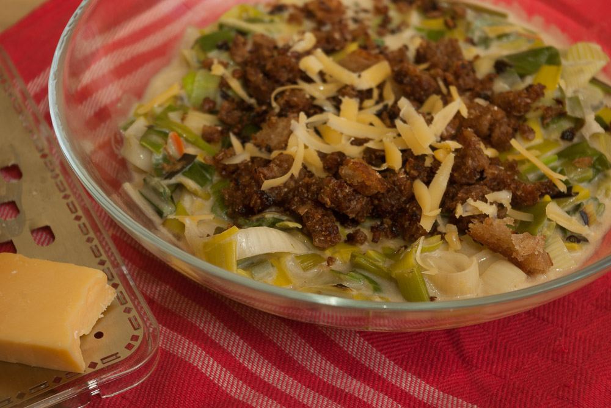

Hier auf dem Apfeleimer gibt es ja, bis auf den Lauchkuchen, noch nicht viele Rezepte mit Lauch. Lauch ist bei uns einfach nicht sonderlich beliebt. Auch Lauchcremesuppe ist nicht so unser Fall - irgendwie schmeckt sie, vor allem aufgewärmt, nach Wachstuch. Geht das noch jemandem so?

Jetzt habe ich mir aber ein Rezept für eine Lauchsuppe aus ein [paar](http://www.kuechengoetter.de/rezepte/Suppen/Lauch-Kaese-Suppe-mit-Brot-6112924.html) [verschiedenen](http://barbaras-spielwiese.blogspot.de/2008/01/lauchsuppe-mit-walnuss-crotons.html) Quellen zusammengestellt, bei dem der Lauch nicht püriert wird, sondern streifig geschnitten bleibt. Aus irgendeinem Grund schmeckt er mir da direkt viel besser.

Als ich noch Fleisch gegessen habe, habe ich mal eine zugegebenermaßen leckere Lauchsuppe probiert, die wohl besonders als "Partysuppe" sehr beliebt zu sein scheint, aber vegetarisch nicht so recht umzusetzen ist. Auch bei meinem alten Bekannten, dem Chefkoch (.de) finden man unzählige Versionen davon: die Lauchsuppe mit **Schmelzkäse, Sahne und Hackfleisch**. Schmelzkäse finde ich nicht so toll (die schmelzen doch eh nur die alten eingetrockneten Käsereste dafür ein, oder?) und Hackfleisch lässt sich hier nicht so gut mit Soja- oder Seitanhack ersetzen wie anderswo, da stimmt die Konsistenz nicht so recht.

Nach ein wenig überlegen und herumsuchen, hatte ich eine Idee - da so eine reine Gemüsesuppe uns nie sonderlich satt macht, gibt es immer Brot dazu. Diesmal habe ich statt Hackfleisch, das ja sicherlich hauptsächlich als sättigende Fetteinlage dient, durch **kleingeschnittene Schwarzbrotwürfel** ersetzt, großzügig in Fett angeröstet - dunkle Croutons quasi. Sie werden zum Servieren **oben auf die Suppe** gegeben.

Der **Käse** darf bleiben, aber nur als "echter" Käse - alles außer Schmelzkäse ist erlaubt, aber ein würziger passt am besten. Auch die **Sahne** bleibt drin, sonst erkennt man das Rezept ja nicht mehr wieder - hier kann man entweder süße oder saure verwenden, oder auch Schmand, aber mir reicht dann auch ein halber Becher (100 g/ml).

## Zutaten

für 4 Portionen

- **Öl** zum Anschwitzen des Lauchs und noch etwas mehr für die Brotwürfel
- 3 Stangen **Lauch** (750-1000 g)
- 1-2 EL **Gemüsebrühe**pulver oder -paste/getrocknetes Suppengemüse/beliebige andere Art, Gemüsegeschmack zu Wasser hinzuzufügen
- 1-2 EL **Mehl**
- 50g **Käse**, vorzugsweise ein würziger, z.B. ein reifer Weichkäse, Ziegenkäse, Feta, Camembert...
- etwas **Milch**
- halben Becher **Sahne oder Schmand**
- 3-4 Scheiben dunkles **Brot**, z.B. Vollkorn, Pumpernickel etc, in kleine Würfel geschnitten (kann gerne auch altbackenes sein)
- zum **Würzen**: Salz, etwas Zucker, Knoblauchpulver, Pfeffer

## Zubereitung

1. **Lauch** waschen, putzen und in Ringe schneiden. In **Öl** anschwitzen
2. Mit **Mehl** bestäuben und unter Rühren mit **Milch** angießen. Suppengemüse bzw. **Gemüsebrüh**pulver (oder Paste) und 1/2 Becher **Sahne** (100 ml) einrühren und mit **Wasser** aufgießen, bis die Konsistenz sämig, aber noch dünnflüssig ist - suppig eben.
3. Einige Minuten köcheln lassen (8-10), währenddessen die **Brotwürfel** in einer Pfanne mit Öl knusprig anbraten und mit **Salz, Knoblauchpulver, Zucker und Pfeffer** würzen.
4. **Käse** zerkleinern und in die Suppe einrühren. Wer Hart- oder Schnittkäse verwendet, kann auch einen Teil zurückbehalten und ihn beim Servieren über die Suppe reiben. Schmelzen lassen. Suppe noch mit Salz und Pfeffer nachwürzen und in tiefen Tellern, bestreut mit den gerösteten **Brotwürfen**, servieren.
