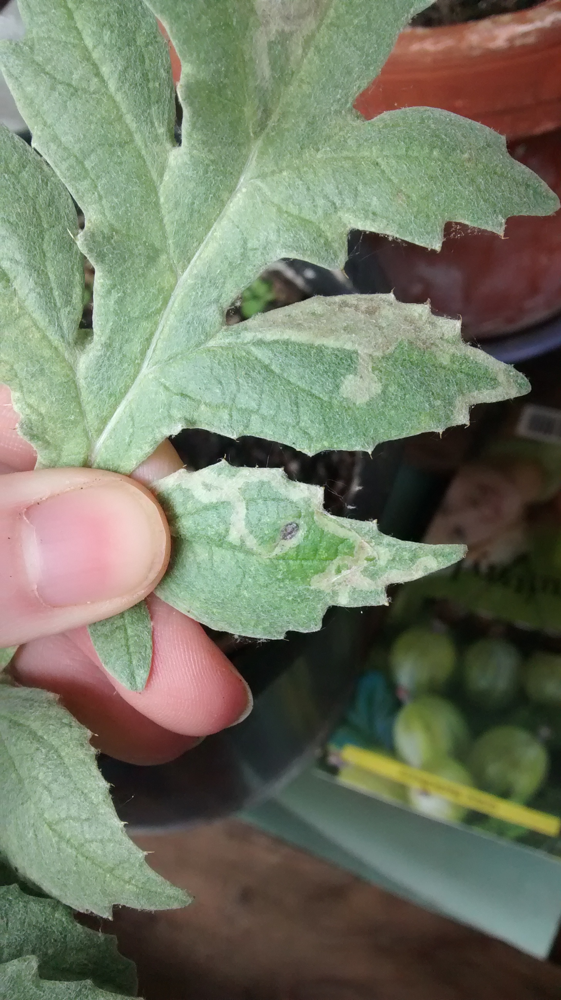

Kennt jemand diese seltsamen Schädlinge? Sie **fressen Tunnel** **zwischen Außen- und Innenschicht des Blattes** und wie man sieht, sind es **kleine schwarze** Wesen, die dann da drinnen hausen, seelenruhig in meinen Blättern!

Gelegentlich habe ich mal **kleine weiße Fliegen** in der Nähe gesehen, ich kann mir vorstellen, daß diese Fliegen ihre Eier auf oder in der Pflanze abgelegt haben und die jetzt geschlüpft sind und sich an den Blättern laben.

Auch an einer Topinambur-Pflanze habe ich ähnliche Blättertunnel gefunden. Das einzige, was mir bis jetzt als Abwehr eingefallen ist, ist einfach alle dieser kleinen Schmarotzer zu **zerquetschen**, das fühlt sich sehr befriedigend an, ist aber auch für die Pflanze nicht besonderns gesund, da sie ja mit zerquetscht wird. **Ideen**?

 

**Edit**: Ich habe inzwischen raus, welches Tierchen sich da an meinen Pflanzen gütlich tut: die [Minierfliege](http://de.wikipedia.org/wiki/Minierfliegen "auf Wikipedia") (doch nicht weiß, sondern schwarz; das muss noch eine andere sein)! Wie ich gelesen habe, ist es recht schwer, mit irgendwelchen Mittelchen der Sache Herr zu werden, da die Fliege ihre Eier IN die Blätter legt und ihre Nachkommen dort hausen und den größten Teil ihres destruktiven Lebens das Blattinnere nicht verlassen. Es soll helfen, **Gelbtafeln/Gelbstecker** bei der Pflanze anzubringen, die die Fliegen anzieht und durch Festkleben am Eierlegen hindert. Ansonsten kann man tatsächlich bei geringem Befall die Babys **im Blatt zerquetschen** (am besten Blatt gegen das Licht halten, dann sieht man sie sehr gut); ansonsten, bei größerem Befall die betroffenen **Blätter entfernen und wegwerfen** (Mülleimer oder verbrennen, nicht kompostieren!).
